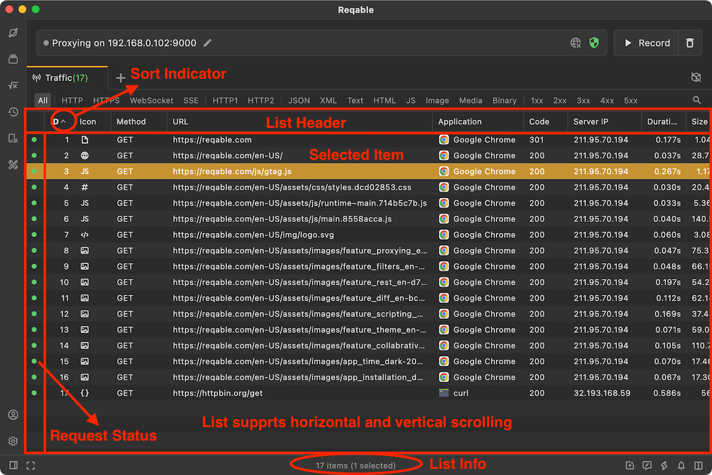
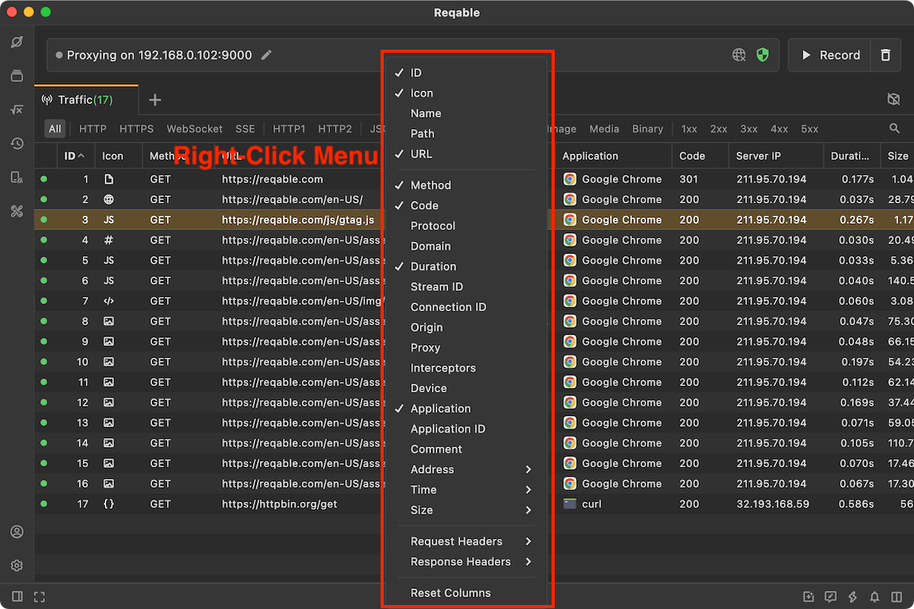
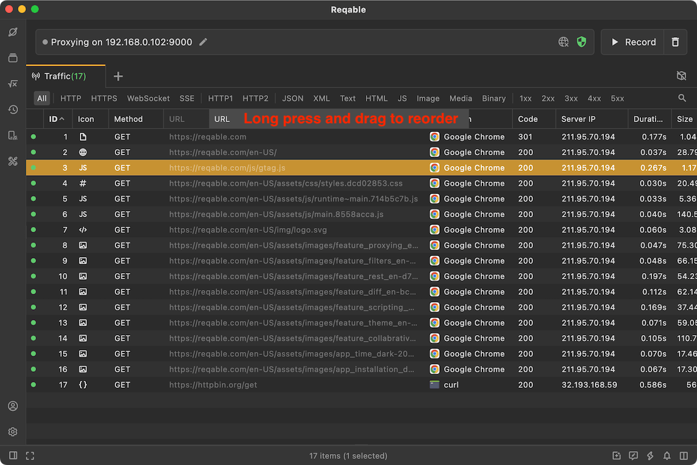
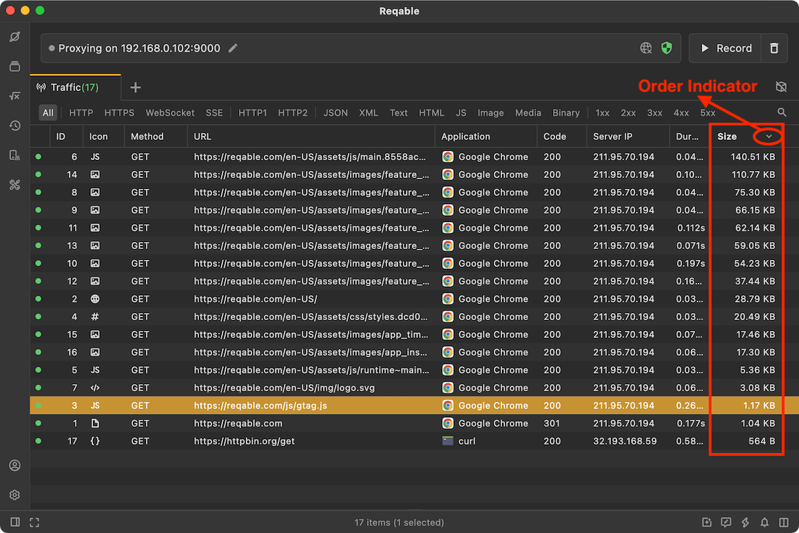
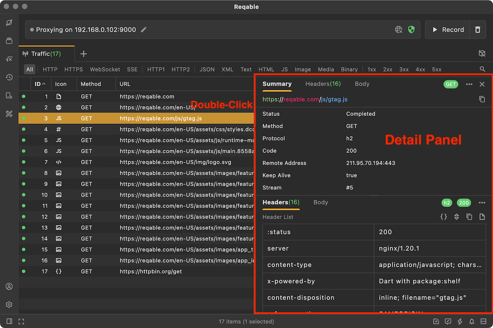
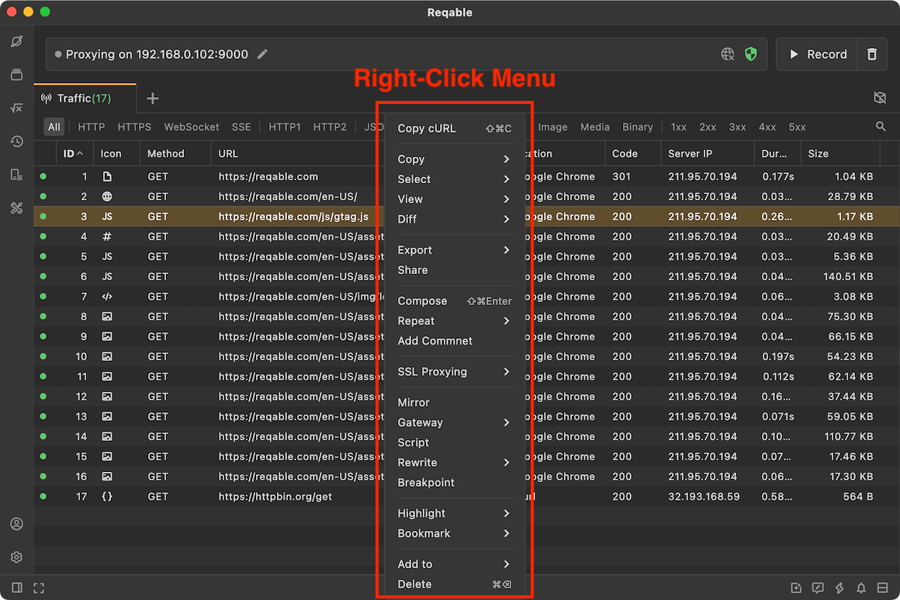

# Traffic List

import Shortcut from '@site/src/components/Shortcut';

Whether it is real-time traffic, historical traffic or HAR file, Reqable is displayed in the form of a list. Understanding the list is one of the basic requirements for API debugging. The following figure shows the important elements and components of the list.

### List Header

The list header is used to control the display of traffic information, because Reqable does not display all information by default, and users may need to configure it according to their own needs. We can open the configuration menu by **right-clicking** the head of the list, click on the menu item to check or cancel the display item, Reqable will remember this configuration, and it will take effect even if the application is restarted. For the meaning of each list column item, you can read this document [column](column).

The list supports scrolling up, down, left, and right. If there are too many horizontal contents in the list, you can also long press and drag to change the column order. Drag the spilter line horizontally to control the width of the column item. For example, when the URL content is too long, adjust the width of the URL column to display more content.

Reqable can sort the list based on a certain column item, and click the column item to switch the row list sorting. For example, in the figure below, we have sorted in descending order according to **Size**.

### List Actions

By default, the data details panel is turned off. We can double-click the list item to open the details panel, and double-click the list item again to close the details panel. When the details panel is already open, click on another list item to update the details.

:::info Tips
There are four ways to close the details panel:
- Double-click the list item again.
- Over drag the dividing line.
- Shortcut key `ESC`.
- More menu icon -> Close.
:::

Right-click the list item to open the context menu, and perform actions on the selected list item. Note that list items support multiple selections.

:::info Tips
There are three ways to clear the list:
- Click the trash icon in the **upper right corner** of the window.
- Right-click on the 'Traffic' tab -> Clear.
- Shortcut <Shortcut>Shift + Control + R</Shortcut>.
:::

Some shortcut keys for list are as follows:

- <Shortcut>Enter</Shortcut> View details.
- <Shortcut>Control + A</Shortcut> Selects all items in the list.
- <Shortcut>↑/↓</Shortcut> Switch the selected item up and down.
- <Shortcut>Alt + ↑/↓</Shortcut> Select the first/last item.
- <Shortcut>Shift + ↑/↓</Shortcut> Continuous selection up and down.
- <Shortcut>Control + Left-click</Shortcut> Select multiple items.
- <Shortcut>Shift + Left-click</Shortcut> Select consecutive items.

### Status Indication

The status indicator is always at the left of the list and has three colors: green, yellow and gray. The three colors represent three states: complete, failed, and in progress.