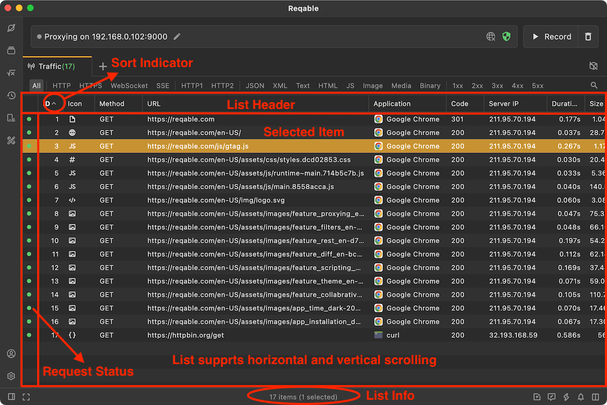
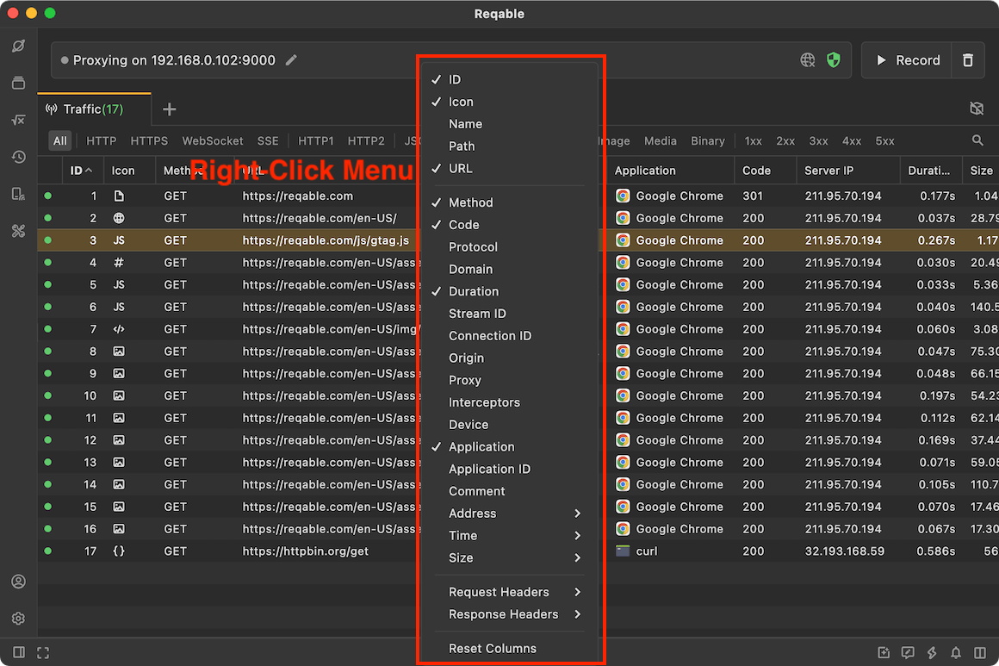
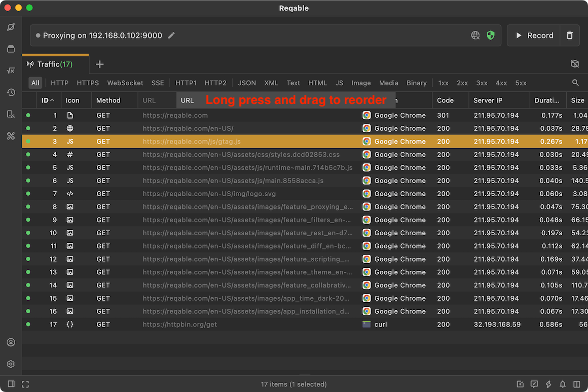
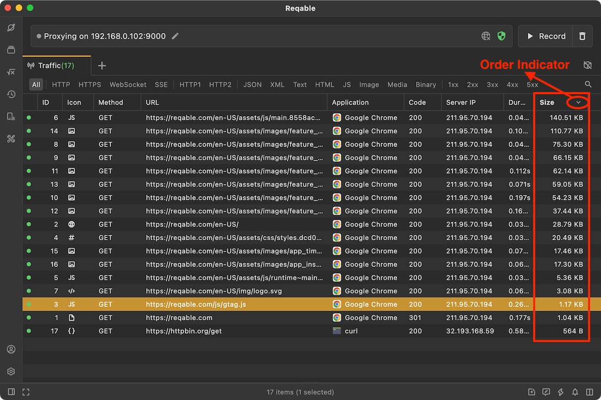
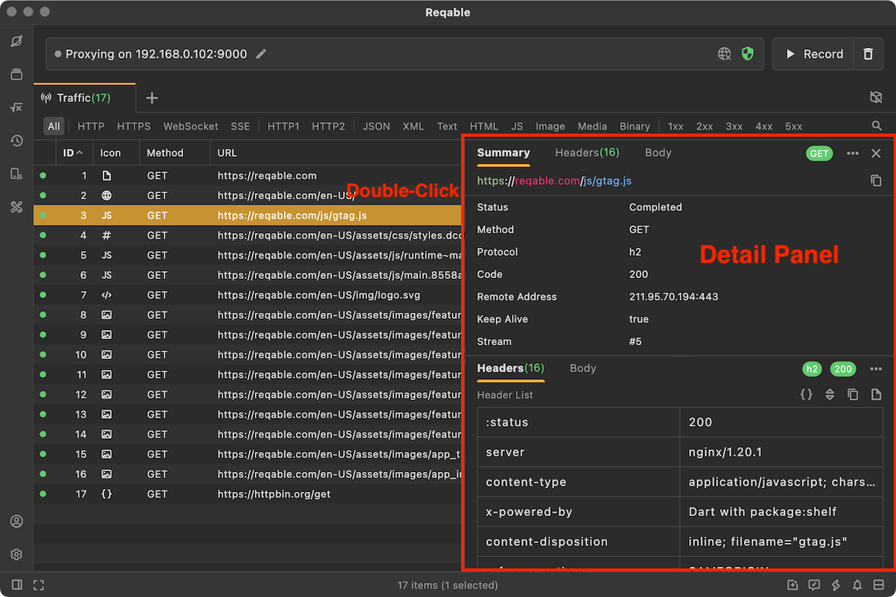
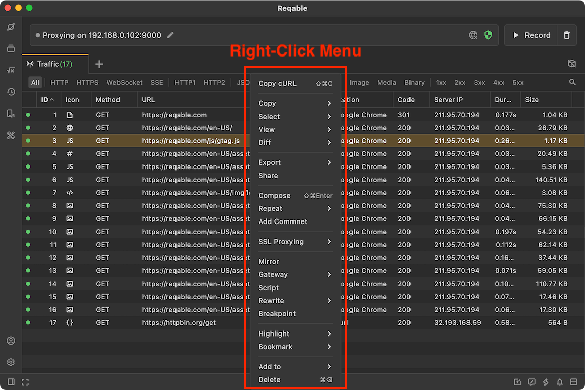

# Traffic List

import Shortcut from '@site/src/components/Shortcut';

Whether it is real-time traffic, historical traffic or HAR file, Reqable displays traffic in the form of a list. Understanding the list is one of the basic requirements for API debugging. The following figure shows the important elements and components of the list.

### List Header

Use the list header to control which traffic fields are shown. Reqable hides some columns by default. **Right-click** the list header to open the configuration menu, then check or uncheck columns to show or hide them. Reqable remembers this configuration across restarts. See [column](column) for column definitions.

The list supports scrolling up, down, left, and right. If the list has too many columns, long-press and drag a column to reorder it. Drag the splitter horizontally to resize a column. For example, when the URL content is too long, adjust the width of the URL column to display more content.

Click a column header to toggle sorting. In the figure below, the list is sorted by **Size** in descending order.

### List Actions

By default, the data details panel is turned off. We can double-click the list item to open the details panel, and double-click the list item again to close the details panel. When the details panel is already open, click on another list item to update the details.

:::info Tips
There are four ways to close the details panel:
- Double-click the list item again.
- Drag the dividing line past the edge.
- Shortcut key `ESC`.
- More menu icon -> Close.
:::

Right-click the list item to open the context menu, and perform actions on the selected list item. Note that list items support multiple selections.

:::info Tips
There are three ways to clear the list:
- Click the trash icon in the **upper right corner** of the window.
- Right-click on the 'Traffic' tab -> Clear.
- Shortcut <Shortcut>Shift + Control + R</Shortcut>.
:::

Some shortcut keys for list are as follows:

- <Shortcut>Enter</Shortcut> View details.
- <Shortcut>Control + A</Shortcut> Selects all items in the list.
- <Shortcut>↑/↓</Shortcut> Switch the selected item up and down.
- <Shortcut>Alt + ↑/↓</Shortcut> Select the first/last item.
- <Shortcut>Shift + ↑/↓</Shortcut> Continuous selection up and down.
- <Shortcut>Control + Left-click</Shortcut> Select multiple items.
- <Shortcut>Shift + Left-click</Shortcut> Select consecutive items.

### Status Indication

The status indicator is always at the left of the list and has three colors: green, yellow and gray. The three colors represent three states: complete, failed, and in progress.