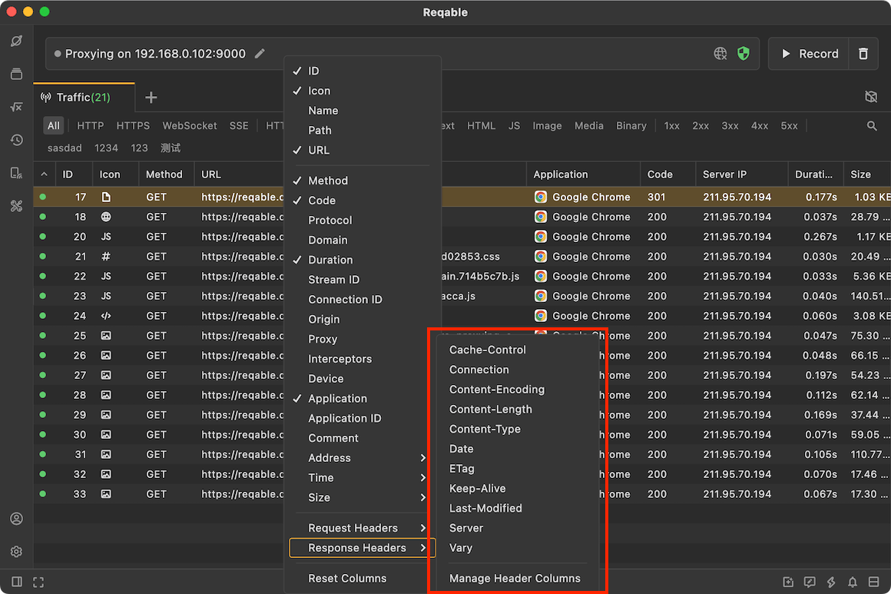

# List Column

Reqable supports many column options to better display traffic. The column options configuration menu can be opened by **right-clicking** on the list header.

This document mainly introduces the meaning of each column option.

### ID

The unique integer ID number is automatically generated according to the order in which the traffic enters the list. The ID number of the first request is 1, and then continuously increases, that is, the ID value of the later request is larger. In other words, we can judge the sequence of requests by the value of ID.

### Icon

|   Icon  |  Description |
|  ----  | ----  |
||Indicates that the SSL proxy request is not decrypted. When the CA root certificate is not installed or SSL Bypass is configured, the proxy request will display this icon.|
||Indicates a proxy request in progress. This icon is displayed when the Reqable proxy server has received client request, but has not been able to establish a communication with the remote server.|
||Indicates that the response body is a JSON.|
||Indicates that the response body is a XML.|
||Indicates that the response body is a Web.|
||Indicates that the response body is a Javascript.|
||Indicates that the response body is a CSS.|
||Indicates that the response body is a raw text.|
||Indicates that the response body is an image.|
||Indicates that the response body is an audio.|
||Indicates that the response body is a video.|
||Indicates that the response body is a compressed file.|
||Indicates that the response body is a Protobuf.|
||Indicates that the response body is a binary.|
||Indicates that this is a certificate-related request.|
||Indicates that this is a Websocket request.|
||Indicates that this is an empty response.|
||Indicates that this is an unknown type request.|

### Name

The last segment of the request URL path, which corresponds to a regular `GET` request, is usually the file name. For example, the name of the following request is `logo.svg`.
> https://reqable.com/en-US/img/logo.svg

### Path

The path of the request URL. For example, the path of the following request is `/zh-CN/img/logo.svg`.
> https://reqable.com/en-US/img/logo.svg

### URL

As the name implies, it is the complete URL of the request, including protocol, host, path, and parameters. Note that what is shown here is the decoded URL.

### Method

HTTP request method, `GET`, `POST`, `PUT`, etc.

### Code

HTTP reponse status code, `200`, `404`, `500`, etc.

### Protocol

HTTP protocol version name, `HTTP/1.1` means HTTP protocol version 1.1, `h2` means HTTP2 protocol version. Note that what is displayed here is the protocol version name in ALPN.

### Host

Request the domain name in the URL. Note that the IP address may be displayed here.

### Duration

The time difference between when the Reqable proxy server receives the request and when the Reqable proxy server sends the response data.

### Stream ID

In the case of TCP connection multiplexing, multiple HTTP requests may be processed in one connection, and Reqable treats each HTTP request in this connection as a stream. Although in the HTTP1 specification, there is no concept of stream, but in order to better reflect the situation of connection reuse, Reqable assigns the value of stream ID to each HTTP request starting from 1, that is, the stream ID of the first request is 1, the stream ID of the second request is 2, and so on. In the HTTP2 specification, there is a concept of stream, so Reqable directly displays the ID number of the stream here. Note that according to the HTTP2 specification, the stream ID is assigned according to an odd number, that is, the stream ID of the first request is 1, and the stream ID of the second request is 3, which is slightly different from HTTP1.

### Connection ID

The ID number of the TCP connection, starting from 1. Each time the Reqable proxy server receives a client TCP connection request, it will add 1 to the ID. By comparing the value of the connection ID, we can determine which HTTP requests are multiplexed TCP connections.

### Origin

Traffic source, since Reqable uses the `Netbare` library as the MITM core, the source of the captured traffic will be displayed as `Netbare`. Note that the source here does not represent client information. If viewing a HAR file, the source here shows the value of `Creator`.

### Proxy

Displays the name of the proxy protocol used by this request, such as `http`, `https`, `socks4`, `socks5`, etc. For more information, please read [proxy](proxy).

### Interceptor

Displays which interceptors have processed this request, and each interceptor will display a corresponding icon. If a request has been processed by multiple interceptors, multiple icons will be displayed here. The supported interceptors are listed in the table below.

|   Icon  |  Description |
|  ----  | ----  |
||Indicates that this request has been mirrored.|
||Indicates that this request has been rewritten.|
||Indicates that this request has been processed by a breakpoint.|
||Indicates that this request has been processed by a script.|

:::info
This feature is supported in `v1.1.4`.
:::

### Application

Displays the application (or executable) that this traffic belongs to, normally show the name and icon of the application (or executable). Note, since some applications (or executable) may not have icons, a default icon will be used here instead. Also, some application (or executable) may not be located due to certain non-deterministic conditions.

:::info
This feature is supported in `v1.3.0`.
:::

### Address - Remote Ip

Indicates the server IP address, which may be IPv4 or IPv6.

### Address - Remote Port

Indicates the server port number. The default port number for HTTP requests is 80, and the default port number for HTTPS requests is 443.

### Address - Local Ip

Indicates the client IP address. The traffic source can be distinguished through this IP, for example `127.0.0.1` means the current device.

### Address - Local Port

Indicates the port number of the client.

### Time - Request Start

The point in time when the Reqable proxy server receives the request. Indicates the time at which a request session was started.

### Time - Request End

The point in time when the  proxy server finishes accepting the request.

### Time - Response Start

The point in time at which the Reqable proxy server begins receiving a response from the remote server.

### Time - Response End

The point at which the Reqable proxy server finishes sending a response to the client. Indicates when a request session ends.

### Headers

In addition to supporting the above column options, Reqable also supports displaying the values of request headers and response headers, such as `Content-Type`, etc. Reqable has built-in some commonly used request header names, if not enough, you can add them yourself through `Manage Header Columns`.

