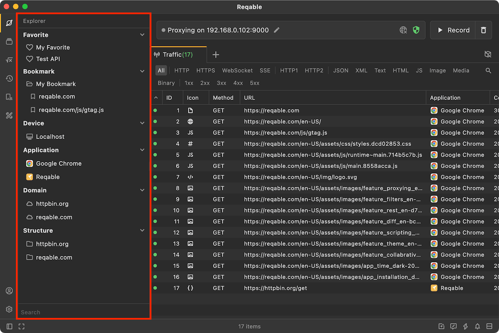
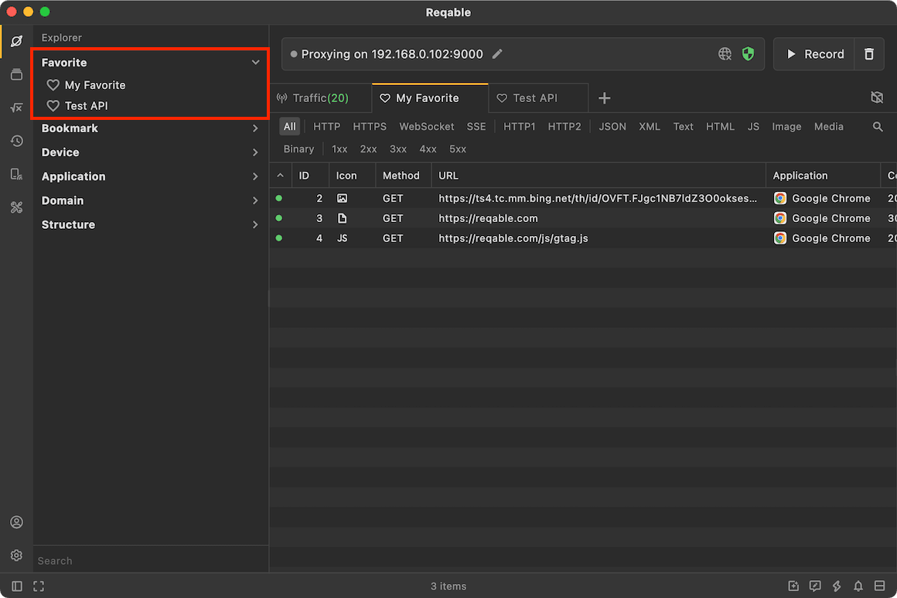
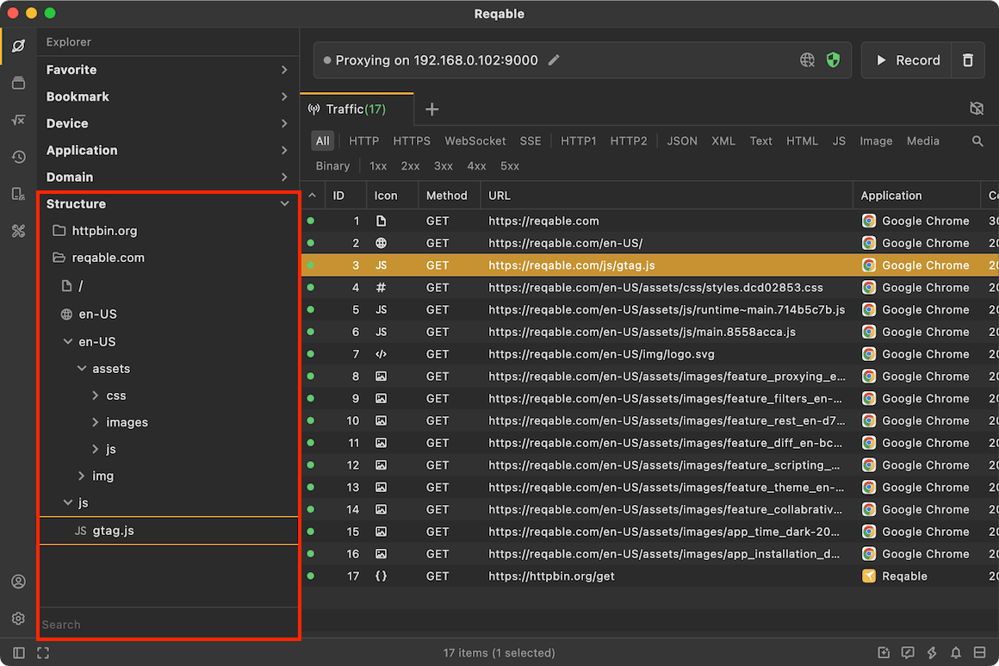
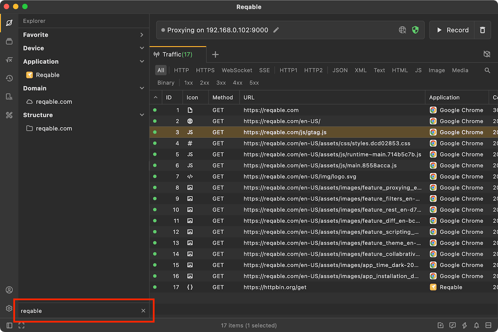

# Explorer

In addition to the main content layout, Reqable also provides **Explorer** sidebar for auxiliary operation. Click the first icon in the sidebar to open the explorer panel. There are three parts in the explorer: [Favorite](#favorite)、[Bookmark](./search#bookmark)、[Device](./search#device)、[Application](./search#application)、[Domain](./search#domain) and [Structure](#structure).

Among these, `Bookmark`, `Device`, `Application`, and `Domain` serve as list filters, their specific functions can be found in [Filter and Search](./search).

### Favorite {#favorite}

Users can add traffic records to favorite folders in [Traffic List](./list) (right-click menu -> Add to -> Favorite Folders). In the Explorer, you can open the favorite folder to view and manage the favorite records. Reqable has a built-in `My Favorite` folder by default, and you can also create their own favorite folders.

### Structure {#structure}

The structure tree is another display form of the traffic. It displays in the form of a file directory, which is more intuitive than the list in some cases. Click a request in the structure tree to expand the details panel as well.

In addition, right-clicking on a file directory can also perform batch actions on all requests under this directory.

### Search

In the search input box at the bottom, you can quickly filter `Device`, `Application` and `Domain`.

