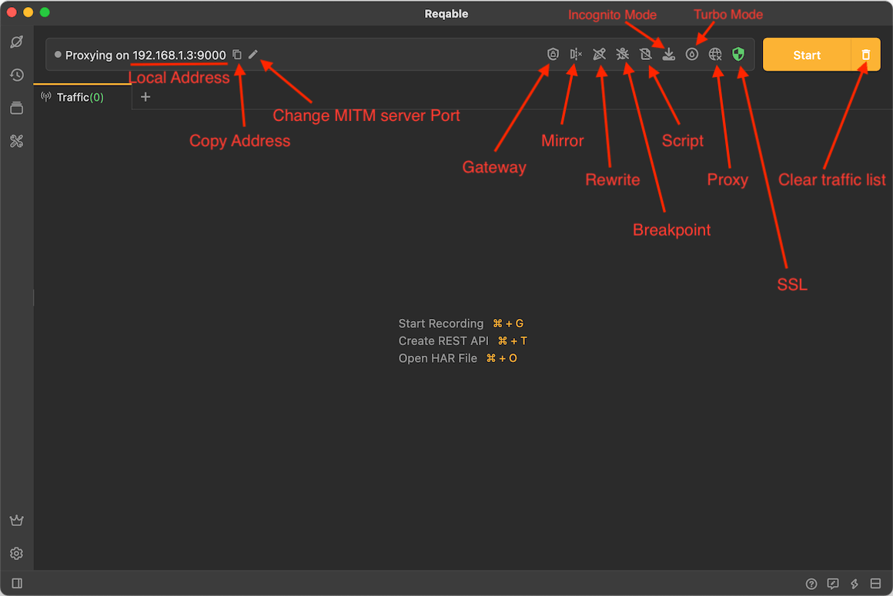

# QuickBar

Almost all the debugg actions are placed on the top QuickBar. The meaning of each component is as follows:

### Local Address

The IP of the machine and the port number of the MITM proxy server will be displayed on the QuickBar, which is convenient for quick setting when the remote device is connected to the LAN. At the same time, two shortcut icons are provided:
- Copy IP and port number
- Modify the port number

### Gateway

One of the core features of Reqable: it supports actions such as blocking, suspending, and interrupting the specified request or response. For details, please read [Gateway](gateway).

### Mirror

One of the core features of Reqable: Configure mirroring for a specified host. For details, please read [Mirror](mirror).

### Rewrite

One of the core features of Reqable: Preset rules to replace or modify specified requests or responses. For details, please read [Rewrite](rewrite).

### Breakpoint

One of the core features of Reqable: Create a breakpoint for requests or responses. For details, please read [Breakpoint](breakpoint).

### Script

One of the core features of Reqable: Write a Python script to handle the request or response. For details, please read [Script](script).

### System Proxy Status Indicator

System network proxy status indicator. For details, please read [Proxy](proxy).

### SSL status indicator

SSL certificate installation status indicator. For details, please read [SSL](ssl).