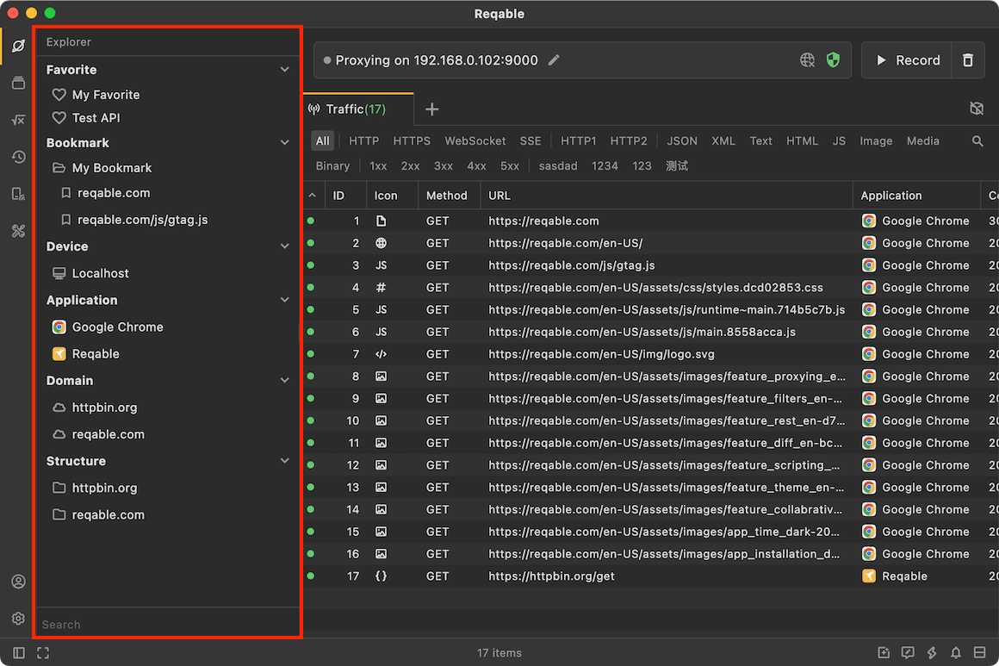
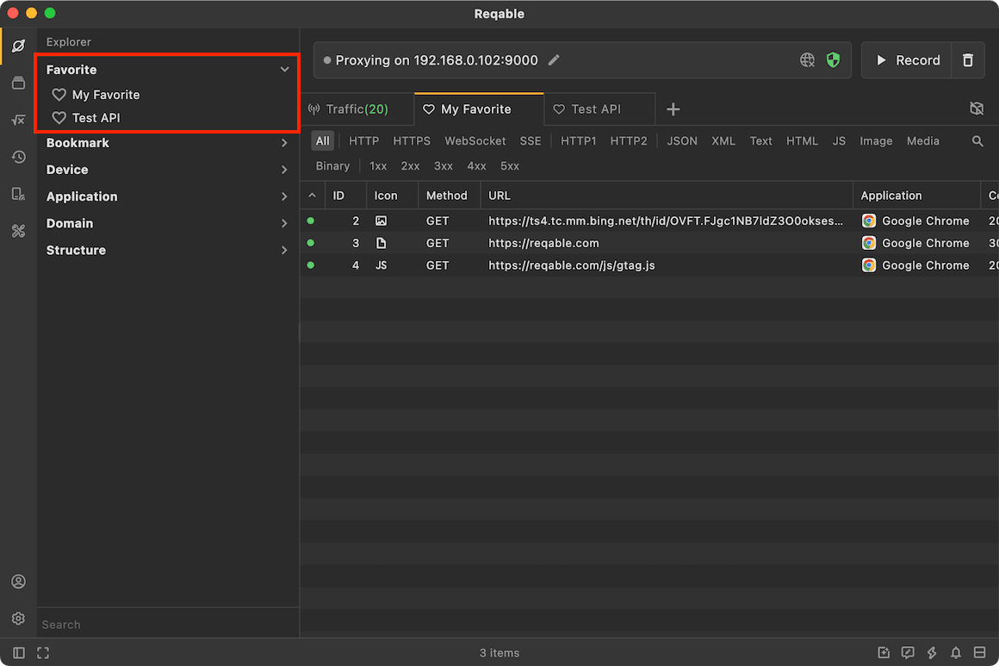
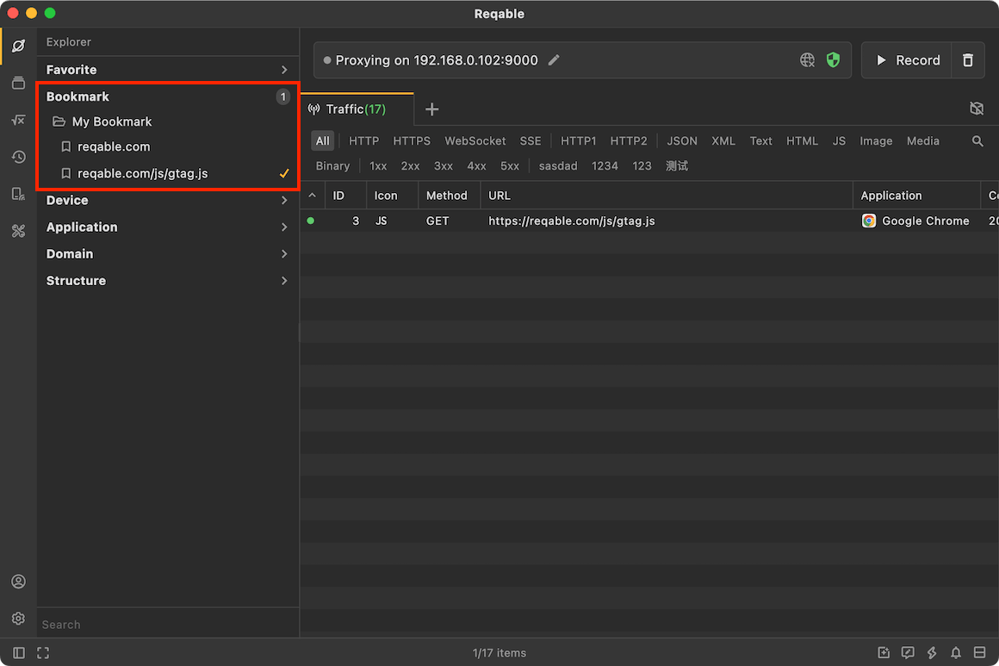
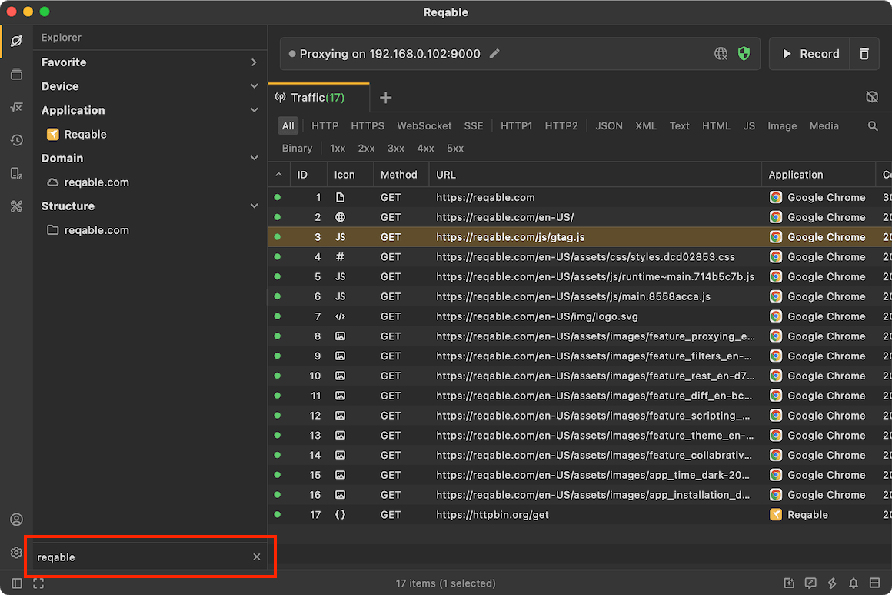
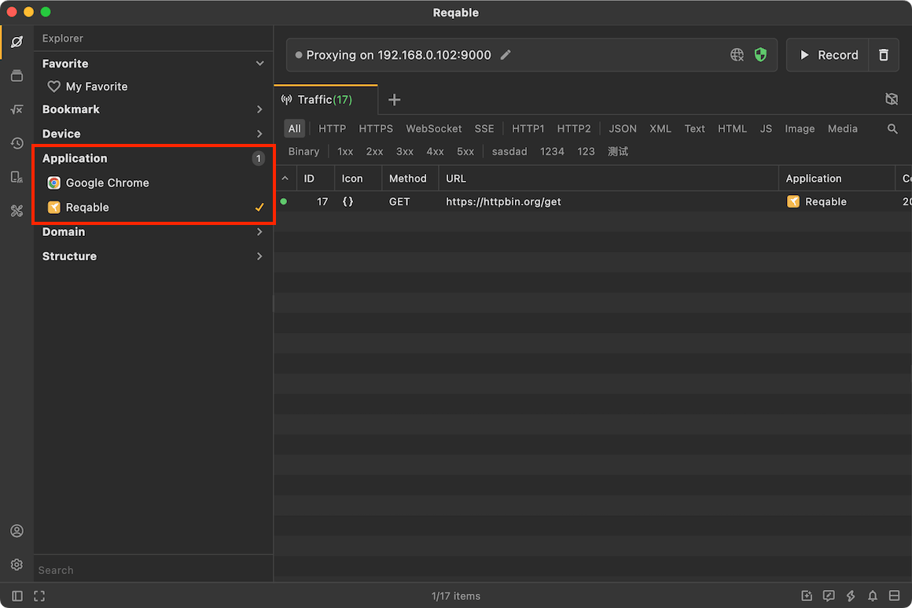

# Explorer

In addition to the main content layout, Reqable also provides **Explorer** sidebar for auxiliary operation. Click the first icon in the sidebar to open the explorer panel. There are three parts in the explorer: [Bookmark](#bookmark), [Domain](#domain) and [Structure](#structure).




### Bookmark {#bookmark}

Bookmarks are used to quickly filter traffic, and bookmarks are managed through folders (only single-level directories are currently supported). Right-click **Bookmark** to create a folder, right-click on a folder to create a new bookmark, of course, we can also create a bookmark from the traffic list.



Bookmarks filter traffic according to the structure, for example `https://reqable.com/en-US/` can filter out all the following requests:

```
https://reqable.com/en-US/img/logo.svg
https://reqable.com/en-US/assets/css/styles.7bbae746.css
```

That is, as long as the request is under the `en-US` directory in the domain name `reqable.com`, it will be filtered out. If the bookmark is a domain name itself, all requests under this domain name will be filtered out.



### Domain {#domain}

The domains are also used to quickly filter traffic, and can be used at the same time as bookmarks (or logically). All domains in the list will be displayed in the explorer. Users can select one or more domains to filter according to the actual situation. If not selected, the list will display all.



:::info Tips
- Double click to single select.
- Click on a number to deselect all.
:::

### Structure {#structure}

The structure tree is another display form of the traffic. It displays in the form of a file directory, which is more intuitive than the list in some cases. Click a request in the structure tree to expand the details panel as well. In addition, right-clicking on a file directory can also perform batch actions on all requests under this directory.

