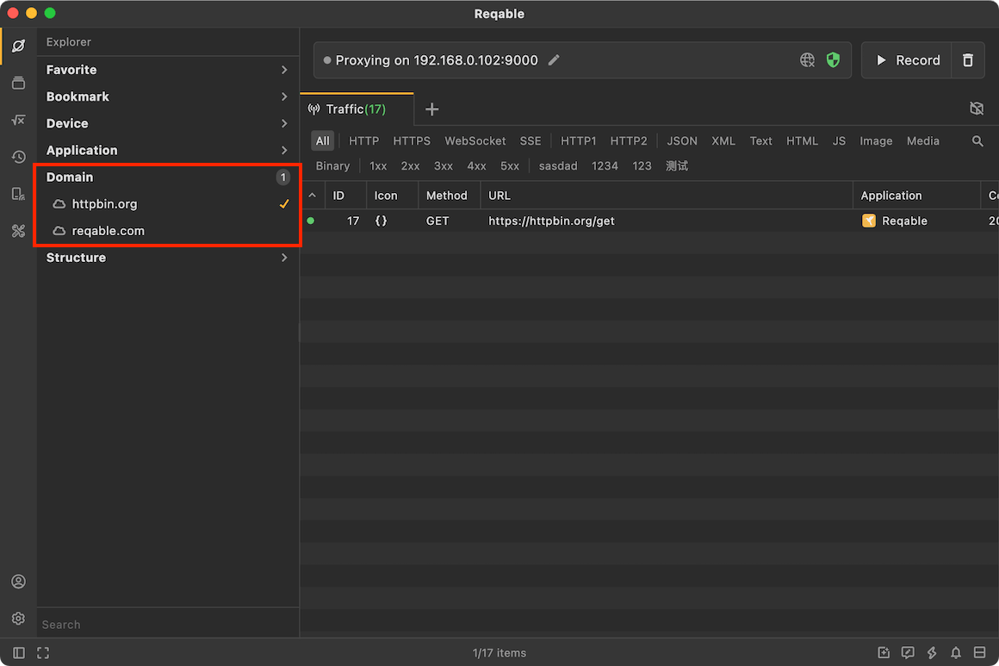

# Explorer

In addition to the main content layout, Reqable also provides **Explorer** sidebar for auxiliary operation. Click the first icon in the sidebar to open the explorer panel. There are three parts in the explorer: [Favorite](#favorite)、[Bookmark](#bookmark)、[Application](#application)、[Domain](#domain) and [Structure](#structure).


### Favorite {#favorite}

Users can add traffic records to favorite folders in [Traffic List](./list) (right-click menu -> Add to -> Favorite Folders). In the Explorer, you can open the favorite folder to view and manage the favorite records. Reqable has a built-in `My Favorite` folder by default, and you can also create their own favorite folders.


### Bookmark {#bookmark}

Bookmarks are used to quickly filter traffic, and bookmarks are managed through folders (only single-level directories are currently supported). Right-click **Bookmark** to create a folder, right-click on a folder to create a new bookmark, of course, we can also create a bookmark from the traffic list.

Bookmarks filter traffic according to the structure, for example `https://reqable.com/en-US/` can filter out all the following requests:

```
https://reqable.com/en-US/img/logo.svg
https://reqable.com/en-US/assets/css/styles.7bbae746.css
```

That is, as long as the request is under the `en-US` directory in the domain name `reqable.com`, it will be filtered out. If the bookmark is a domain name itself, all requests under this domain name will be filtered out.


### Application {#application}

Application is used to quickly filter records, and has a logical relationship of ** or ** with [Bookmark](#bookmark). All applications in the list will be displayed (traffic without detected application source will be displayed by IP source address). You can select one or more applications for filtering. If no selection is made, the list will display all applications.


:::info Tips
- Double click to single select.
- Click on a number to deselect all.
- Right click to pin the app to the top and keep it there.
:::

### Domain {#domain}

The domains are also used to quickly filter traffic, and can be used at the same time as bookmarks (or logically). All domains in the list will be displayed in the explorer. You can select one or more domains for filtering. If not selected, the list will display all domains.


### Structure {#structure}

The structure tree is another display form of the traffic. It displays in the form of a file directory, which is more intuitive than the list in some cases. Click a request in the structure tree to expand the details panel as well.



In addition, right-clicking on a file directory can also perform batch actions on all requests under this directory.

### Search

In the search input box at the bottom, you can quickly filter [Domain](#domain) and [Application](#application).

