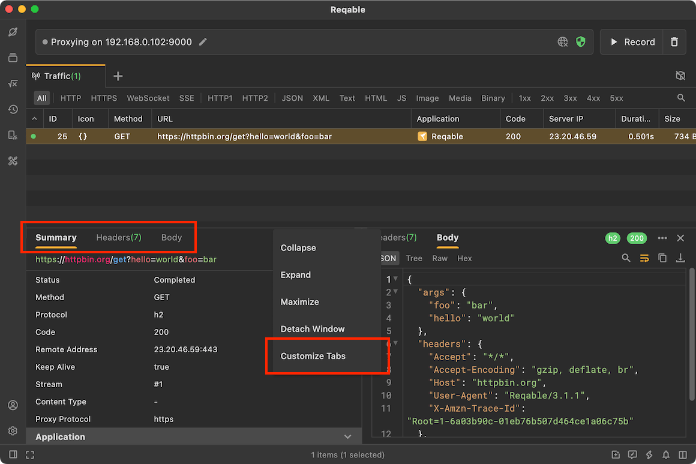
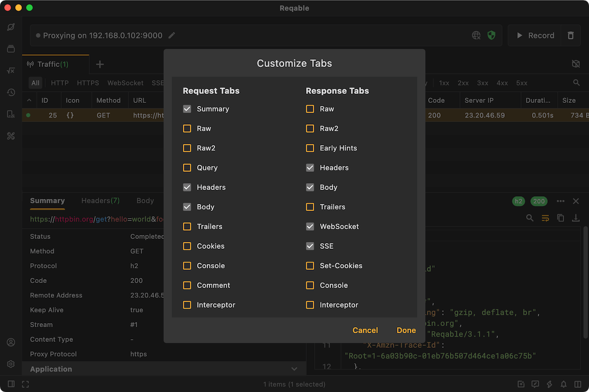
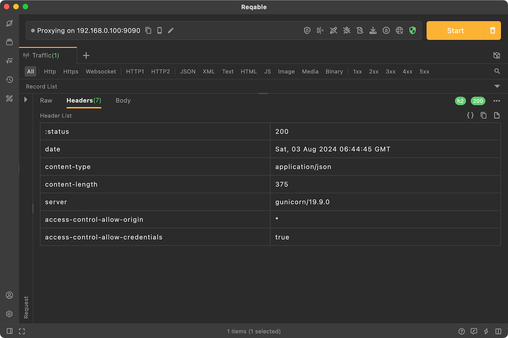
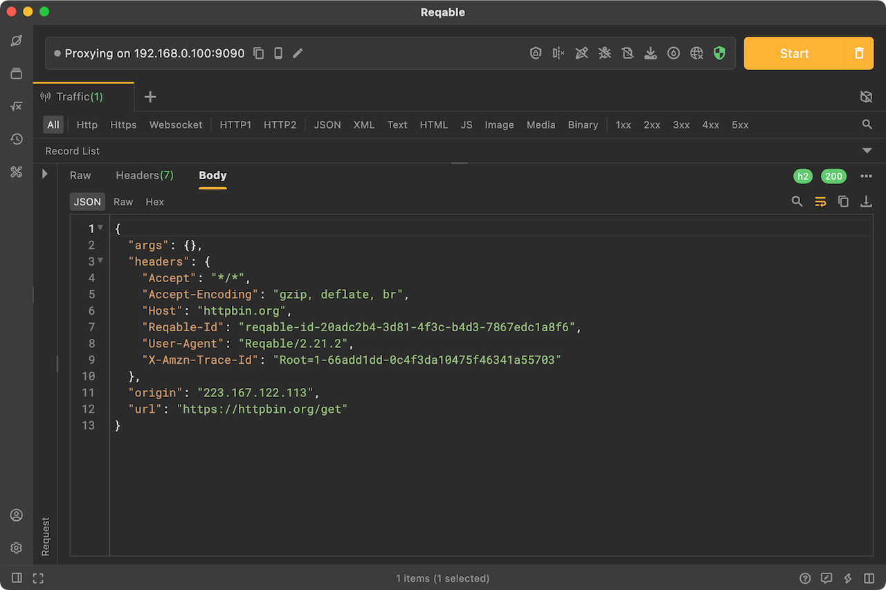
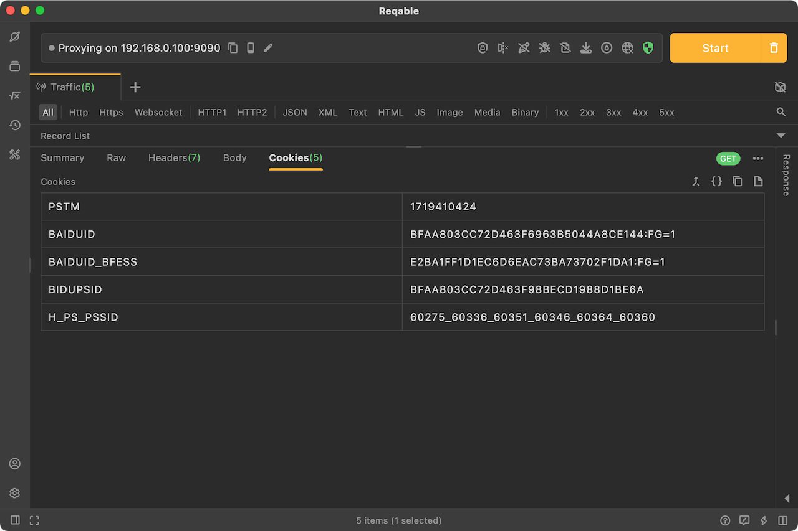
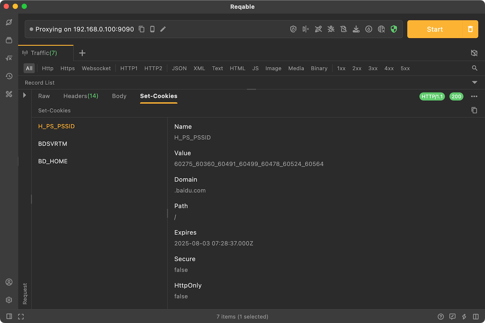
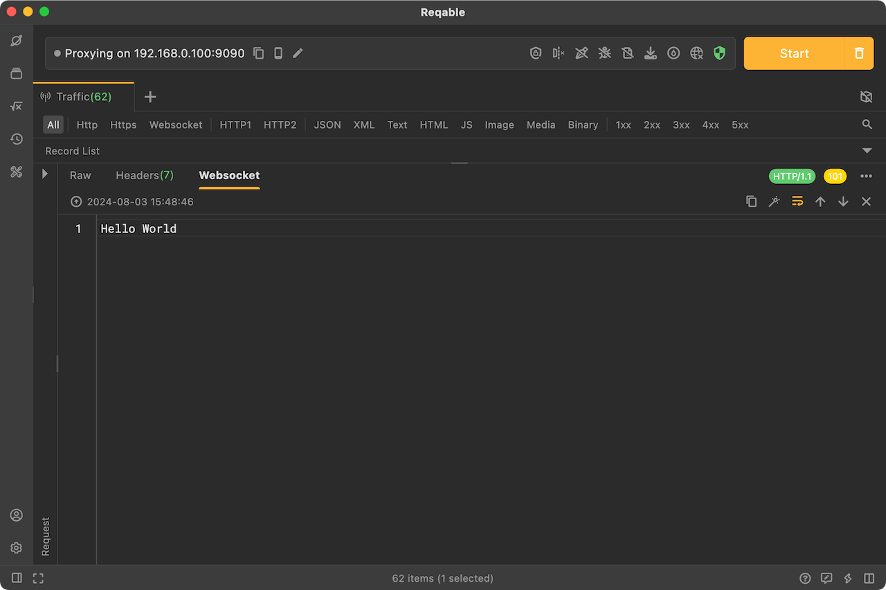

# Tabs

In the session details of HTTP traffic, we will display the data in the form of tabs. Click Tab to switch and view data in different parts.

Expand options menu on the right and select `Customize Tabs` to manage tabs and customize which tab is displayed or not displayed.

:::caution
If a tab has no data in the session, it may not be displayed even if it is checked.
:::

### Summary {#summary}

The summary tab displays the overall information of an HTTP request, such as request URL, status, request method, protocol version, response status code, server address, connection information, TLS information, certificate information, timing, size, and other details.

### Raw {#raw}

The protocol message of the request or response is displayed in the raw tab according to the HTTP/1.1 protocol specification. The protocol message of a request includes the request line, request header and request body, and the protocol message of a response includes the status line, response header and response body.

### Query {#query}

The query tab displays the query parameters of a request. If a request has no query parameters, this tab will not be displayed.

### Header {#header}

The request header or response header list will be displayed in the header tab. As an essential part of the HTTP protocol, this tab will be fixed and cannot be unchecked.

### Body {#body}

This tab will display request body and response body. As an essential part of the HTTP protocol, this tab will be fixed and cannot be unchecked.

Reqable supports a variety of data viewer and preview, such as JSON, XML, binary, images, multi-parts, etc.

### Trailer {#trailer}

In some HTTP/1.1 and HTTP2 protocol specifications, it is supported to send trailers after the request body or response body. This data will be displayed in this tab. If a request or response has no trailer, this tab will not be displayed.

### Cookie {#cookie}

The cookie tab will display the cookie data of the request. If a request has no cookies, this tab will not be displayed.

### Set-Cookie {#cookie}

The set-cookie tab will display the cookie data of the response. If a response has no cookies, this tab will not be displayed.

### Console {#console}

The console tab will display the log output when the script is executed. If there is no log, this tab will not be displayed.

### Comment {#comment}

The comment of request will be displayed in this tab. Users can modify and submit the comment in this tab. As long as you check the tab, it will always be displayed.

### Websocket {#websocket}

If a request is websocket, the body tab will automatically upgrade to websocket, displays the websocket frames.

### Early Hints {#earlyHint}

In the HTTP2 protocol specification, the server may respond with `103 Early Hints` before sending data, and the content of the early hints will be displayed in this tab. If there is no early hint in a response, this tab will not be displayed.

