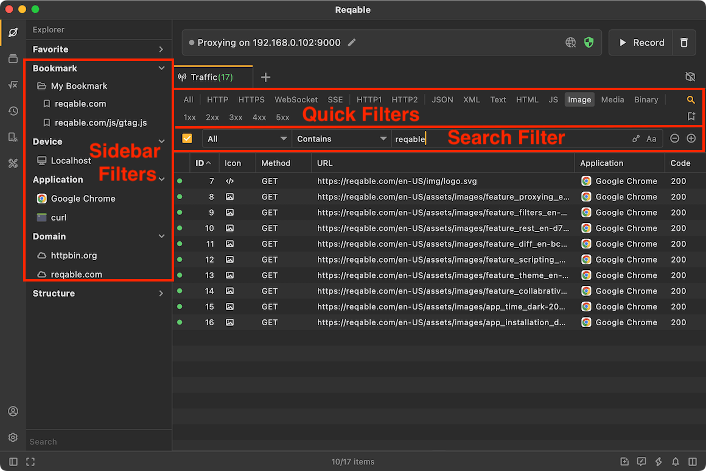
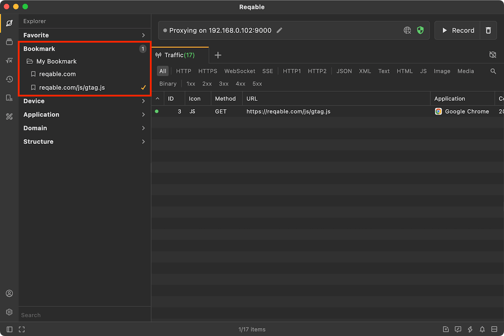
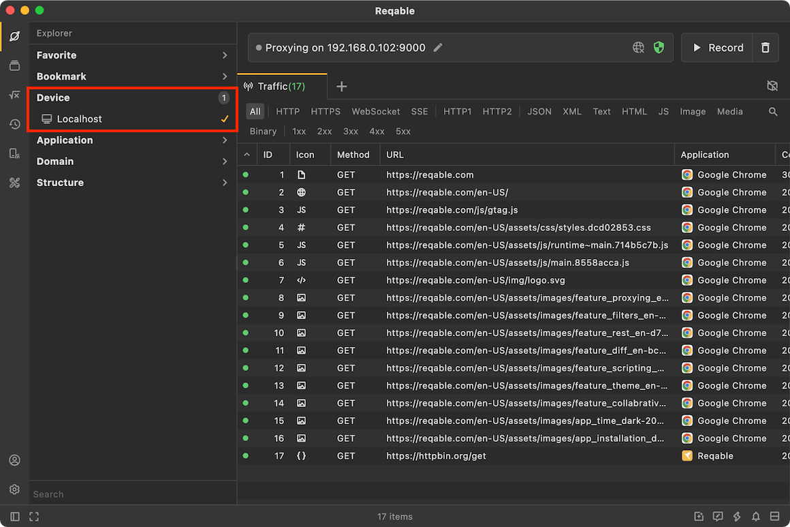

# Filter and Search

import Shortcut from '@site/src/components/Shortcut';

Reqable provides 4 traffic filtering methods: bookmark filter, domain filter, quick filter and search filter. Among them, bookmark filtering and domain filtering are located in the sidebar [Explorer](explorer), which have been introduced in the previous document. The main content of this article is to introduce quick filtering and search filtering.

### Quick Filter

The quick filter is located at the top of the list and is divided into three parts: protocol, content type, and status code. Filter items in different parts can coexist, and the logical relationship is `and`. Click each filter item to quickly filter, and click again to cancel the filter.

:::note
1xx, 2xx, 4xx, etc. represent the status code range, for example, 4xx represents the range of 400-499.
:::

### Search Filter

Reqable provides up to three sets of search conditions, and supports global search and subdivided search. Click the magnifying glass button on the far right of the quick filter bar to open it, or use the shortcut key <Shortcut>Control + F</Shortcut> to open it.

The above figure shows the filter conditions supported by Reqable. Note that the logical relationship between each set of filter conditions is `and`.

There are two types of input for filtering content: text input and selection input. Text input supports case matching and regular expressions. Selection input, just click the input box and select from the pop-up menu. Some types of text input will have content prompts, such as request type, server address, etc.

:::info Tips
When the traffic of multiple devices is displayed in the list, you can use `Local Address` to search and filter, for example `127.0.0.1` means the current computer.
:::