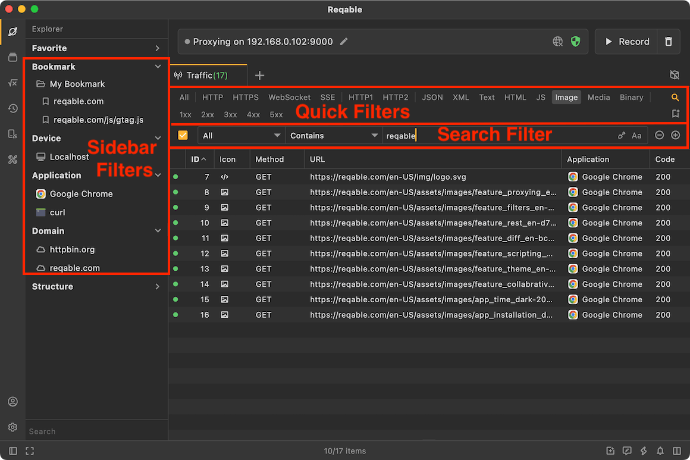
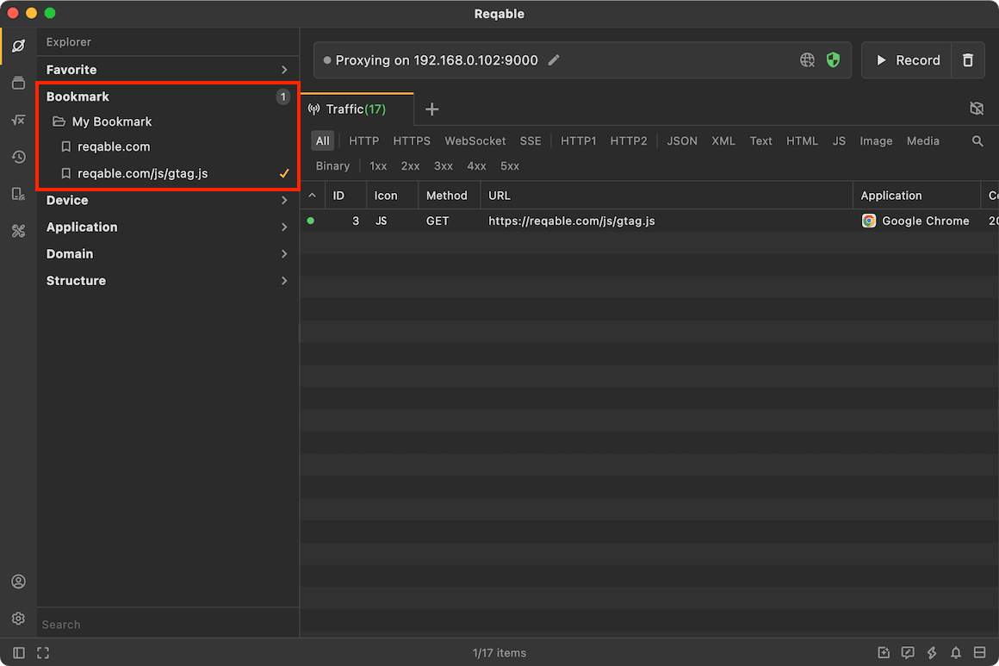
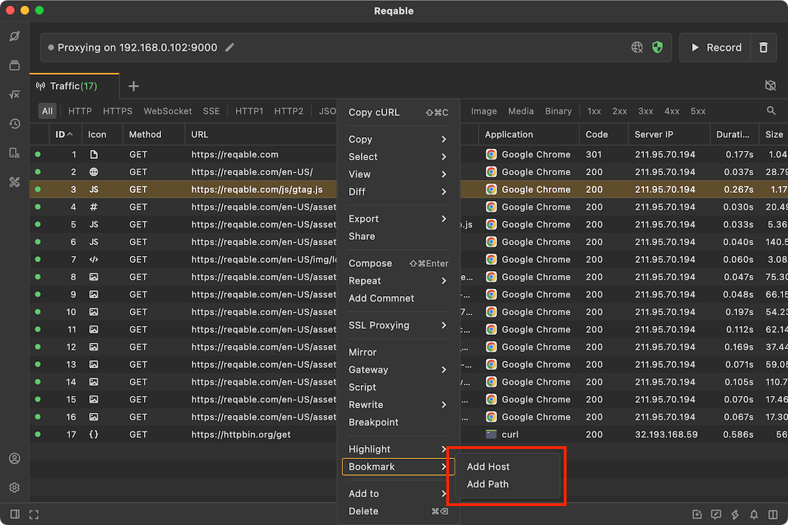
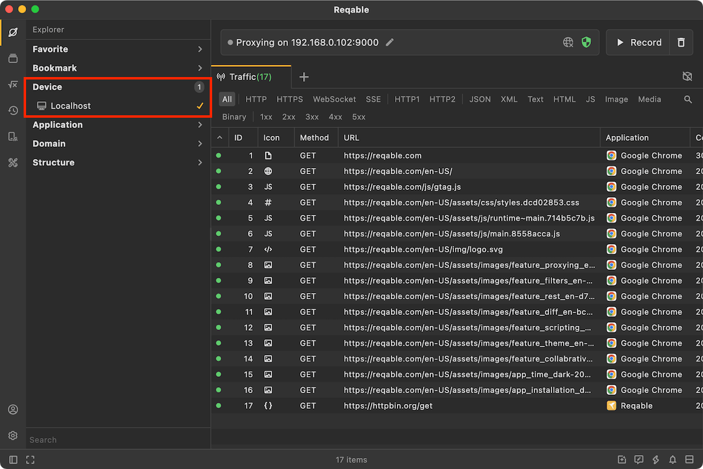
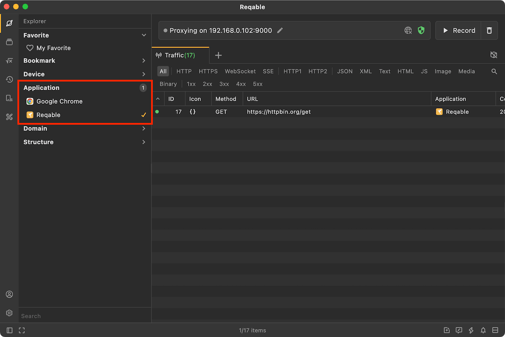
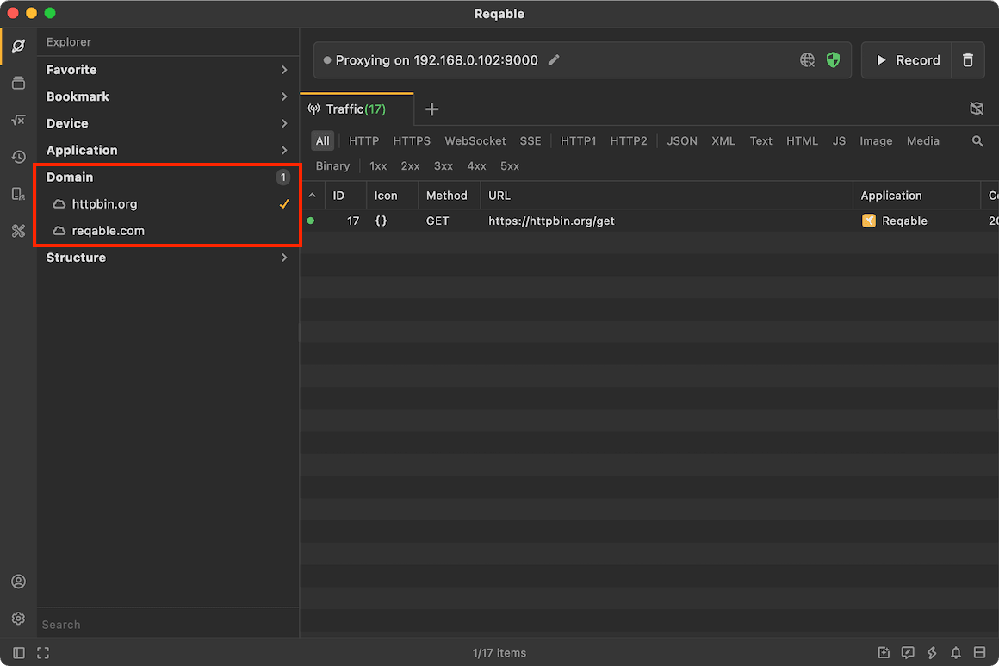
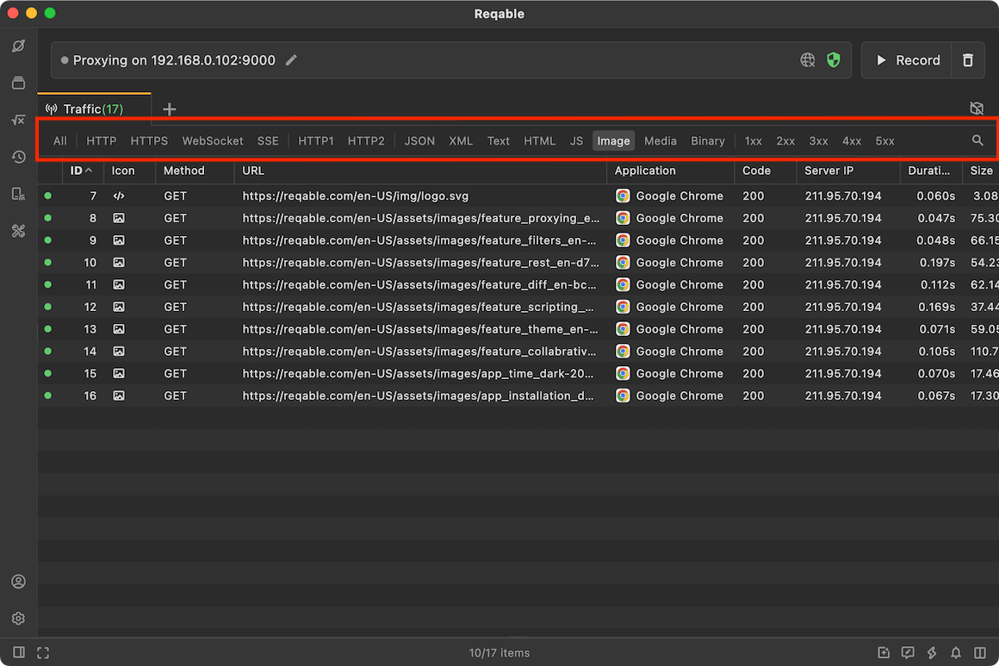
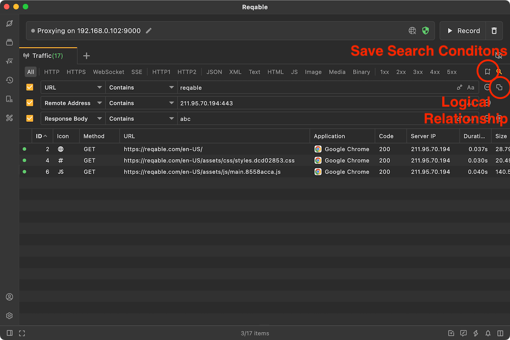
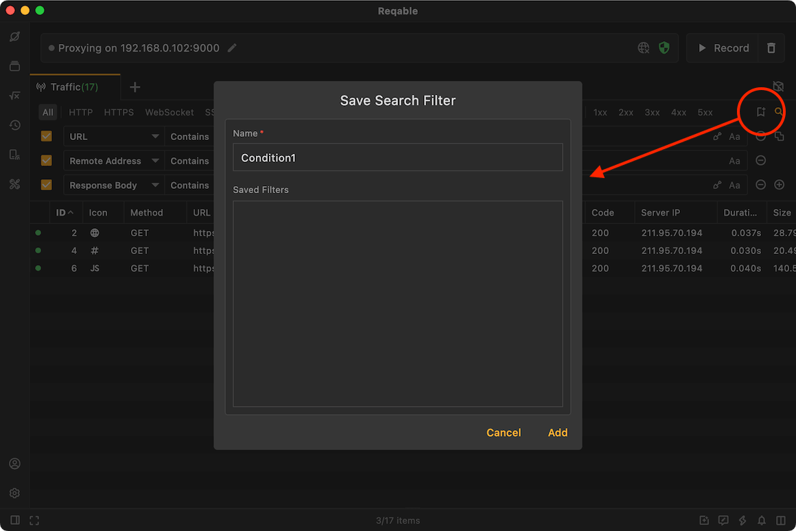

# Filter and Search

import Shortcut from '@site/src/components/Shortcut';

Reqable offers a diverse range of data filters, specifically: [Bookmark](#bookmark), [Device](#device), [Application](#application), [Domain](#domain), [Quick Filter](#quick-filter), and [Search Filter](#search-filter). Among these, `Bookmark`, `Device`, `Application`, and `Domain` are located in the [Explorer] sidebar, while `Quick Filter` and `Search` are situated at the top of the traffic list.

### Bookmark {#bookmark}

Bookmarks are used to quickly filter requests, clicking a bookmark filters the list to display only matching records. Bookmarks support multi-selection, applying an "OR" logic when multiple bookmarks are selected.

Bookmarks are managed using folders (which support only a single level of hierarchy). You can create a new bookmark by right-clicking on a folder. Additionally, you can create a bookmark directly from [Traffic List](./list).

Reqable includes a built-in "My Bookmark" folder by default, you can also create their own custom bookmark folders.

### Device {#device}

This feature is used to quickly filter records and operates according to an `OR` logical relationship with [Bookmark](#bookmark). The explorer displays the names of all devices in the list (if connected locally in non-[Collaboration](../getting-started/collaboration), the source IP address will be displayed instead), users can select one or more devices to filter the results based on their specific needs. If no devices are selected, the list will display all devices.

:::info Tips
- Double click to single select.
- Click on a number to deselect all.
- Right click to pin the app to the top and keep it there.
:::

### Application {#application}

Application is used to quickly filter records, and has a logical relationship of ** or ** with [Bookmark](#bookmark). All applications in the list will be displayed (traffic without detected application source will be displayed by `Unknown App`). You can select one or more applications for filtering. If no selection is made, the list will display all applications.

### Domain {#domain}

The domains are also used to quickly filter traffic, and can be used at the same time as bookmarks (or logically). All domains in the list will be displayed in the explorer. You can select one or more domains for filtering. If not selected, the list will display all domains.

### Quick Filter {#quick-filter}

The quick filter is located at the top of the list and is divided into three parts: protocol, content type, and status code. Filter items in different parts can coexist, and the logical relationship is `and`. Click each filter item to quickly filter, and click again to cancel the filter.

:::note
1xx, 2xx, 4xx, etc. represent the status code range, for example, 4xx represents the range of 400-499.
:::

### Search Filter {#search-filter}

Reqable provides up to three sets of search conditions, and supports global search and subdivided search. Click the magnifying glass button on the far right of the quick filter bar to open it, or use the shortcut key <Shortcut>Control + F</Shortcut> to open it.

Supported search criteria include:

- All
- URL
- Method
- Request Mime
- Request Header
- Request Body
- Response Mime
- Response Header
- Response Body
- Code
- Remote Address
- Local Address
- Highlight
- Interceptors
- Comment
- Console

Supported search match types include:

- Contains
- NOT contains
- Equals
- NOT equals
- Starts with
- Ends with
- Match wildcard
- NOT match wildcard
- Match regex
- NOT match regex

Reqable free users are provided with one set of search conditions, while premium users are provided with up to three sets of search conditions.

The logical relationship between each set of filter criteria defaults to "AND". However, you can click the icon shown in the image above to switch the logical relationship to "OR." Clicking the "Save Sarch Filter" icon in the image allows you to save your current filter settings. Saved configs appear in the [Quick Filter](##quick-filter), allowing you to apply them directly with a single click in the future.

:::info Deep Search
Some non-ASCII characters such as Chinese are encoded using Unicode. By default, for performance reasons, Reqable's search filter does not decode these characters back into their original text form for matching purposes. If you encounter this situation, please enable `Deep Search` (indicated by a shovel icon located at the end of the input field).
:::