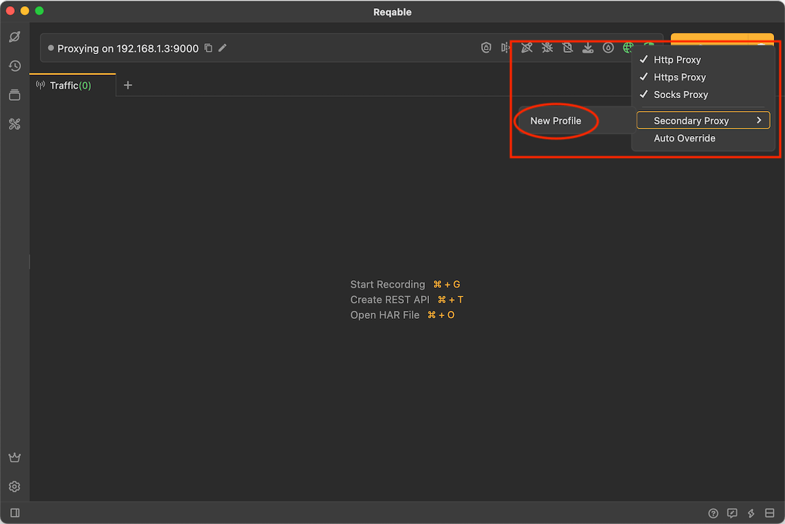
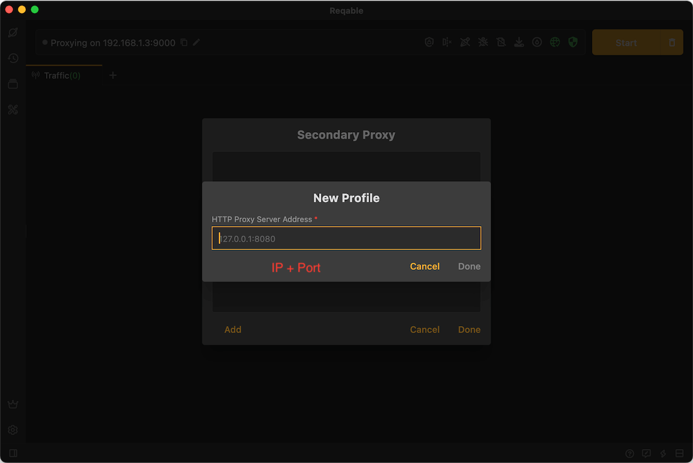
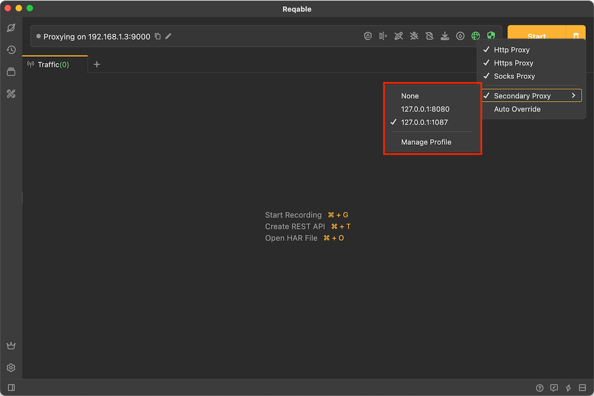
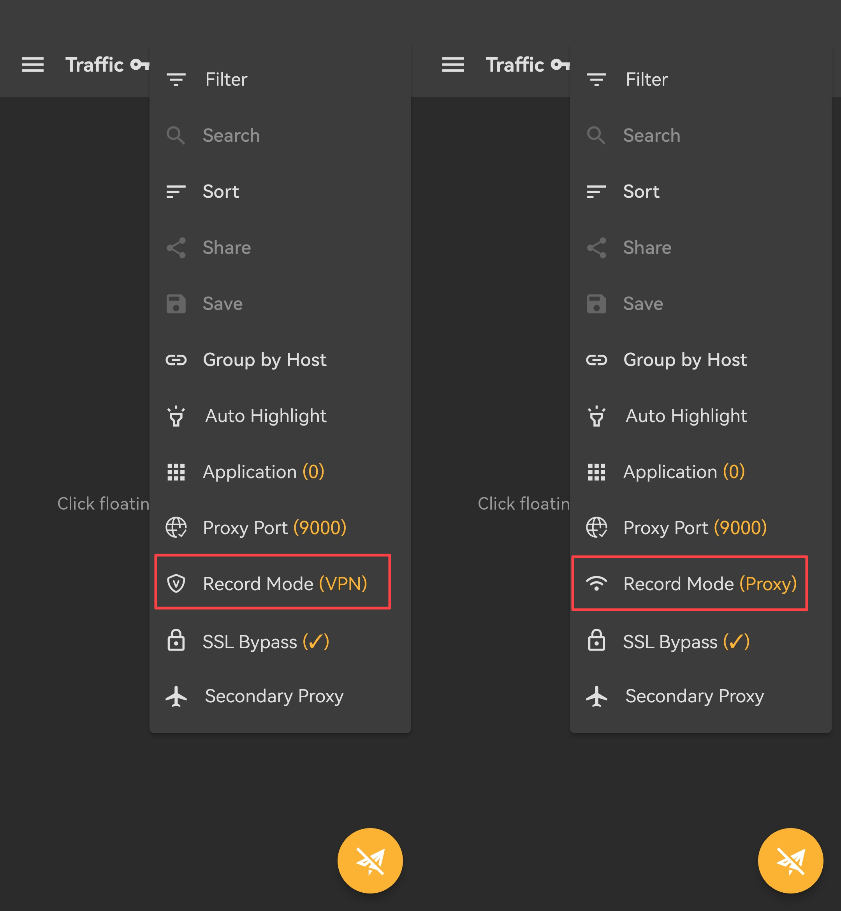

# Proxy

Reqable uses the MITM proxy server to intercept traffic. How to use and configure the proxy correctly is very important. By default, Reqable will automatically configure the system network proxy, without the need for users to manually open the system settings.

The status of the system proxy will be displayed on the [QuickBar](quickbar). If the system  proxy is properly configured, the icon will show a green active state; otherwise, it will show a yellow warning state. Clicking the icon in the green state will disable the system network proxy; clicking the icon in the yellow state will enable the system network proxy.

:::caution

When you need to perform traffic analysis on native applications (such as browsers, etc.), please keep the system network proxy in the green active state! Some proxy applications such as Clash may cause conflicts. It is recommended to close other proxy applications when using Reqable.

:::

Under normal circumstances, a client application (such as a browser) will actively connect to Reqable proxy server according to the system network proxy configuration. However, some applications do not use the system network proxy configuration. In this case, users need to manually configure it in the settings of the client application. If an application neither uses the system network proxy configuration nor provides a way to manually set a proxy, Reqable will not be able to analyze its traffic. Of course, under the premise of obtaining the authorization of the target application, you can consider using tools such as `Proxifier` to forcibly forward its traffic to Reqable proxy server.

For localhost traffic, it may not go through the Reqable proxy server, even if we have properly configured the system network proxy. About the workaround, please read [localhost](localhost).

In addition, on Windows, some clients do not support default proxy rule. Please read the following [Proxy Rules](#rule) for more details.

### Proxy Protocol

Reqable supports five proxy protocols including HTTP, HTTPS, Socks4, Socks4a, and Socks5. Reqable proxy server listens to the same port (port 9000 by default), and automatically determines the protocol based on the client's message content. Reqable cannot specify which proxy protocol the target application adopts, it can only be configured in the proxy settings of the system, which is determined by the client program itself. Regarding proxy settings, different computer systems provide different methods. Please read the following according to the operation system you are using.

#### Windows

Windows can only configure Web proxy or Socks proxy, choose one of the two. By default, Reqable will automatically configure the web proxy. If there is a need to use the Socks proxy, you can switch it in the right-click menu of the proxy icon.

#### MacOS

The Mac OSX system supports the configuration of HTTP, HTTPS and SOCKS protocols at the same time. Users can configure all three or only one in Reqable. In general, it is recommended to check all three protocols.

#### Linux

The Linux system is the same as the Mac OSX system, supports the configuration of HTTP, HTTPS and SOCKS protocols at the same time. Users can configure all three or only one in Reqable. In general, it is recommended to check all three protocols.

### Secondary Proxy {#secondary}

For accessing some restricted websites, such as accessing Google in mainland China, you need to use some proxy software. However, only one proxy can be configured in the system settings. When Reqable is used as the system proxy, these websites will not be accessible. In this case, Reqable's secondary proxy needs to be used. The principle of Reqable's secondary proxy: When Reqable receives the client's proxy request, it will forward it to the secondary proxy server, and the secondary proxy server will carry out the actual communication. Right-click **Proxy Icon** -> **Secondary Proxy** -> **New Profile** to create a secondary proxy configuration.

On the profile editing page, enter the IP address and port number of the secondary proxy server, and save it.

:::info

The secondary proxy currently does not support the SOCKS protocol, nor does it support authentication. It only supports filling in the IP address and port number of the HTTP proxy server.

:::

If you have multiple proxy servers, you can create multiple profiles, just switch in the right-click menu. If you need to turn off the secondary proxy, switch to `None` in the right-click menu.

### Proxy Rule {#rule}

On the Windows system, the web proxy supports the following formats.

① `{ip}:{http_port}`

② `http=http://{ip}:{http_port};https=http://{ip}:{http_port}`

③ `http={ip}:{http_port};https={ip}:{http_port}`

The first of these is a common format and is the default format chosen by Reqable. But some clients can't recognize this format (see this [issue](https://github.com/MatsuriDayo/nekoray/issues/104)), so Reqable provides an option to switch the format. When the web proxy type is selected, the proxy rules can be switched.

### Record Mode

:::caution Attention

If you are not familiar with this function, please keep the **VPN** mode.

:::

On the Android side of Reqable, we provide two`record modes`to capture network traffic:  **Proxy Mode** and **VPN Mode**。

- **Proxy Mode**
 Configure the IP and port of Reqable's MITM server into the system's network proxy settings. If the application supports it, it will read the system's network proxy settings for network requests, allowing Reqable to capture the traffic. On the PC side, Reqable only supports this mode and can automatically configure the system proxy settings with one click. On the mobile side, you need to manually configure the system proxy, and if the application does not support proxy settings, it may not be able to capture the traffic.

- **VPN Mode**
 Also known as TUN mode, it forces the application's network traffic into the VPN virtual network card, which is undetectable by the application itself. The virtual network card automatically forwards the traffic to Reqable's MITM server for traffic analysis. Mechanically speaking, the VPN mode can automatically intercept traffic, similar to a transparent proxy, with the application itself being unaware, offering stronger operability. Currently, only the mobile side of Reqable supports VPN mode.
