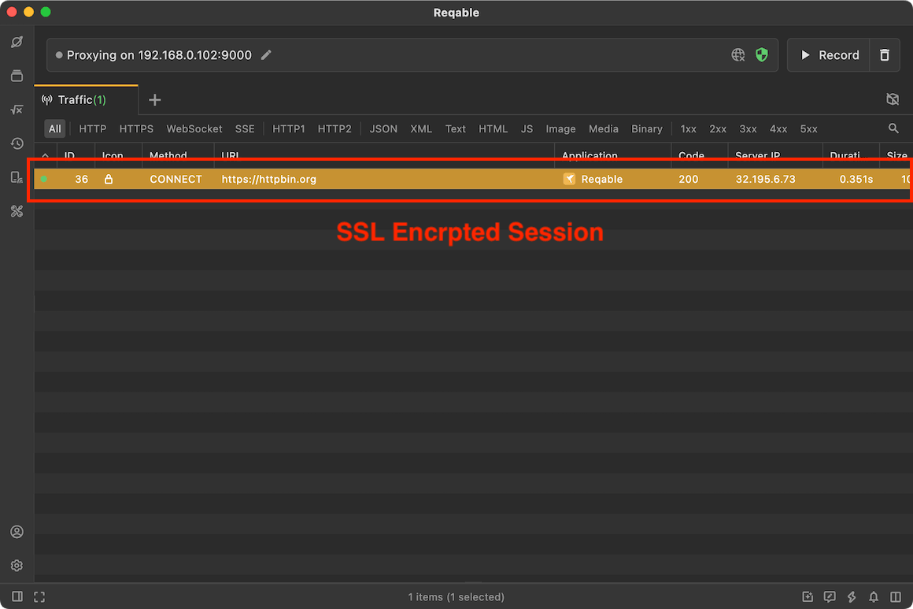
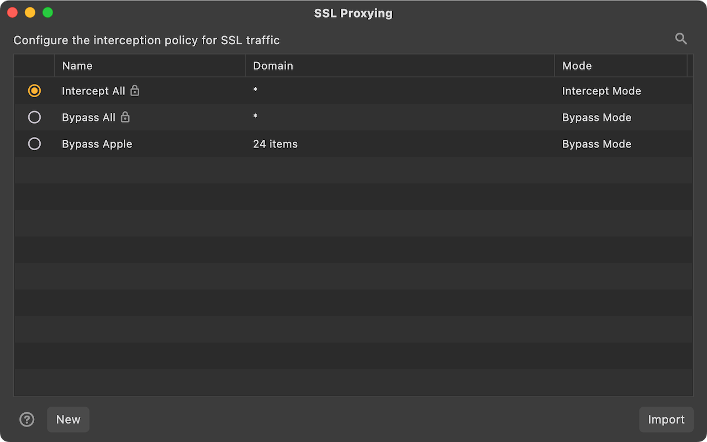
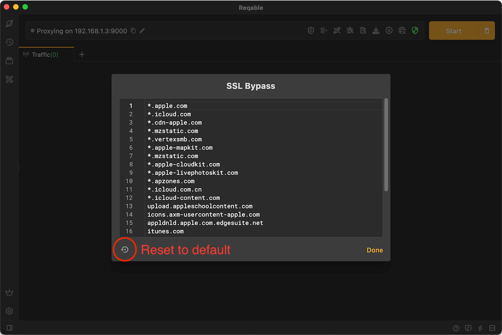

# SSL

Reqable supports analyzing SSL traffic. If the CA root certificate has been successfully installed, Reqable will automatically decrypt all SSL traffic by default, otherwise Reqable will bypass the SSL decryption logic. The undecrypted SSL traffic will display a 🔒 icon, as follows:



By default, Reqable automatically descrypt SSL traffic, which may cause some problems. For example, client pinned certificates, two-way authentication, etc., causing the request to fail. In this case, we need to configure bypass rules to ignore these SSL traffic. Right-click the shield icon and click **SSL Bypass** in the menu to open the configuration page.



On the configuration page, you can input hosts line by line, and wildcard `*` and `?` are supported.



For example, if the `*.apple.com` is configured, the following requests will skip the SSL decryption.
```
https://www.apple.com/
https://api.apple.com/
```

:::info
- Configuring SSL Bypass helps to filter out some irrelevant traffic, also is helpful for improving performance.
- On the Mac OSX system, Reqable configures the hosts that Apple requires to bypass by default, because these hosts are all certificate pinned.
:::