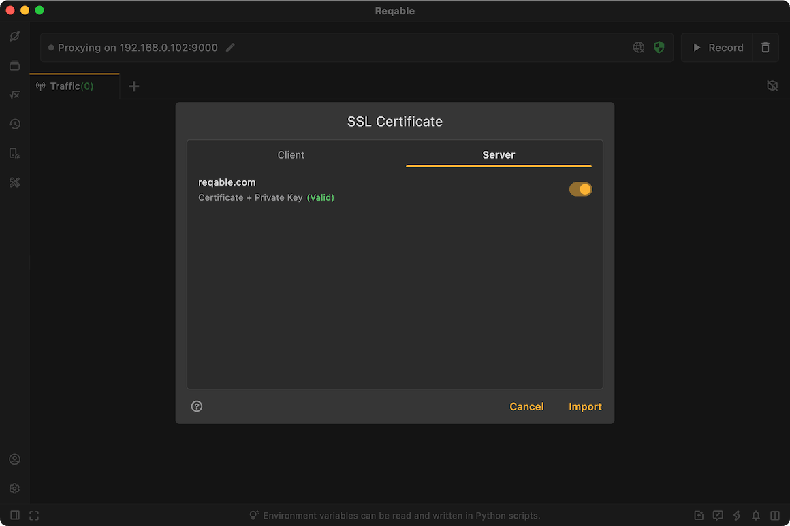

# SSL

Reqable supports analyzing SSL traffic. If the CA root certificate has been successfully installed, Reqable will automatically decrypt all SSL traffic by default, otherwise Reqable will bypass the SSL decryption logic. The undecrypted SSL traffic will display a 🔒 icon, as follows:


By default, Reqable automatically descrypt SSL traffic, which may cause some issues. For example, client pinned certificates, two-way authentication, etc., causing the request to fail. In this case, we need to configure some rules to specify which domains' traffic is SSL decrypted and which domains' SSL traffic bypasses SSL decryption. We call it `SSL Proxying`. You can open it through `Tools` -> `SSL Proxying` or right-click the shield icon.


Reqable provides two built-in rule sets: Intercept All and Bypass All. Intercept All means to intercept all SSL traffic and decrypt it, while Bypass All means not to decrypt any SSL traffic.

Of course, users can also add custom rules to set different SSL behavior modes.


Domain names support wildcard characters `*` and `?`. For example, if the rule `*.apple.com` is configured, the following domain name requests will be matched.
```
https://www.apple.com/
https://api.apple.com/
```

Traffic matching the SSL bypass rule will still be shown in the list, and can be distinguished by the 🔒 icon. If you do not want it to be shown in the list, you can check the box `"Hide bypassed traffic`.

:::info
- Configuring bypass rules helps filter out irrelevant traffic and is very helpful in improving performance.
:::

## SSL Certificates {#ssl-certificates}

Some HTTP requests may enable certificate pinning or two-way authentication. In these cases, Reqable cannot perform SSL decryption by default (manifested as SSL handshake failure or connection failure). For these scenarios, users can configure custom SSL certificates in Reqable, either client certificates or server certificates.



Configure the client certificate, mainly for two-way authentication scenarios. When the Reqable proxy client negotiates SSL handshake with the server, it will send the certificate to the server for verification.

Configure the server certificate, mainly for certificate pinning scenarios. When the Reqable proxy server negotiates SSL handshake with the client, it will send the certificate to the client for verification.

When configuring the certificate, you are required to specify the domain name. Reqable will automatically determine whether to use a custom SSL certificate based on the domain.

Custom SSL certificates support importing the following formats:
- crt
- pem
- der
- p12
- pfx
- zip
