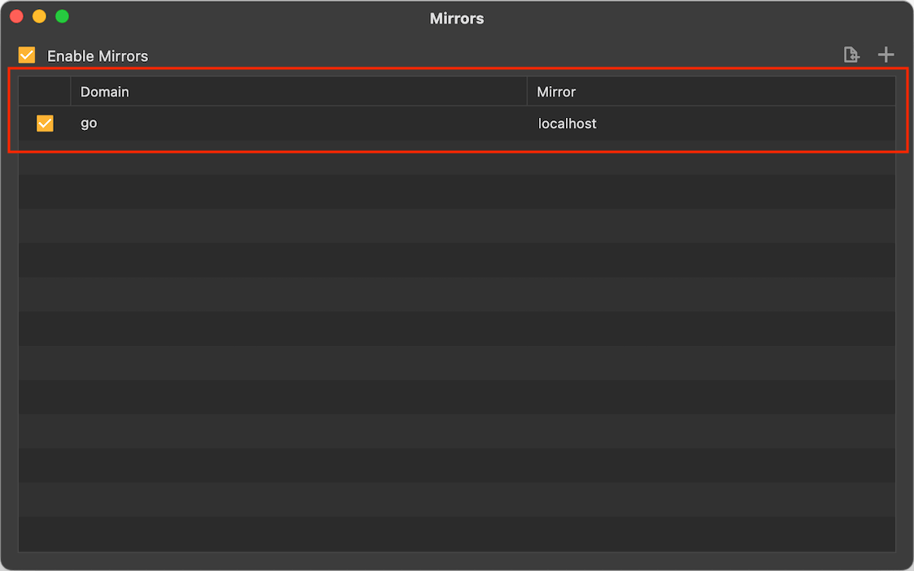

# Localhost Traffic

For localhost traffic, it may not go through the Reqable proxy server, even if we have properly configured the system network proxy, some additional settings are required here. Note that different systems adopt different methods. Please choose your operation system to read below.

### Windows

To listen to localhost traffic, you need to enable the `Loopback` option in Reqable. Note that this option is enabled by default.

### Mac & Linux

We need to use the [mirror] feature to map `localhost`, for example, we can map `localhost` to `go` in the following way.



After the configuration is complete and the mirror switch is turned on, `go` will be used as the alias of `localhost`, and then `localhost` in the URL can be replaced by `go`.
```
Old link: http://localhost:3000/
New link: http://go:3000/
```
Of course, you can also use other aliases rather than `go`, here is just an example.

:::info Tips
For the example link above, you can add the port number when configuring the mirror, that is, use `go:3000` as the mirror. `http://go` will be equivalent to `http://localhost:3000`, isn’t it much more convenient?
:::