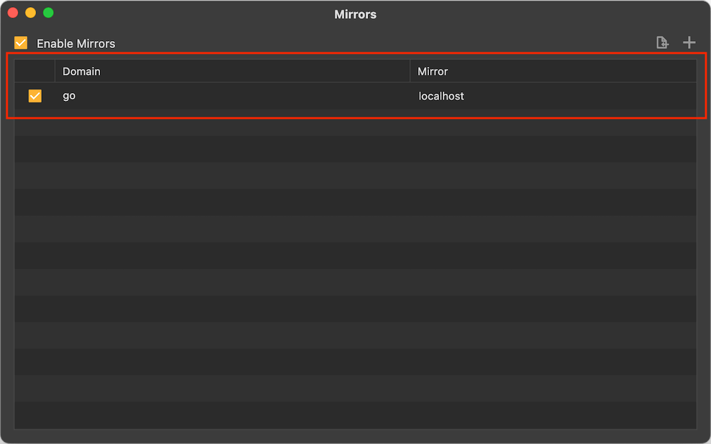

# Localhost Traffic

Localhost traffic may not go through the Reqable proxy server even when the system proxy is configured correctly, so additional setup is required. The steps differ by operating system:

### Windows

To listen to localhost traffic, you need to enable the `Loopback` option in Reqable. Note that this option is enabled by default.

### Mac & Linux

Use the [Mirror](./mirror) feature to map `localhost`. For example, map `localhost` to `go` as follows:



After the configuration is complete and the mirror switch is turned on, `go` will be used as the alias of `localhost`, and then `localhost` in the URL can be replaced by `go`.
```
Old link: http://localhost:3000/
New link: http://go:3000/
```
You can use other aliases instead of `go`; this is only an example.

:::info Tips
For the example above, you can include the port when configuring the mirror—use `go:3000`. Then `http://go` is equivalent to `http://localhost:3000`, so you do not need to specify the port in every URL.
:::