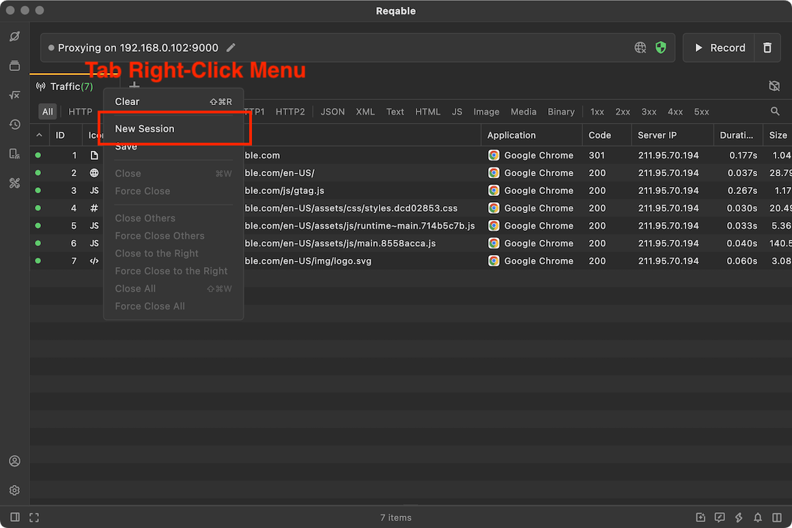
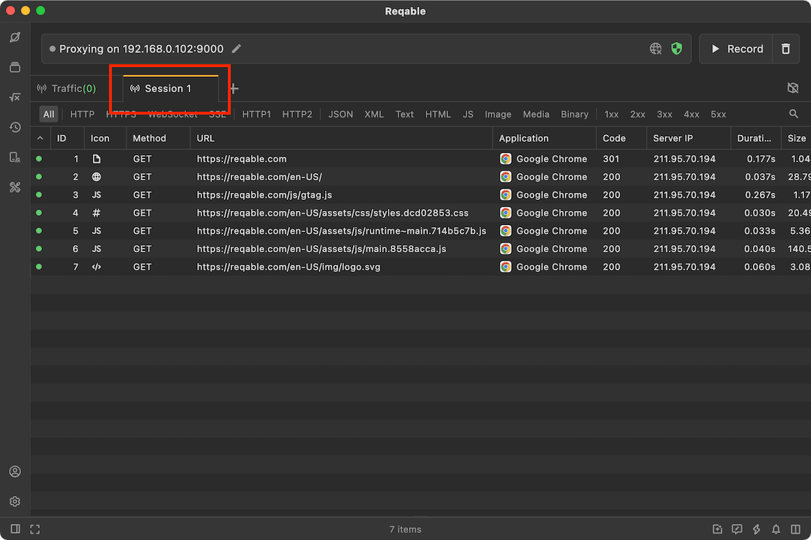
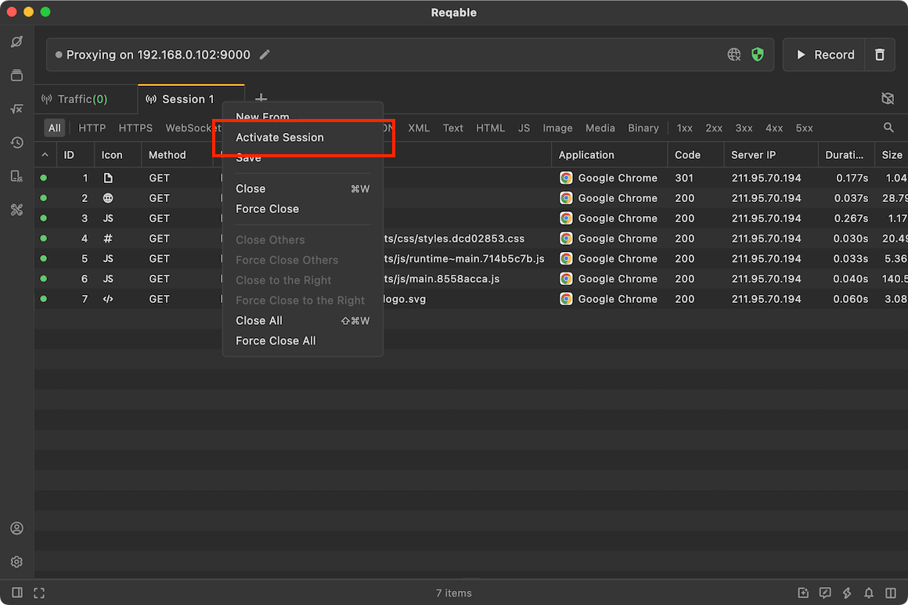

# Muti-Sessions

In terms of design, Reqable fixes the traffic tab to the far left (it cannot be deleted or moved). If you want to record traffic to multiple sessions, you may not know how to do it. This article mainly explains how to use multi-sessions to record traffic.

We can open the context menu by right-clicking `Traffic` Tab, and click **New Session**.

Reqable will migrate the traffic list to a tab, so that new incoming traffic will be displayed in the new session list.

If you want to switch to the old session, just right-click on the tab of the old session, and click **Activate Session**.

In theory, you can create multiple new sessions, or copy a new session based on an existing session.