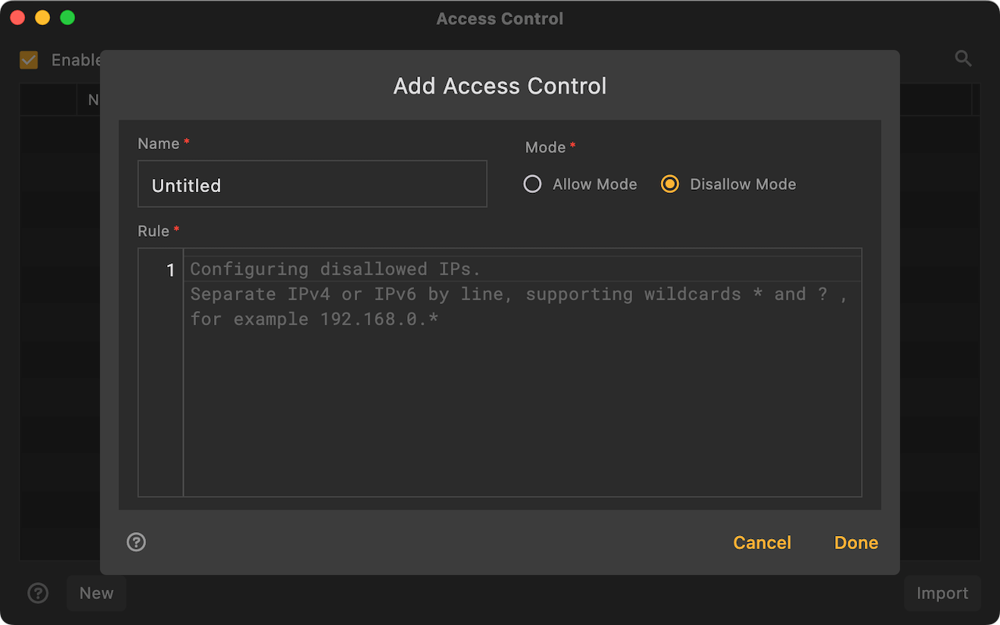

# Access Control

By default, Reqable's MITM proxy server will receive all access requests, which may be interfered by external parties in some cases, and may even cause access loops, which will greatly consume the performance of the running device. Now, users can control which IP devices can access the proxy server, and unauthorized IP devices will be rejected.

:::info
This feature is available in version v2.21.0+.
:::

### How to use

Open `Access Control` from the `Proxy` menu and add a configuration. The user needs to specify a name, choose `Allow Mode` or `Disallow Mode`, and configure the IP address to be controlled. IP addresses support IPv4 and IPv6, and wildcards * and ? can be used for matching. Multiple IP addresses can be filled in line by line.

For example, if you only want local access, you can select `Allow Mode` and configure the IP address `127.0.0.1`.

:::info
For mobile app, open `Access Control` from `⋮` -> `More`.
:::