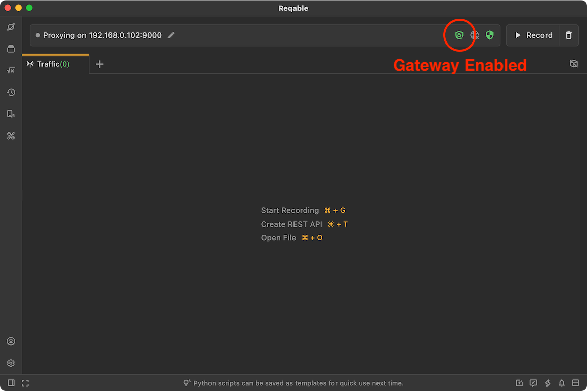
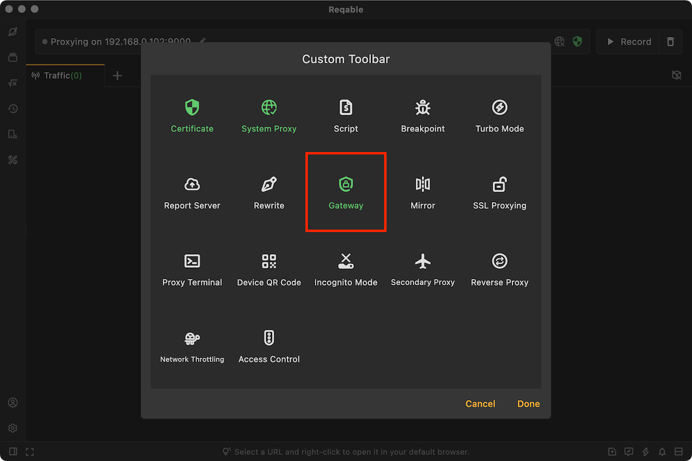
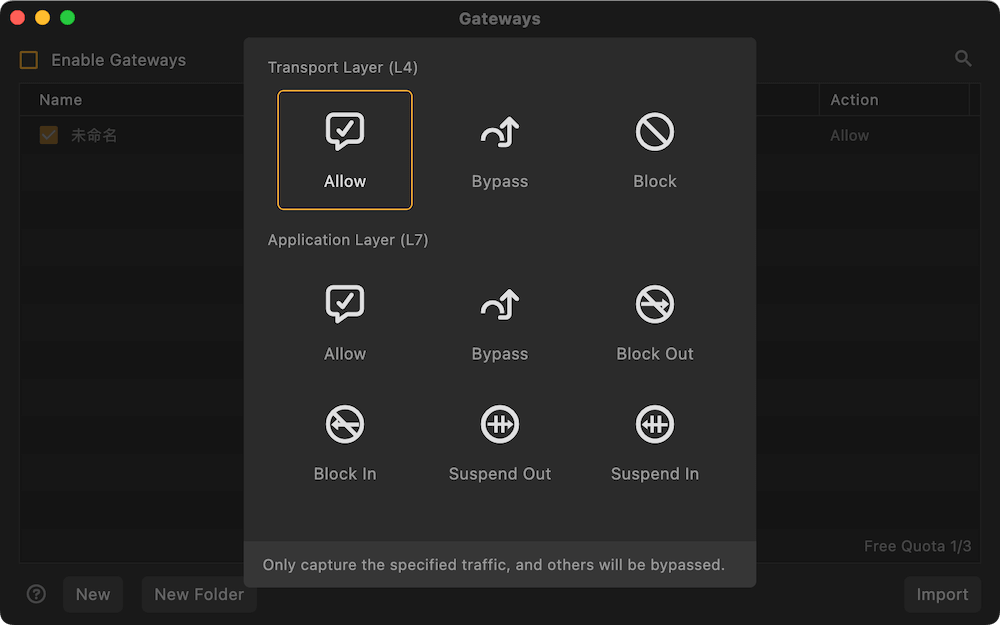

# Gateway

import Shortcut from '@site/src/components/Shortcut';

Gateway is one of the core debugging feature of Reqable. As the name suggests, means network gateway. Note that the gateway here is different from the gateway in computer terms, and it only means the unique statement about HTTP network control in Reqable.

Gateway can be enabled or disabled in four ways:
- Click directly on the gateway icon
- Right click on the gateway icon -> Enable/Disable
- Tray -> Gateway -> Enable/Disable
- Shortcut key <Shortcut>Shift + Control + G</Shortcut>

When the gateway is enabled, the gateway icon on the `QuickBar` will turn green and active.

### Create Gateway

There are six ways to create a gateway rule:
- Right click on the gateway icon -> Add Gateway
- Tray -> Gateway ->Add Gateway
- Gateway List -> Click the `+` icon in the upper right corner
- Gateway List -> Right-Click Menu -> New
- Traffic list -> Select a item -> Right-click menu -> Gateway
- Shortcut key <Shortcut>Shift + Alt + G</Shortcut>

Enter the rule name and matching URL, the URL supports wildcard * and ? matching, and finally you need to choose a behavior. Reqable supports the following five behaviors:

#### Allowed Only

Only allowed traffic will be shown in the list, others will be hidden.

#### Silently

Requests that will not be displayed in the traffic list, which can be seen as the inversion of the **Allowed Only**.

#### Block Request

The Reqable proxy server will block the request (the request will not be sent to the server), and immediately disconnect the TCP connection.

#### Block Response

The Reqable proxy server will block the response (the response will not be sent to the client), and immediately disconnect the TCP connection.

#### Suspend Request

The Reqable proxy server will block the request (the request will not be sent to the server), and the TCP connection will still be maintained. This mode is suitable for testing HTTP request timeouts.

#### Suspend Response

The Reqable proxy server will block the response (the response will not be sent to the client), and the TCP connection will still be maintained. This mode is suitable for testing HTTP request timeouts.

:::caution Priority

Behavior priority: Block > Suspend > Allowed Only > Silently.

:::

### Import and Export

Reqable supports batch import and export of gateway rules, which is convenient for sharing and collaboration with others.

