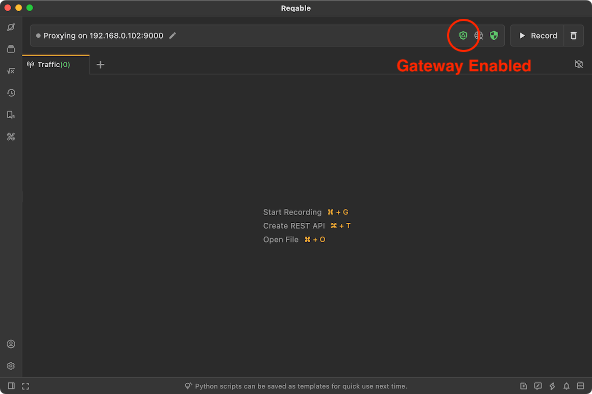
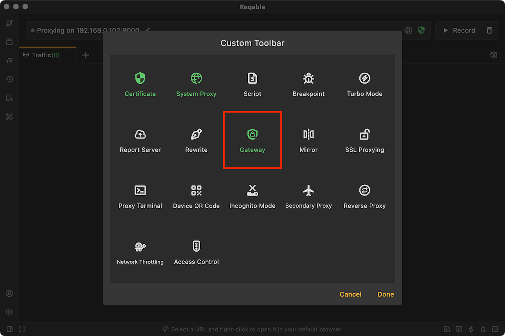
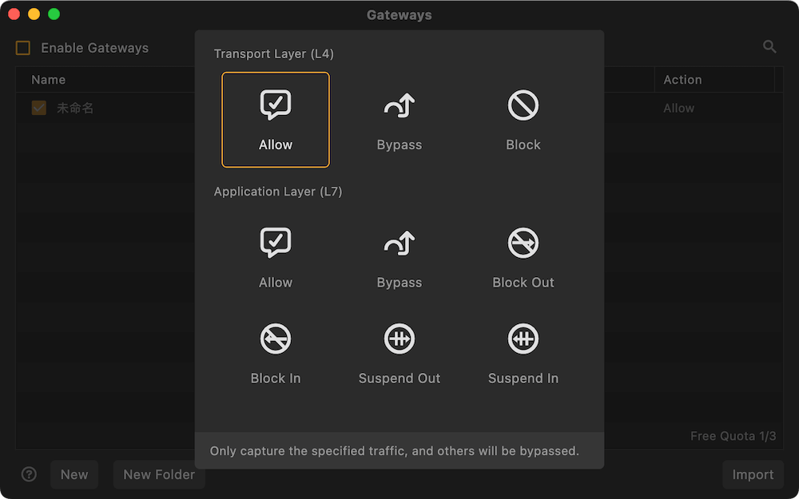
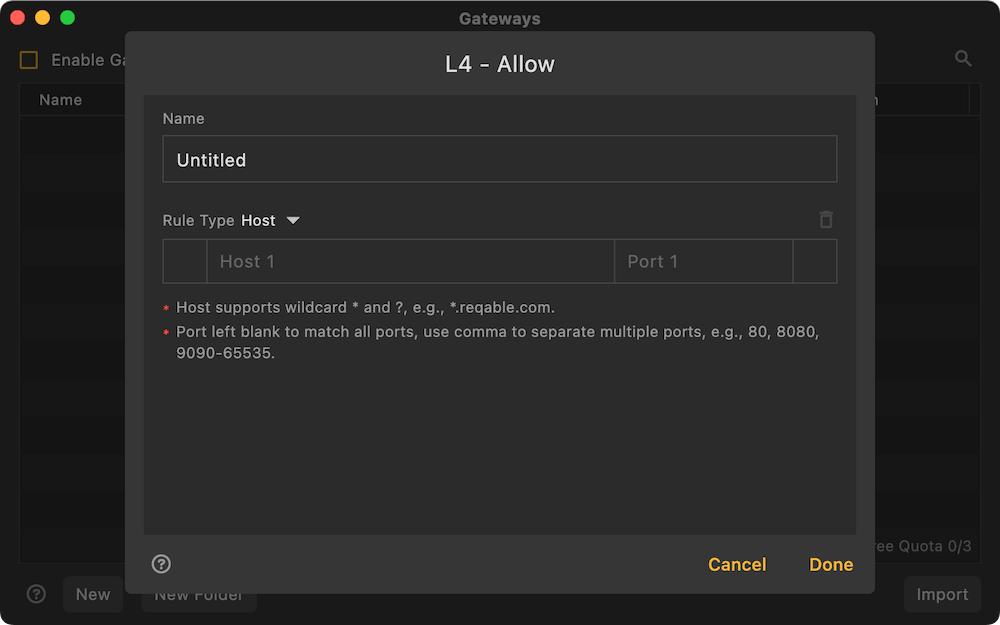
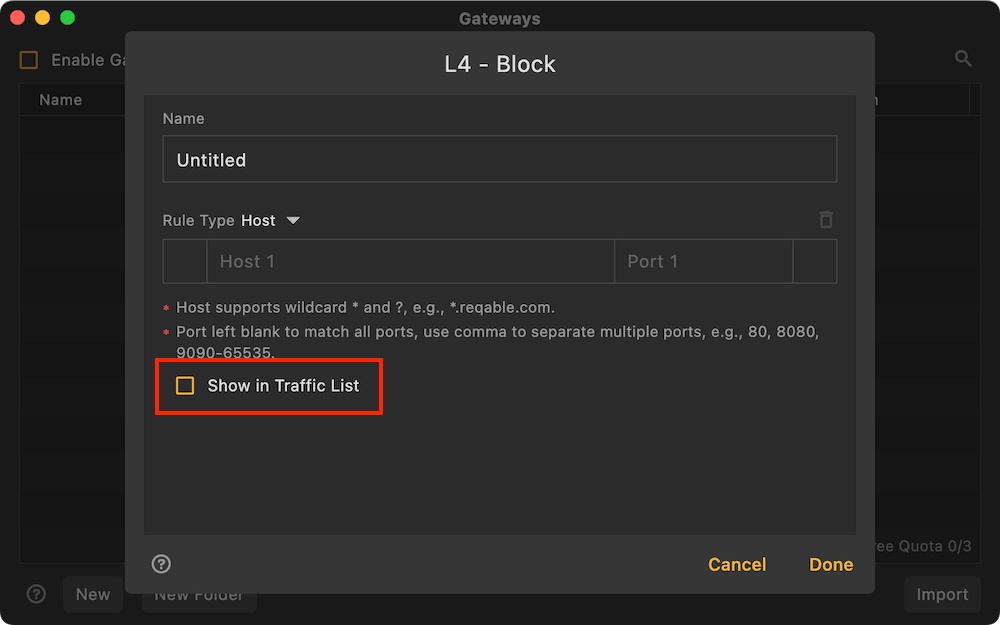
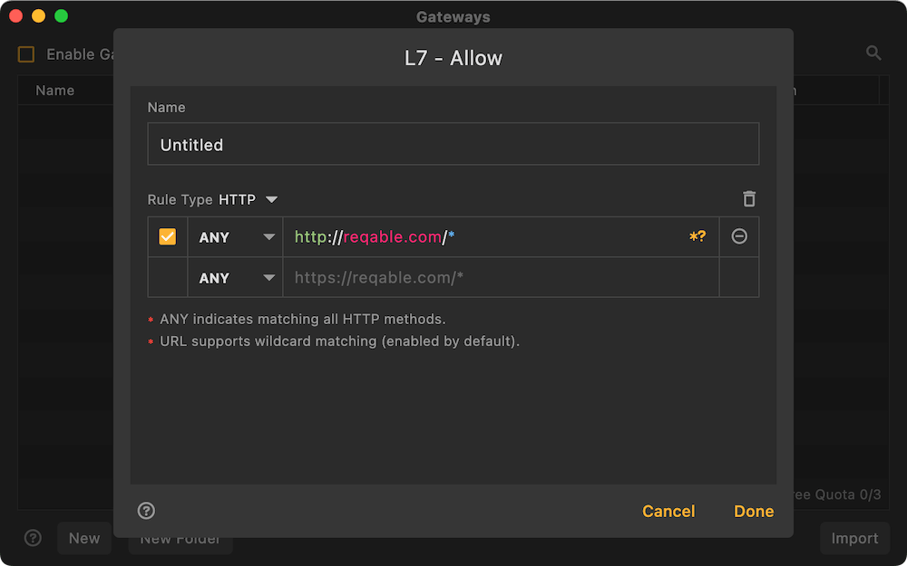
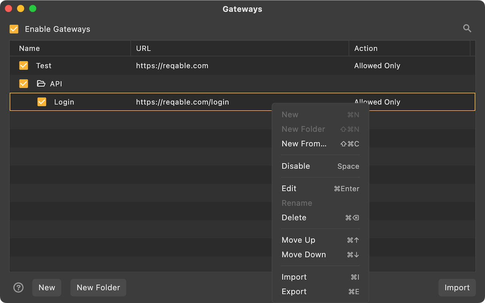

# Gateway

import Shortcut from '@site/src/components/Shortcut';

Gateway is one of the core debugging feature of Reqable. As the name suggests, means network gateway. Note that the gateway here is different from the gateway in computer terms, and it only means the unique statement about traffic control in Reqable.

You can enable the gateway via the menu path `Traffic` -> `Gateway` -> `Enable` (Shortcut key <Shortcut>Shift + Control + G</Shortcut>). Once the gateway is enabled, an activation icon will appear on the toolbar.

Click the icon above to disable the gateway, once disabled, the icon will disappear from the toolbar. If you wish to keep the gateway icon permanently visible on the toolbar, you can right-click the toolbar to edit and select to pin it.

:::info

To prevent abuse, Reqable does not provide this feature on mobile app.

:::

### Create Gateway

There are some ways to create a gateway rule:
- Traffic menu -> Gateway -> Add Rule
- Gateway icon right-click menu -> Add Rule
- Tray -> Gateway -> Add Rule
- Gateway List -> New
- Gateway List -> Right-Click Menu -> New
- Traffic list -> Select a item -> Right-click menu -> Gateway
- Shortcut key <Shortcut>Shift + Alt + G</Shortcut>

Gateways are categorized into `Network Layer (L4)` and `Application Layer (L7)` controls, corresponding to two specific layers within the OSI 7-layer network model.

The Network Layer (L4) offers three modes:

- Allow Only
- Bypass
- Block

The Network Layer (L4) supports two rule types: `Domain` and `IP/CIDR`. Multiple rules of each type can be configured, a match on any single rule will trigger the action.

The Application Layer (L7) offers six modes:

- Allow Only
- Bypass
- Block (Outbound)
- Block (Inbound)
- Suspend (Outbound)
- Suspend (Inbound)

The Application Layer (L7) supports four rule types: `Domain`, `IP/CIDR`, `HTTP`, and `WebSocket`. Multiple rules of each type can be configured, a match on any single rule will trigger the action.

Below, we provide a detailed explanation of each mode.

### Allow Only (L4)

At the Network Layer, this mode controls exactly which traffic is captured. Non-matching traffic is subject to a "Bypass" policy (rather than being blocked), consequently, only requests from the *allowed* traffic will appear in the traffic list.

::: info

If you wish to block rather than bypass traffic, please create an additional `Block` policy.

:::

### Bypass (L4)

This mode ignores matching traffic, it will not appear in the traffic list, though the traffic itself is still sent to the server. It can be viewed as the inverse of the `Allow Only` mode. This mode is ideal for filtering out irrelevant requests from the device that might otherwise clutter your view.

### Block (L4)

This mode blocks matching traffic, preventing it from being sent to the server. By default, blocked traffic does not appear in the traffic list unless you explicitly check the option `Show in Traffic List`.

### Allow Only (L7)

Functionally identical to `Allow Only (L4)`, this mode operates at the Application Layer. Because it processes traffic at a higher level, it enables more granular matching capabilities, thereby adding two additional rule types: `HTTP` and `WebSocket`. 

### Bypass (L7)

Its functionality is identical to `Bypass (L4)`, with the addition of two matching rules: `HTTP` and `WebSocket`.

### Block Outbound (L7)

Its functionality is identical to `Block (L4)`, with the addition of two matching rules: `HTTP` and `WebSocket`.

### Block Inbound (L7)

In contrast to `Block Outbound (L7)`, this rule blocks traffic sent to the client, rather than traffic sent to the server.

### Suspend Outbound (L7)

In contrast to `Block Outbound (L7)`, `Suspend` does not terminate the connection, instead, it simulates a timeout effect.

### Suspend Inbound (L7)

In contrast to `Block Inbound (L7)`, `Suspend` does not terminate the connection, instead, it simulates a timeout effect.

::: caution Priority

Processing priority for a single request that matches multiple modes: `Allow Only` > `Bypass` > `Block` > `Suspend`.

:::

### Rule Management

Rules are matched from top to bottom. The same request can match multiple rules. The one at the front will be executed first. Rules support folder-level management. You can adjust the position by long pressing and dragging. It also supports import and export, which is convenient for sharing and collaboration with others.

