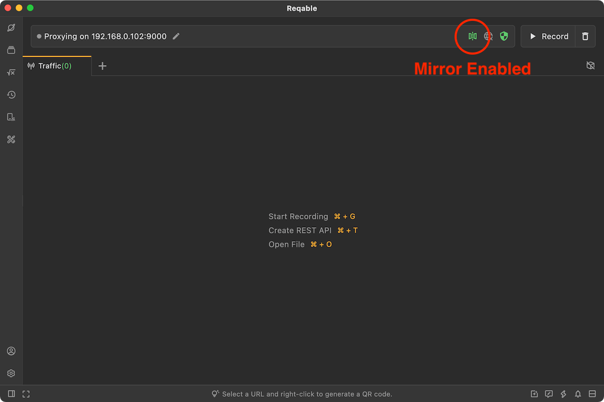
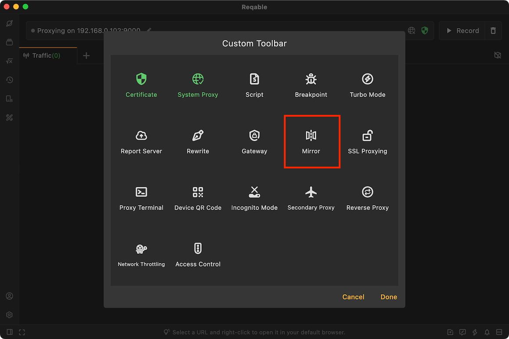

# Mirror

import Shortcut from '@site/src/components/Shortcut';

Mirror is one of the core debugging feature of Reqable, and mirror refers to host mapping. For example, accessing host A (`www.foo.com`) is mapped to accessing host B (`www.bar.com`), all requests sent by the client to host A will be sent to host B. This feature is implemented at the proxy layer, not the application layer, and belongs to the overall redirection. If you need to redirect the specified path request, please use the [Rewrite——Redirect](rewrite#redirect) instead.

:::info

Mirror is similar to modifying the system's `hosts.txt`, like modifying DNS, so `https` requests cannot be mapped to `http` requests (such as `Localhost` service). To handle this problem, please use [Rewrite Redirect](rewrite#redirect).

:::

Mirror can be enabled or disabled in four ways:
- Click directly on the mirror icon
- Right click on the mirror icon -> Enable/Disable
- Tray -> Mirror -> Enable/Disable
- Shortcut key <Shortcut>Shift + Control + M</Shortcut>

When the mirror is enabled, the mirror icon on the `QuickBar` will turn green and active.

### Create Mirror

There are six ways to create a mirror rule:
- Right click on the mirror icon -> Add Mirror
- Tray -> Mirror ->Add Mirror
- Mirror List -> Click the `+` icon in the upper right corner
- Mirror List -> Right-Click Menu -> New
- Traffic list -> Select a item -> Right-click menu -> Mirror
- Shortcut key <Shortcut>Shift + Alt + M</Shortcut>

Origin hosts support wildcard * and ? matching. The mapping rule in the above figure is to map all hosts with the suffix of foo.com to `www.reqable.com`.

:::note About Port

If no port number is specified, the HTTP request defaults to **80** port, and the HTTPS request defaults to **443** port.
Of course, you can also explicitly specify the port number, for example: `*.foo.com:8080 -> www.bar.com:9000`

:::

:::caution

Since the HTTP request of the browser or application may use `KeepAlive`, the mirror configuration cannot take effect immediately. Therefore, it is recommended to restart the browser or target application immediately after configuring the mirror.

:::

### Import and Export

Reqable supports batch import and export of mirror rules, which is convenient for sharing and collaboration with others.

