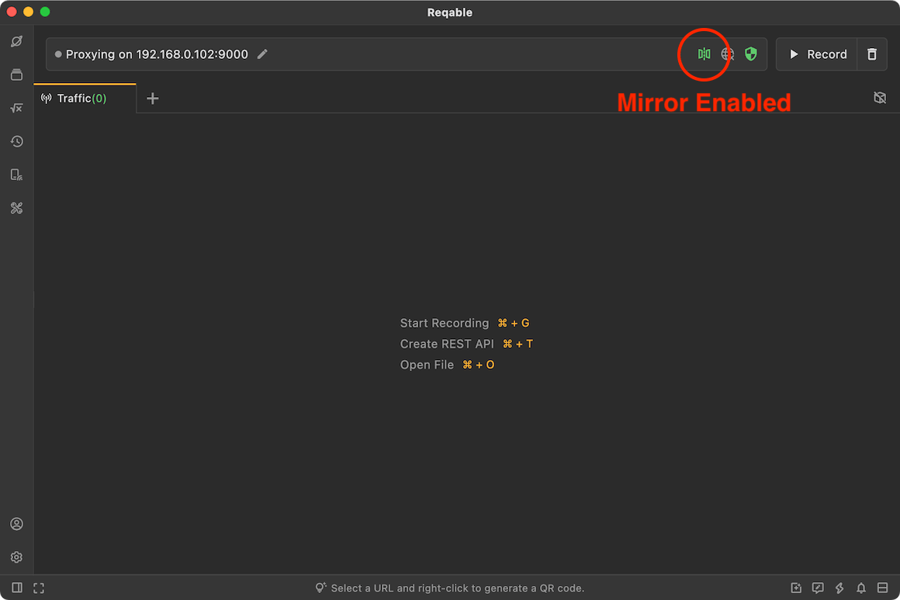
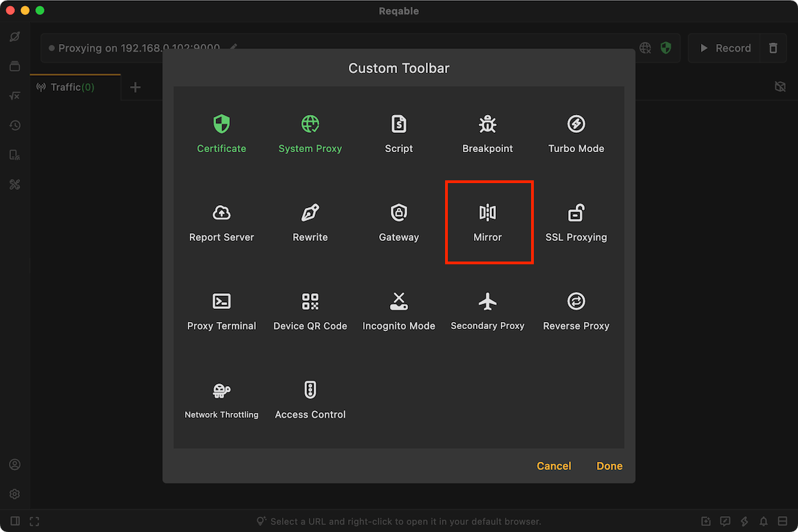
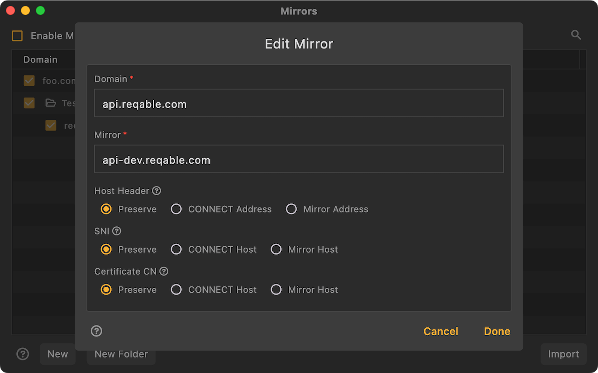
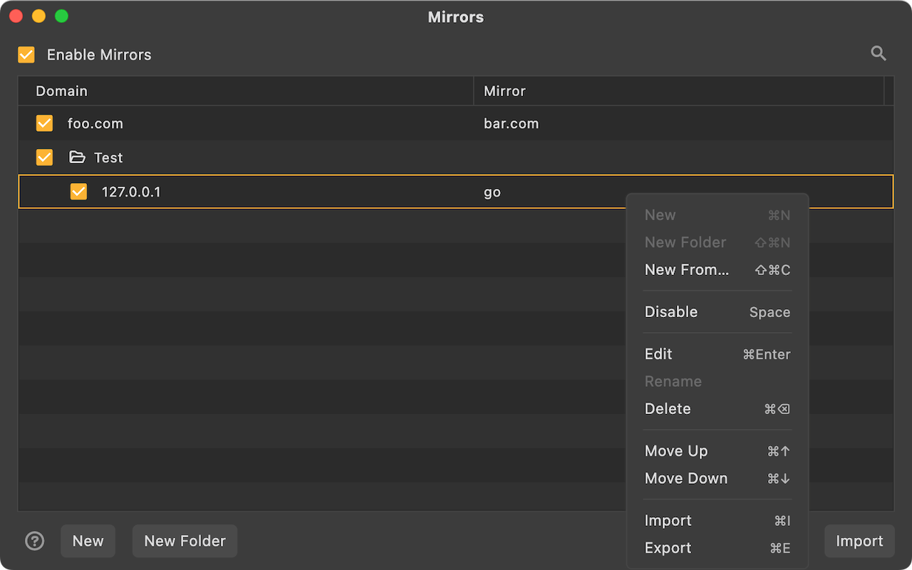

# Mirror

import Shortcut from '@site/src/components/Shortcut';

Mirror is one of Reqable's core debugging features. It maps one host to another—for example, requests to host A (`www.foo.com`) are sent to host B (`www.bar.com`). This runs at the proxy layer rather than the application layer and redirects all traffic for the host. To redirect a specific path, use [Rewrite — Redirect](rewrite#redirect) instead.

:::info

Mirror is similar to modifying the system's `hosts.txt`, like modifying DNS, so `https` requests cannot be mapped to `http` requests (such as `Localhost` service). To handle this problem, please use [Rewrite Redirect](rewrite#redirect).

:::

You can enable the mirror via the menu path `Traffic` -> `Mirror` -> `Enable` (Shortcut key <Shortcut>Shift + Control + M</Shortcut>). Once the mirror is enabled, an activation icon will appear on the toolbar.

Click the icon above to disable the mirror, once disabled, the icon will disappear from the toolbar. If you wish to keep the mirror icon permanently visible on the toolbar, you can right-click the toolbar to edit and select to pin it.

:::info

To prevent abuse, Reqable does not provide this feature on mobile app.

:::

### Create Mirror

You can create a mirror rule in several ways:
- Traffic menu -> Mirror -> Add Rule
- Mirror icon right-click menu -> Add Rule
- Tray -> Mirror -> Add Rule
- Mirror List -> New
- Mirror List -> Right-Click Menu -> New
- Traffic list -> Select an item -> Right-click menu -> Mirror
- Shortcut key <Shortcut>Shift + Alt + M</Shortcut>

The domain supports wildcard * and ? matching. If `*.reqable.com` is configured, all subdomains can be matched, including `api.reqable.com`, `www.reqable.com`, etc.

If the domain port number is not specified, HTTP requests default to **80** port, and HTTPS requests default to **443** port. Of course, the port number can also be specified explicitly, for example: `*.reqable.com:8080`.

If the mirror port number is not specified, the port number of the original domain will be used.

#### Host Header

Each HTTP request header basically contains `Host`, such as `Host: reqable.com:80`. The mirror function can specify the strategy of this value.

- Preserve, keep the `Host` unchanged.
- Use CONNECT address. The CONNECT address generally refers to the URL address, such as `reqable.com:80`. This value is generally the same as the Host header.
- Use mirror address. This changes the value of `Host` to the mirror value.

#### SNI

Server Name Indication, which is generally included in the handshake packet of SSL/TLS. This value will affect the verification of SSL certificate.

- Preserve, keep the SNI value unchanged.

- Use CONNECT address. The CONNECT address generally refers to the original domain, such as `reqable.com`. This value is generally the same as the SNI.
- Use mirror address. This changes the SNI to the mirror value.

#### Certificate CN

Common name of Certificate, this value will affect the verification of SSL certificate.

- Preserve, keep the CN value unchanged.

- Use CONNECT address. The CONNECT address generally refers to the original domain, such as `reqable.com`. This value is generally the same as the CN.
- Use mirror address. This changes the CN to the mirror value.

:::caution

Since the HTTP request of the browser or application may use `KeepAlive`, the mirror configuration cannot take effect immediately. Therefore, it is recommended to restart the browser or target application immediately after configuring the mirror.

:::

### Rules Management

Rules are matched from top to bottom. The same request can match multiple rules. The one at the front will be executed first. Rules support folder-level management. You can adjust the position by long pressing and dragging. Import and export are also supported for sharing rules with others.

