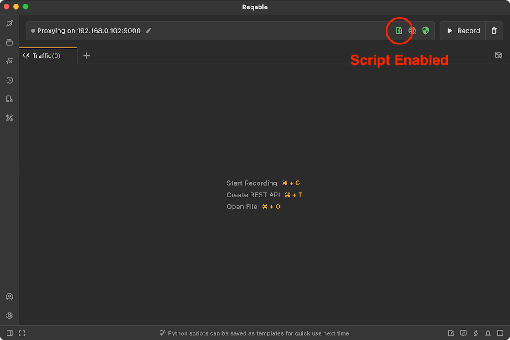
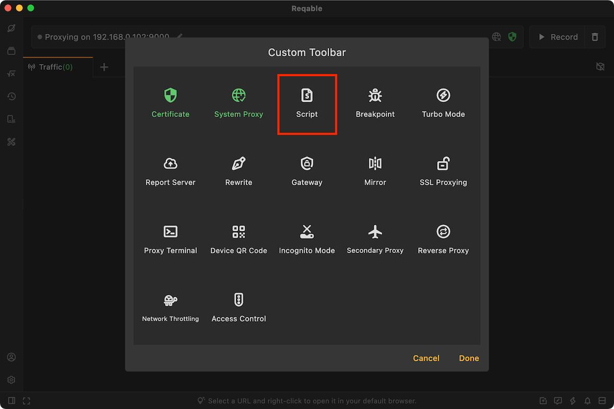
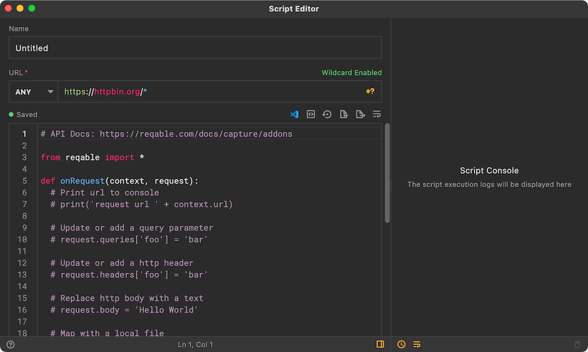
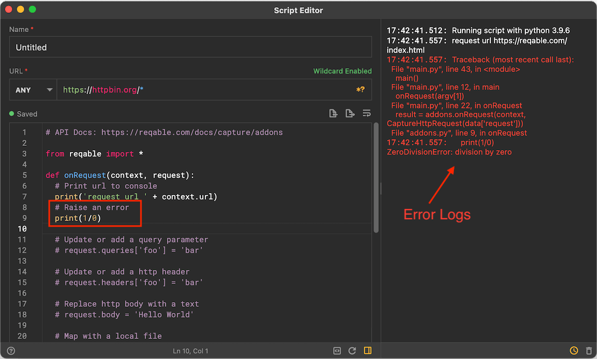
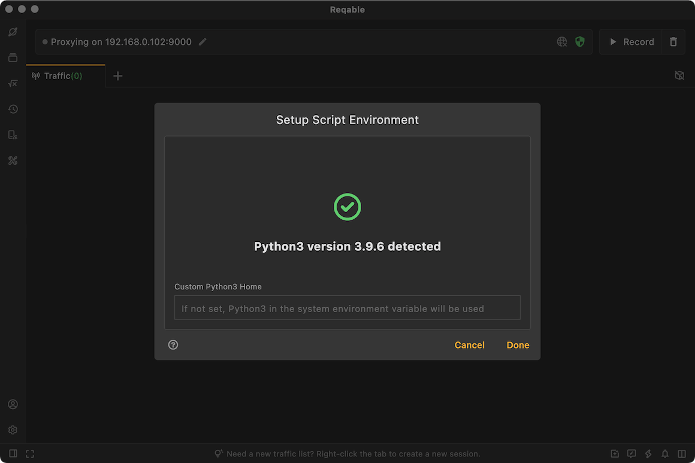

# Script

import Shortcut from '@site/src/components/Shortcut';

Script is one of the core debugging feature of Reqable, which supports writing Python scripts to process HTTP requests and responses. Reqable provides a set of Python-based APIs. In scripts, we can modify, replace or delete the request and response packets, and even interrupt the request and response. In addition to using Reqable's built-in API, users can also use various Python site-packages, such as `requests` and so on.

Script can be enabled or disabled in four ways:
- Click directly on the script icon
- Right click on the script icon -> Enable/Disable
- Tray -> Script -> Enable/Disable
- Shortcut key <Shortcut>Shift + Control + P</Shortcut>

When the script is enabled, the script icon on the `QuickBar` will turn green and active.



### Create Script

There are six ways to create a script rule:
- Right click on the script icon -> Add Script
- Tray -> Script ->Add Script
- Script List -> Click the `+` icon in the upper right corner
- Script List -> Right-Click Menu -> New
- Traffic list -> Select a item -> Right-click menu -> Script
- Shortcut key <Shortcut>Shift + Alt + P</Shortcut>

Enter the rule name and matching URL, the URL supports wildcard * and ? matching, then write Python scripts to handle HTTP request and response.



### Edit Script

The script runs with Python3 and must use Python3 syntax. The script provides two function call entries: `onRequest` and `onResponse`, as the name implies, process request and response.

After the script is modified, it will be saved automatically, or you can manually use the shortcut key <Shortcut>Control + S</Shortcut> to save it immediately.

#### onRequest

This function is called before the request is sent to the server, and the developer can modify the request within the scope of this function.

The function receives two parameters [CaptureContext](addons#api-context) and [HttpRequest](addons#api-request) and returns [HttpRequest](addons#api-request).

:::info Request Interrupt

If you need to interrupt a request, the result of the onRequest function returns `None`!

:::

#### onResponse

This function is called before the response is sent to the client. Developers can modify the response within the scope of this function.

The function receives two parameters [CaptureContext](addons#api-context) and [HttpResponse](addons#api-response) and returns [HttpResponse](addons#api-response).

:::info Response Interrupt

If you need to interrupt a request, the result of the onResponse function returns `None`!

:::

#### Lifecycle

It should be noted that the two functions `onRequest` and `onResponse` run in different processes, so the two functions cannot directly share external variables. If you need to share data, please use the `shared` variable of [CaptureContext](addons#api-context).

```python
def onRequest(context, request):
  context.shared = 'foobar'
  return request

def onResponse(context, response):
  print(context.shared) # print foobar
  return response
```

### API Docs {#api-addons}

Migrated to [Addons API](addons)!

### Debug Console

Reqable provides a debug console, which is convenient for developers to view the log output of scripts and the backtrace information of script errors. Keep the script editor window open during script execution, and all information will be output to the console in real time.



In the example above, we wrote a division by zero error, and the corresponding error message was also displayed in the console.

### Environment {#env}

The script function depends on the local Python3 environment, please make sure that Python3 is installed on the local device. For beginners, please refer to [Python3 Download and Installation](https://www.runoob.com/Python3/Python3-install.html).

:::caution

**Python3 version must be greater than 3.6**

:::

If there are multiple Python3 environments on your machine, you can manually specify the Python3 Home path: **Right-click the script icon -> Setup Environment**



### Rules Management

Rules are matched from top to bottom. The same request can match multiple rules. The one at the front will be executed first. Rules support folder-level management. You can adjust the position by long pressing and dragging. It also supports import and export, which is convenient for sharing and collaboration with others.

