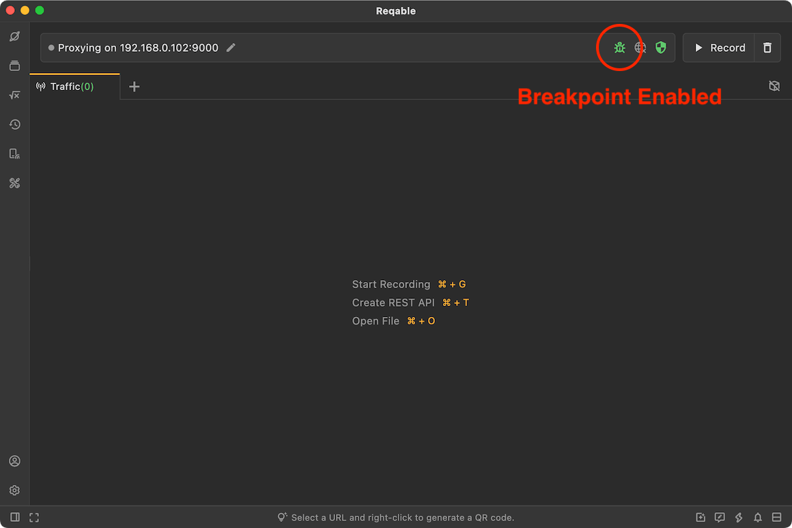
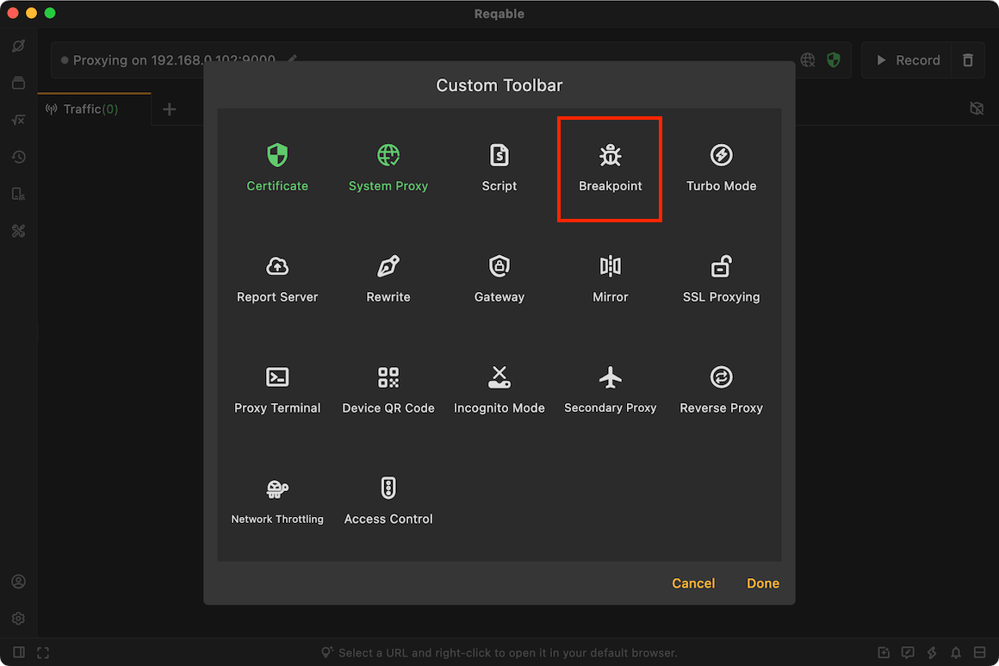
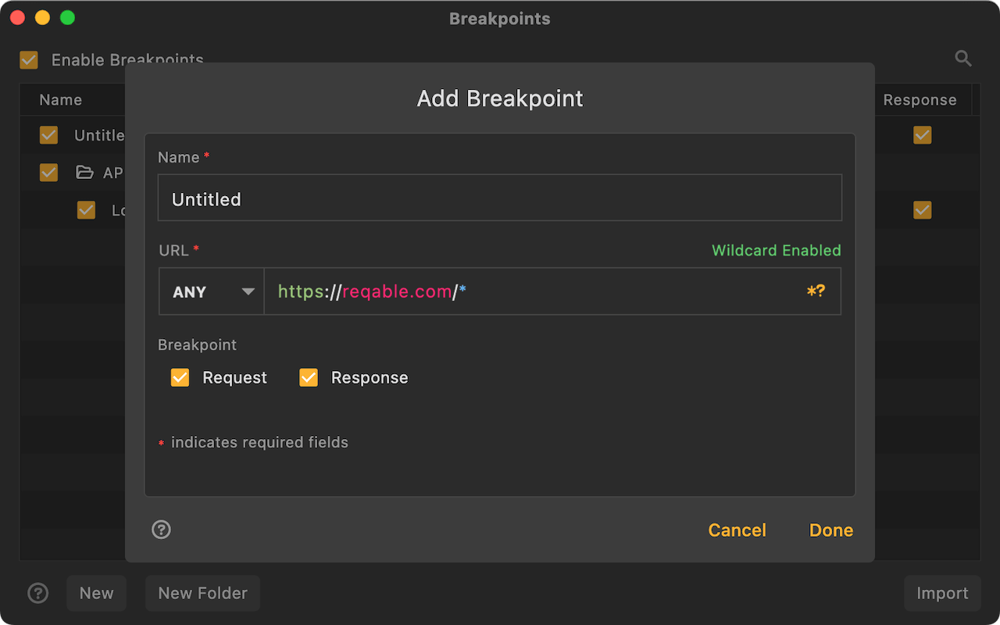
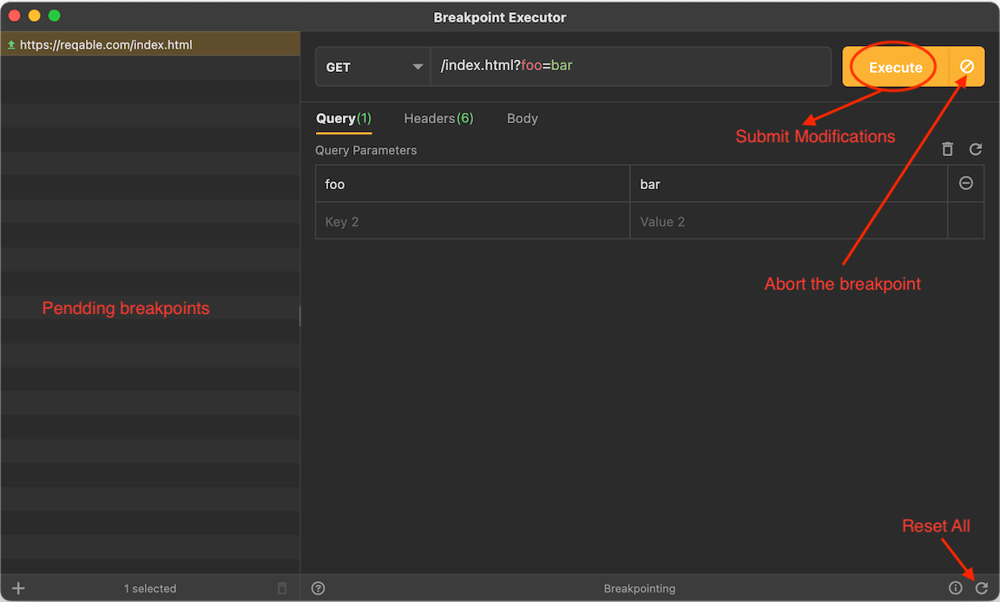

# Breakpoint

import Shortcut from '@site/src/components/Shortcut';

Breakpoint is one of the core debugging feature of Reqable. By setting matching rules, the request and response can be controlled and modified in real time after the breakpoint is triggered.

Breakpoint can be enabled or disabled in four ways:
- Click directly on the breakpoint icon
- Right click on the breakpoint icon -> Enable/Disable
- Tray -> Breakpoint -> Enable/Disable
- Shortcut key <Shortcut>Shift + Control + B</Shortcut>

When the breakpoint is enabled, the breakpoint icon on the `QuickBar` will turn green and active.

### Create Breakpoint

There are six ways to create a breakpoint rule:
- Right click on the breakpoint icon -> Add Breakpoint
- Tray -> Breakpoint ->Add Breakpoint
- Breakpoint List -> Click the `+` icon in the upper right corner
- Breakpoint List -> Right-Click Menu -> New
- Traffic list -> Select a item -> Right-click menu -> Breakpoint
- Shortcut key <Shortcut>Shift + Alt + B</Shortcut>

Enter the rule name and matching URL, the URL supports wildcard * and ? matching. When the request or response matches, it will automatically enter the breakpoint operation interface.

### Executor {#executor}

After the breakpoint takes effect, the operation interface as shown in the figure below will pop up automatically. On this page, we can modify the data and submit.

:::caution

- When the client or server is disconnected, the breakpoint will automatically become invalid and the data cannot be submitted.
- Each breakpoint request is in a separate thread. If there are too many requests and it exceeds the thread pool limit, it will not enter the breakpoint list and will need to wait until the existing breakpoint requests are completed.

:::

### Rules Management

Rules are matched from top to bottom. The same request can match multiple rules. The one at the front will be executed first. Rules support folder-level management. You can adjust the position by long pressing and dragging. It also supports import and export, which is convenient for sharing and collaboration with others.

