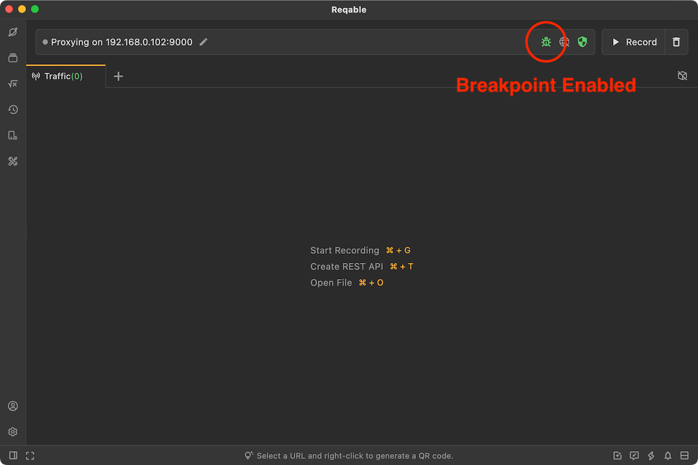
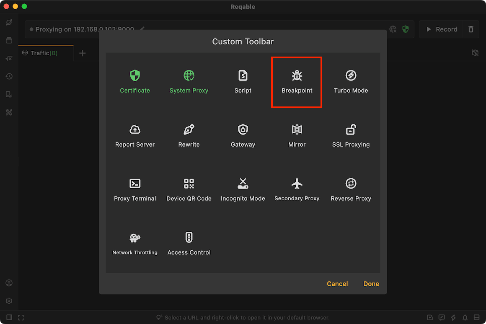
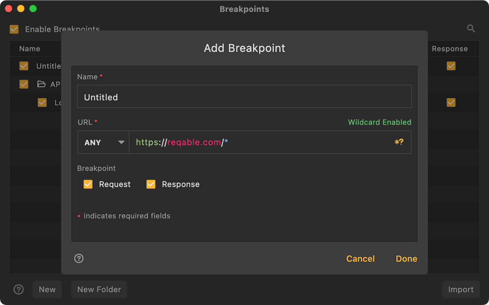
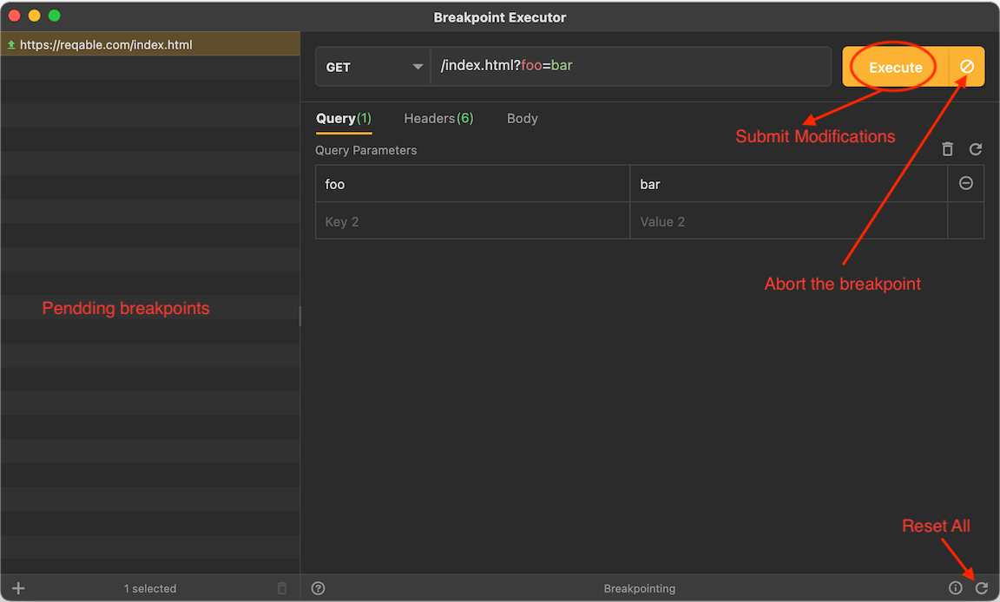
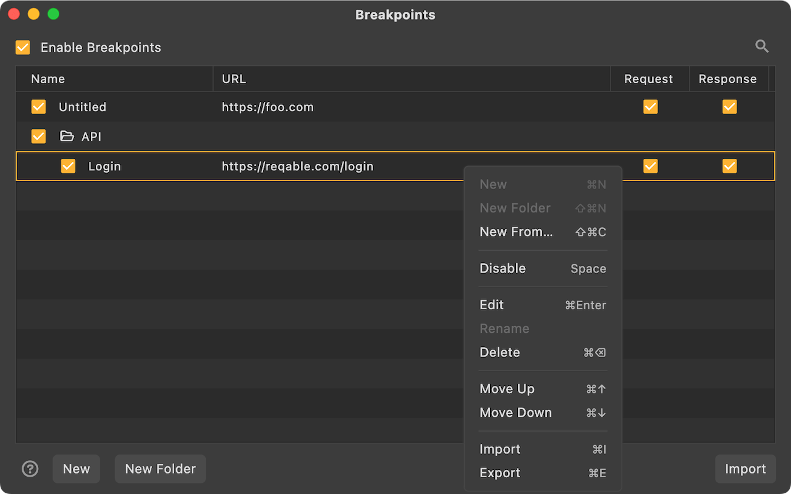

# Breakpoint

import Shortcut from '@site/src/components/Shortcut';

Breakpoint is one of the core debugging features of Reqable. By setting matching rules, the request and response can be controlled and modified in real time after the breakpoint is triggered.

You can enable the breakpoint via the menu path `Traffic` -> `Breakpoint` -> `Enable` (Shortcut key <Shortcut>Shift + Control + B</Shortcut>). Once the breakpoint is enabled, an activation icon will appear on the toolbar.

Click the icon above to disable the breakpoint, once disabled, the icon will disappear from the toolbar. If you wish to keep the breakpoint icon permanently visible on the toolbar, you can right-click the toolbar to edit and select to pin it.

:::info

To prevent abuse, Reqable does not provide this feature on mobile app.

:::

### Create Breakpoint

You can create a breakpoint rule in several ways:
- Traffic menu -> Breakpoint -> Add Rule
- Breakpoint icon right-click menu -> Add Rule
- Tray -> Breakpoint -> Add Rule
- Breakpoint List -> New
- Breakpoint List -> Right-Click Menu -> New
- Traffic list -> Select an item -> Right-click menu -> Breakpoint
- Shortcut key <Shortcut>Shift + Alt + B</Shortcut>

Enter the rule name and matching URL, the URL supports wildcard * and ? matching. When the request or response matches, it will automatically enter the breakpoint operation interface.

### Executor {#executor}

When a breakpoint is hit, the editor shown below opens automatically. Modify the data and submit.

:::caution

- When the client or server is disconnected, the breakpoint will automatically become invalid and the data cannot be submitted.
- Each breakpoint request is in a separate thread. If there are too many requests and it exceeds the thread pool limit, it will not enter the breakpoint list and will need to wait until the existing breakpoint requests are completed.

:::

### Rules Management

Rules are matched from top to bottom. The same request can match multiple rules. The one at the front will be executed first. Rules support folder-level management. You can adjust the position by long pressing and dragging. Import and export are also supported for sharing rules with others.

