# Rewrite

import Shortcut from '@site/src/components/Shortcut';

Rewriting is one of Reqable's core debugging features, which automatically modifies requests or responses through preset rules. Reqable's rewriting supports 5 modes: [Redirection](#redirect), [Replace Request](#replace-req), [Replace Response](#replace-res), [Modify Request](#modify- req) and [Modify Response] (#modify-res).

Rewrite can be enabled or disabled in four ways:
- Click directly on the rewrite icon
- Right click on the rewrite icon -> Enable/Disable
- Tray -> Rewrite -> Enable/Disable
- Shortcut key <Shortcut>Shift + Control + K</Shortcut>

When the rewrite is enabled, the rewrite icon on the `QuickBar` will turn green and active.

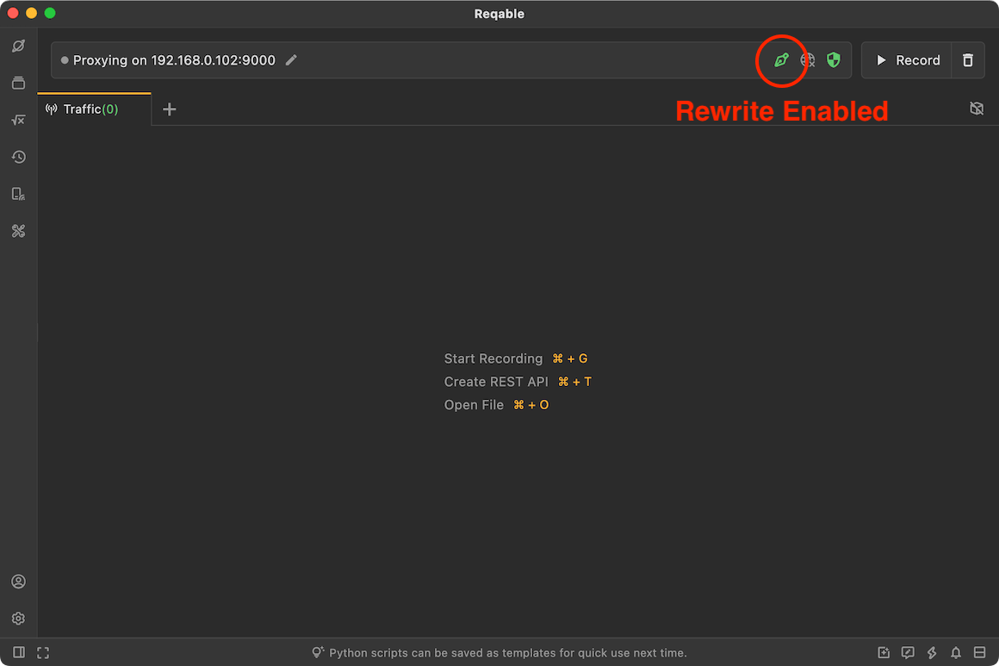

### Create Rewrite

There are six ways to create a rewrite rule:
- Right click on the rewrite icon -> Add Rewrite
- Tray -> Rewrite ->Add Rewrite
- Rewrite List -> Click the `+` icon in the upper right corner
- Rewrite List -> Right-Click Menu -> New
- Traffic list -> Select a item -> Right-click menu -> Rewrite
- Shortcut key <Shortcut>Shift + Alt + G</Shortcut>

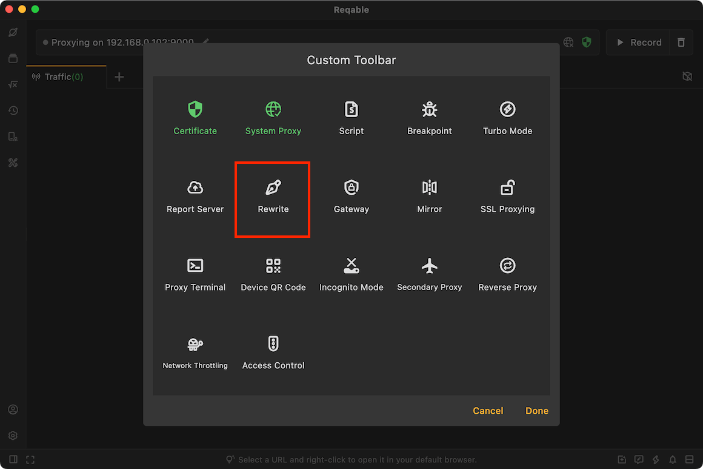

Enter the rule name and matching URL, the URL supports wildcard * and ? matching. Finally set an rewriting behavior. Reqable supports the following five rewriting behaviors.

### Redirection{#redirect}

Compared with [Mirror](mirror), rewrite redirection provides more fine-grained operation, for example, the request A: `https://hello.com/foo`, can be redirected to request B: `https://hello.com/bar`.

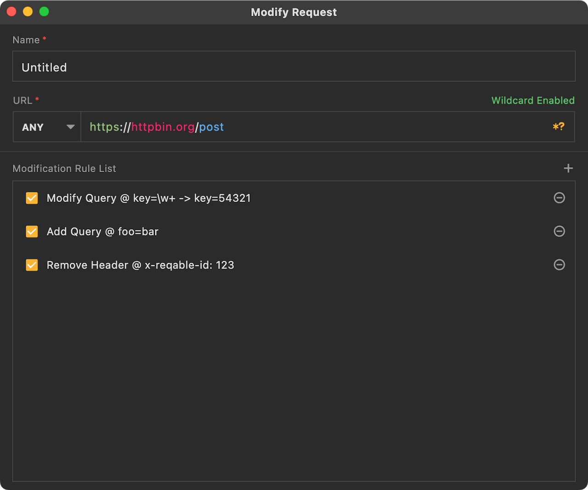

The picture above is the redirection edit page, there are a few points to note:
- **Reserve host in headers** When requesting a new URL address, whether to keep the Host value of the request header as the original address. It is generally not recommended to enable this option. Different server frameworks have different processing logic for Host, which may cause request failure.
- **Directory Match** If the new URL address ends with /*, it means match the subdirectory of the original address.
- **Exclude URL** This is optional, and can be configured when the redirected URL needs to be excluded.

The following is an example of redirection, if we need to set a redirection for the following URL:
```
https://hello.com/foo/bar/ok?abc=123
```
redirected to
```
https://world.com/new/*
```
Then the actual redirected URL is
```
https://world.com/new/foo/bar/ok?abc=123
```
:::warning

Under the implementation of the current version, if the server address of the original request cannot accessed, the request will directly fail (that is, no redirection request will be initiated).

:::

### Replace Request{#replace-req}

This rewriting behavior means to directly replace the request data, supports method, path, headers and body.

:::info Tips

When creating a rewrite rule from the right-click menu of the traffic list, the request data will be automatically filled in, and we only need to modify it slightly.

:::

#### Replace Method and Path

No matter what the original request method and path are, it will be replaced with the preset request method and path.

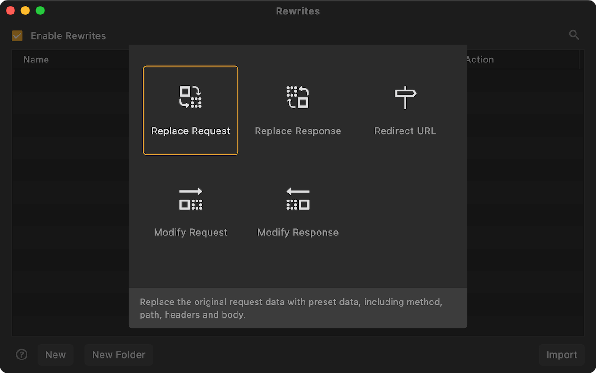

#### Replace Request Headers {#repleace-req-headers}

Whatever the original request headers are, it will be replaced with the preset request headers.

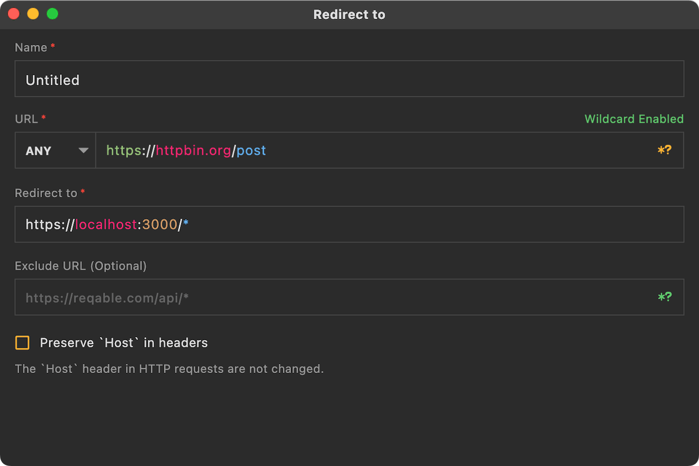

:::caution About Content-Length

Regardless of whether there is a preset Content-Length, the final Content-Length value will be automatically recalculated. So there is no need to care about Content-Length when replacing the header.

:::

#### Replace Request Body {#repleace-req-body}

Whatever the original request body is, it will be replaced with the preset request body.

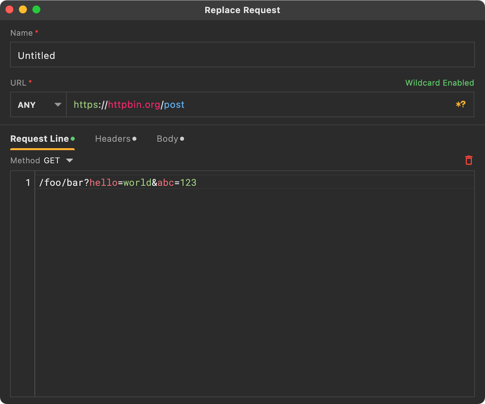

Reqable supports preset three body types: empty, text and local file.

### Replace Response {#replace-res}

This rewriting behavior means to directly replace the response data, supports status code, headers and body.

#### Replace Status Code

Whatever the original response status is, it will be replaced with the preset response status.

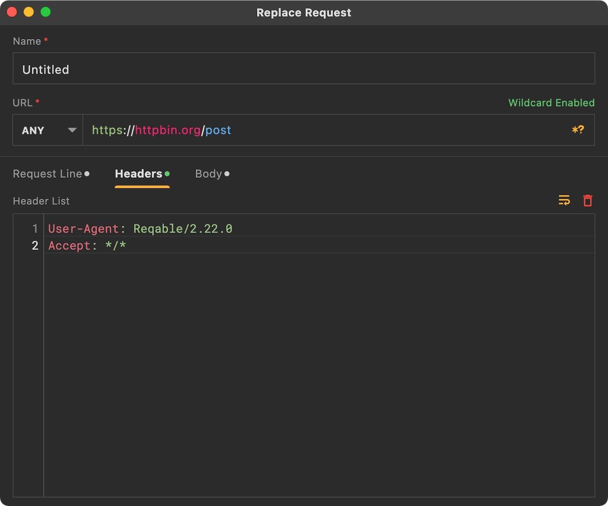

#### Replace Response Headers

See [Replace Request Headers](#repleace-req-headers)

#### Replace Response Body

See [Replace Request Body](#repleace-req-body)

### Modify Request {#modify-req}

Compared with [Replace Request](#replace-req), this behavior provides a more detailed modification strategy. For example, delete query parameters, modify an item in the request header, and replace the content of the request body with regex.

For example, with the following request parameters, we want to modify the key value to 54321, but keep other parameters unchanged.

```url
https://reqable.com?key=12345&foo=bar&hello=world
```

Now you only need to create a key matching replacement rule.

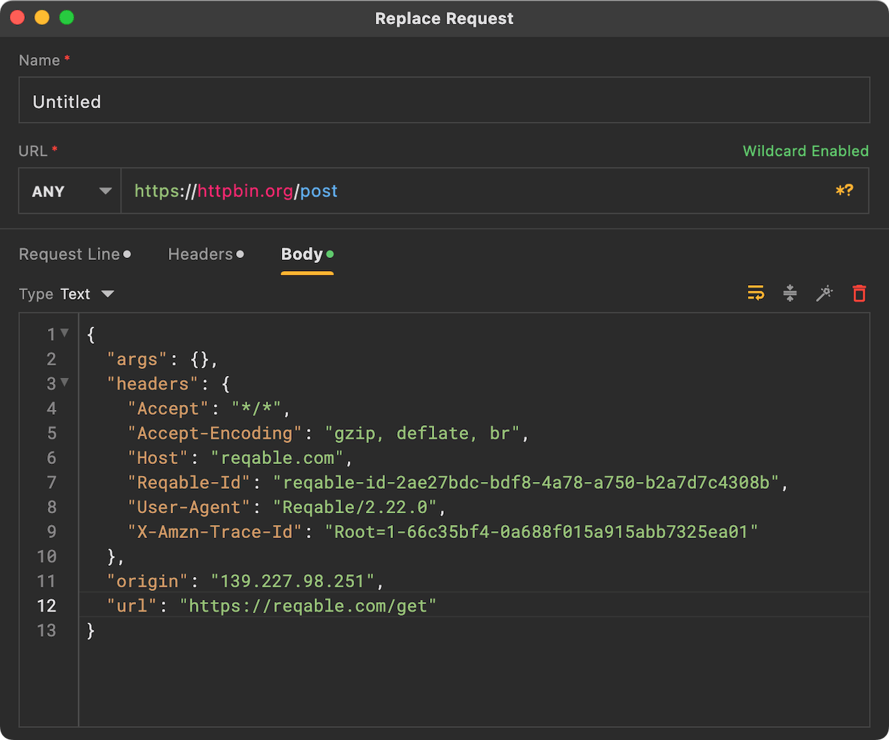

If it is more complicated, we don't know the specific value of the key, but we still want to replace it with 54321, we can use regular expressions.


To make it more complicated, if we want to add a prefix `api-` to the original key value, we can use regular expressions and `$` group replacement.

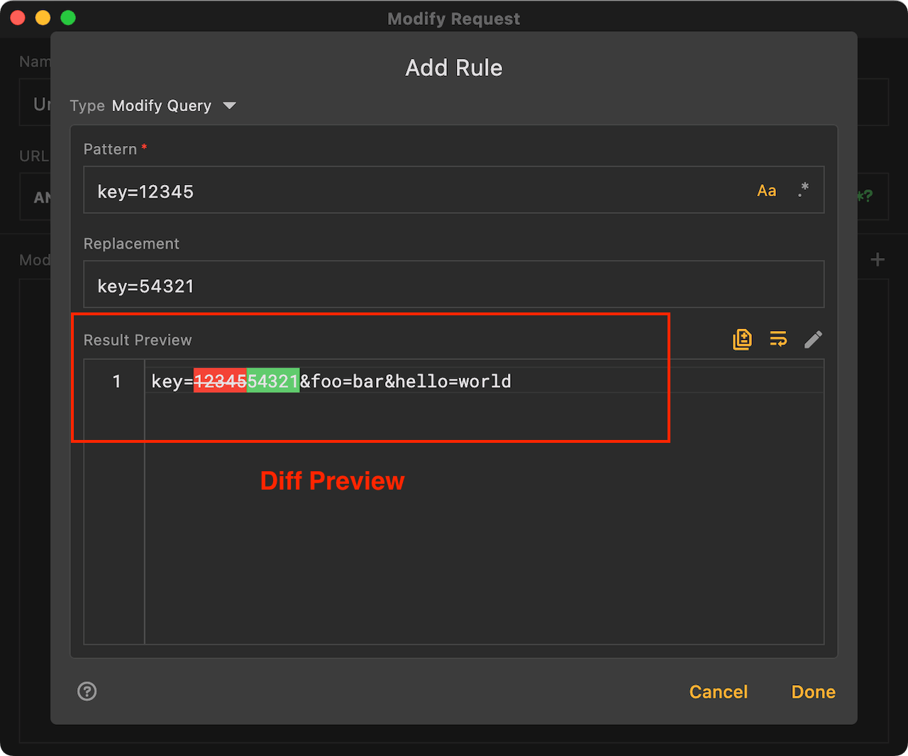

A request can create and apply multiple modification rules, which we can manage in the list.

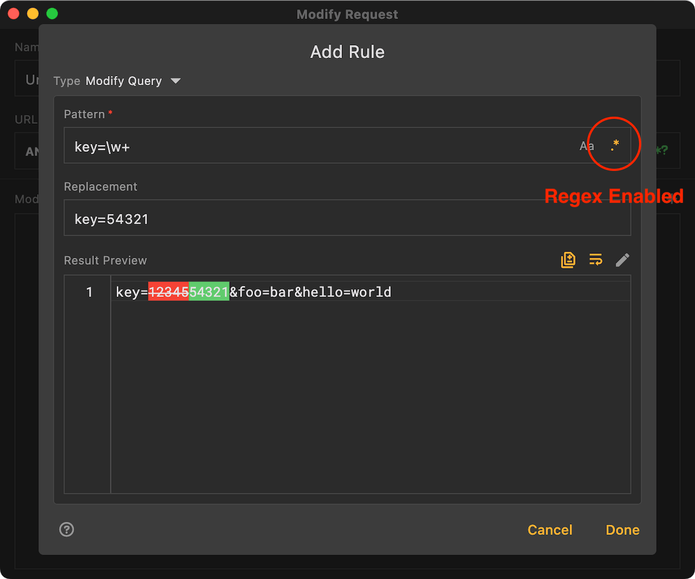

:::caution

- This behavior does not support modifying the request method and path.
- Do not modify the value of the request header Content-Length, because the final value of Content-Length will be automatically recalculated.

:::

### Modify Response {#modify-res}

Same as [Modify Request](#modify-req).

:::caution

- This behavior does not support modifying the response status code.
- Do not modify the value of the request header Content-Length, because the final value of Content-Length will be automatically recalculated.

:::

### Rules Management

Rules are matched from top to bottom. The same request can match multiple rules. The one at the front will be executed first. Rules support folder-level management. You can adjust the position by long pressing and dragging. It also supports import and export, which is convenient for sharing and collaboration with others.

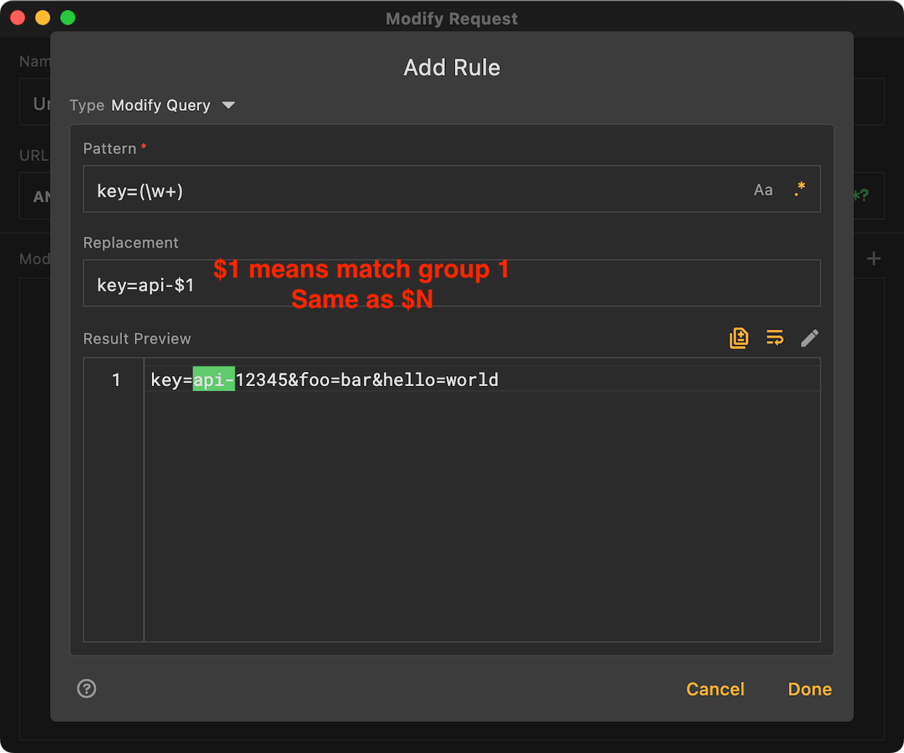