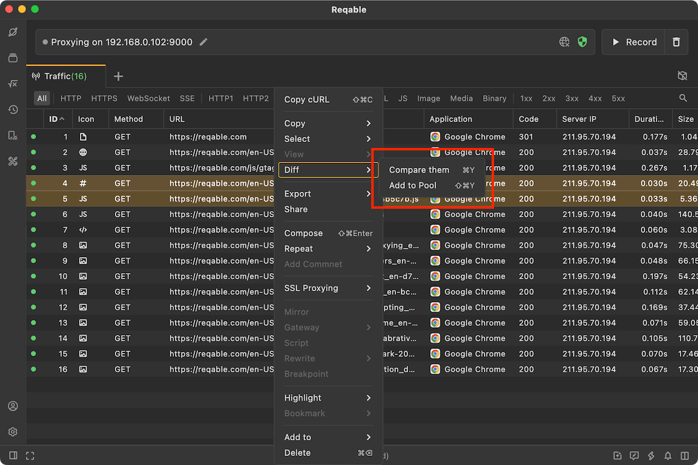
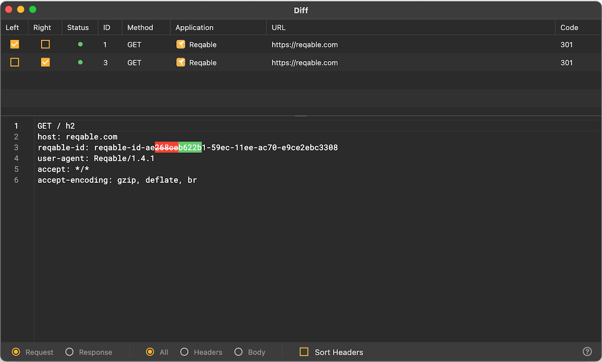

# Diff

import Shortcut from '@site/src/components/Shortcut';

When analyzing requests and locating bugs, we may need to compare some request or response contents. Reqable provides a built-in tool to assist users in Diffing request or response.

### How to Use

After selecting two requests, choose `Diff` in the right-click menu, or use the shortcut key <Shortcut>Control + Y</Shortcut> to compare the two requests immediately.

Reqable will automatically pop up the diff window, and users can select the content to be compared.

If there are multiple requests, you can also add them to the diff list and make a selection. Similarly, right-clicking on the diff list can perform operations such as deletion and clearing.