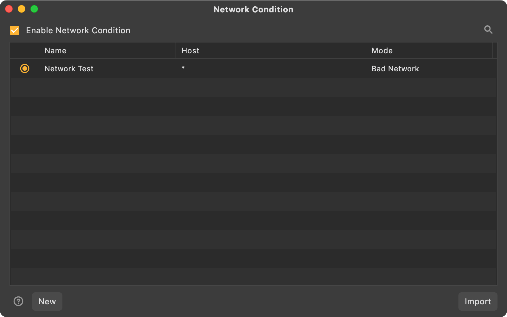
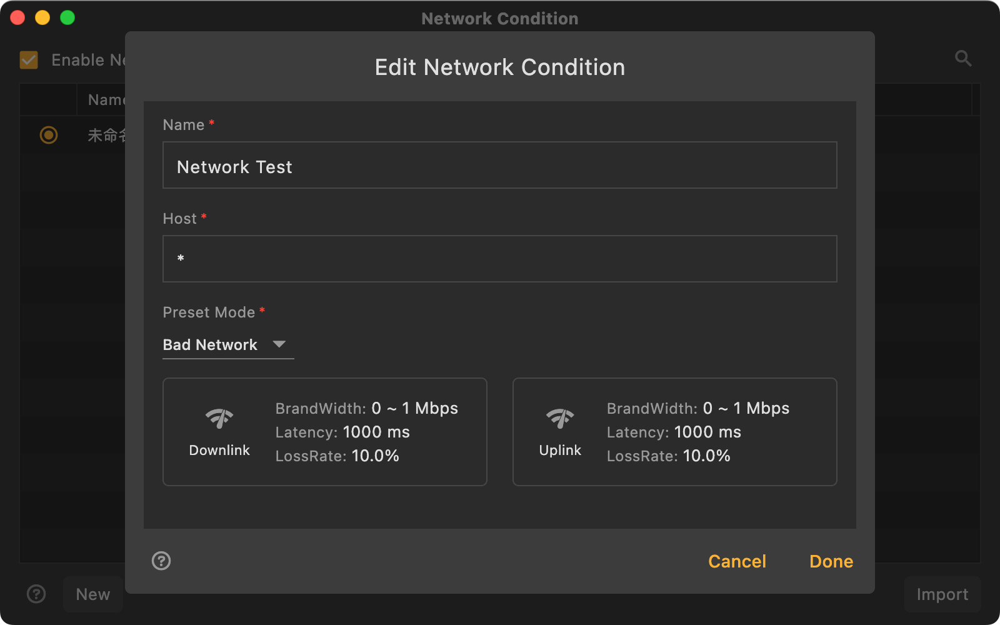

# Network Condition

import Shortcut from '@site/src/components/Shortcut';

Reqable supports setting network conditions for specified domain names and simulating different network environments, such as offline, weak network, 2G, etc.

:::info
This feature is available in version v2.23.0+.
:::

### How to use

Select `Network Condition` from the `Tools` menu or use the shortcut <Shortcut>Alt + J</Shortcut> to open the configuration page.

Users can configure different network conditions for different hosts, but only one network condititon configuration can be enabled at a time. Host supports wildcard `*` and `?`, and also supports the port number.

:::info
If you need to configure the network condition globally, just fill in `*` in the host.
:::

Reqable has preset common network condition modes, and currently does not support user customization. The preset network condition is as follows:

|   Preset Mode  |  Uplink Bandwidth |  Downlink Bandwidth |  Latency  |  Packet Loss Rate  |
|    ----    | ----  | ----  | ----  | ----  |
|    Offline    |   0 bps  |  0 bps  |  0 ms | 100% |
|    Bad Network    |0～1 Mbps|0～1 Mbps| 1000ms | 10% |
|    Slow Network    |1～5 Mbps|1～5 Mbps| 100ms | 0% |
|    Fast Network    |5～20 Mbps|5～20 Mbps| 30ms | 0% |
|    2G    |0～240 kbps|0～200 kbps| 1200ms | 2.5% |
|    3G    |0～780 kbps|0～330 kbps| 400ms | 0% |
|    4G    |30～50 Mbps|5～10 Mbps| 50ms | 0% |
|    5G    |40～70 Mbps|7～15 Mbps| 0ms | 0% |
|    Wi-Fi    |25～40 Mbps|15～30 Mbps| 0ms | 0% |

- Uplink Bandwidth: affects the speed of data upload. The actual bandwidth calculation will take a random value within the interval.
- Downlink bandwidth: affects the speed of data download. The actual bandwidth calculation will take a random value within the interval.
- Latency: The minimum delay time for processing each data packet. If the bandwidth is not enough to trigger a delay, the actual delay may exceed this value.
- Packet Loss Rate: simulates network abnormalities. If packet hits the loss, the request fails.