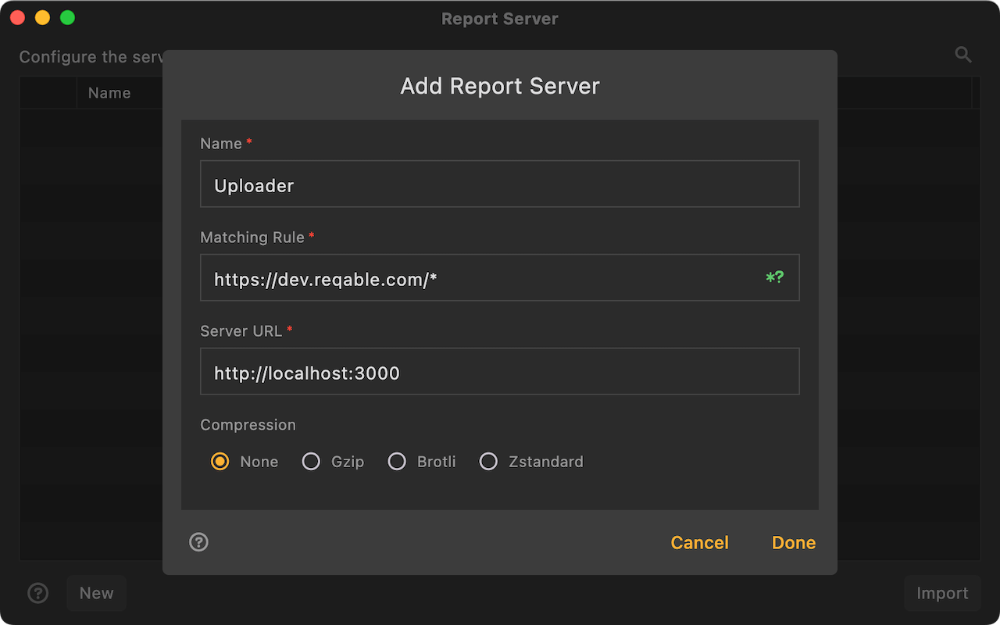

# Report Server

Reqable supports automatically uploading captured HTTP requests and responses to a specified server, which can be applied to scenarios such as data collection.

:::info
This feature is available in version v2.20.0+.
:::

### How it works?

Users need to deploy a server to receive data reported by Reqable. Reqable communicates with the server using the HTTP protocol, request method is `POST`, and the request path can be defined by the user. Whenever Reqable detects that a HTTP session is completed, it sends the data to the server in the HTTP Archive format (JSON). After receiving the data, the server parses the data according to the HTTP Archive format and performs customized operations. The transmission supports compression, and users can choose an algorithm like Gzip, Brotli, and Zstandard.

### How to use

Open `Tools` -> `Report Server`, specify a configuration name, a URL matching rule for the data to be collected (supports the `*` and `?` wildcards), and an upload path of the server to receive data. It is recommended to select the compression algorithm for efficiency.

For example, if you want to collect all traffic under the `dev.reqable.com` domain name, you can configure the rule as `https://dev.reqable.com/*`.

Reqable also carries the following data in the request header:
- x-reqable-platform：The platform name that Reqable runs on, such as windows, macos, linux, android, ios, etc.
- x-reqable-reporter-host：The domain name of the current session, suc as `dev.reqable.com`.
- x-reqable-reporter-rule：The rules of hit.

:::caution
Each HTTP session Reqable will only be sent once, and will not be retried if the sending fails.
:::

We provide a code example of a Python server for reference:

https://github.com/reqable/report-server-example/blob/main/server.py