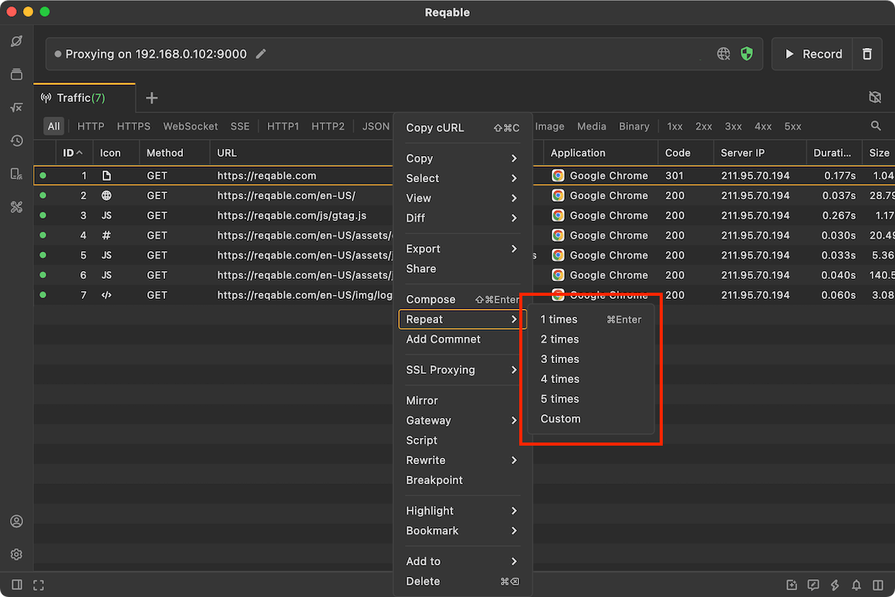
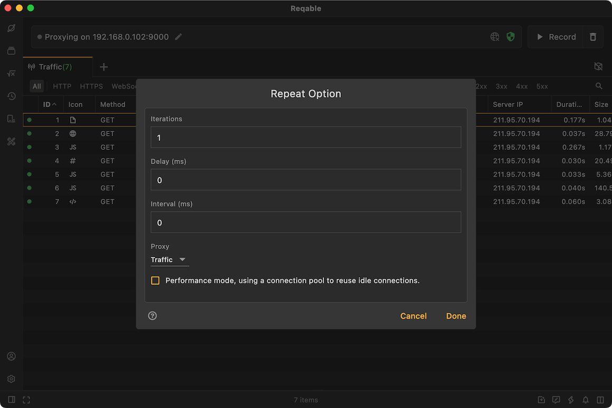

# Repeat

import Shortcut from '@site/src/components/Shortcut';

Reqable can replay one or more requests. Select the requests that need to be replay and right-click:



Use the shortcut key <Shortcut>Control + Enter</Shortcut> to quickly replay the selected requests once each.

### Advanced Repeat

Reqable also supports customization of replaying requests, including times, delays, intervals, and proxy configurations.



- Interations: The number of times the request was sent.
- Delay: Indicates how long it takes for the request to start sending, in milliseconds.
- Interval: Indicates the time interval sent between each request, in milliseconds. Valid for sending times greater than 1.
- Proxy: You can set the proxy configuration for the request, including not using a proxy, using a debug proxy, and using a system proxy.

For example:
```
Jack set a replay request https://www.test.com/get at 13:00:00,
Interations is 3 times, the delay is 3000ms, and the interval is 10000ms.
The time point of sending the first request is 13:00:03, with a delay of 3s.
The time point of sending the second request is 13:00:13, with a delay of 13s.
The time point when the third request is sent is 13:00:23, with a delay of 23s.
```

Requests are performed concurrently, and there can be up to **255** connections at the same time, and requests exceeding this number need to be queued.

:::caution

- If you want the request to appear in the traffic list, please set the proxy to **Debug**.
- If you use this function to stress test the server, it is recommended to set the proxy to **Unset**.

:::
