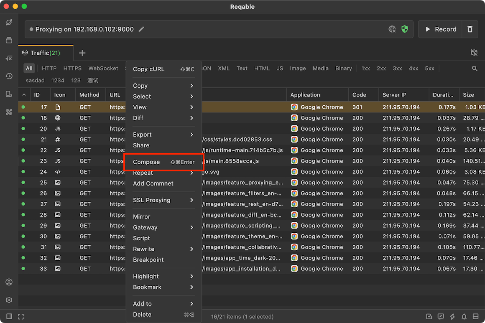
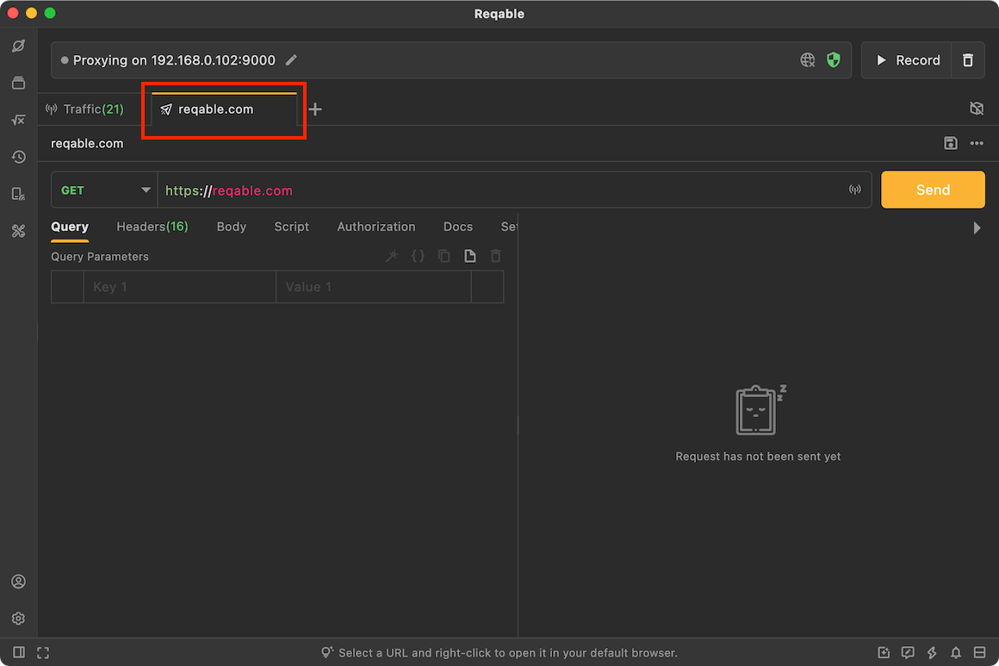

# Compose

import Shortcut from '@site/src/components/Shortcut';

Reqable supports composing the API in the traffic list, just select a record and right-click to compose (shortcut key <Shortcut>Control + Shift + Enter</Shortcut>)

This will automatically create a new API session, and the method, protocol, path, query parameters, headers and body will be automatically imported into the API editor.

