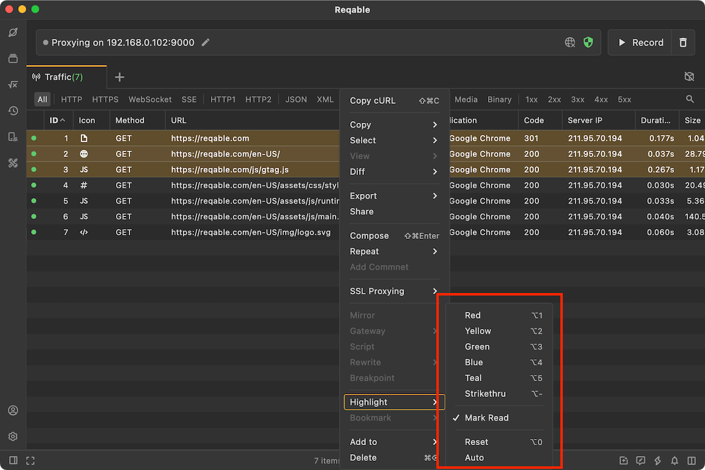
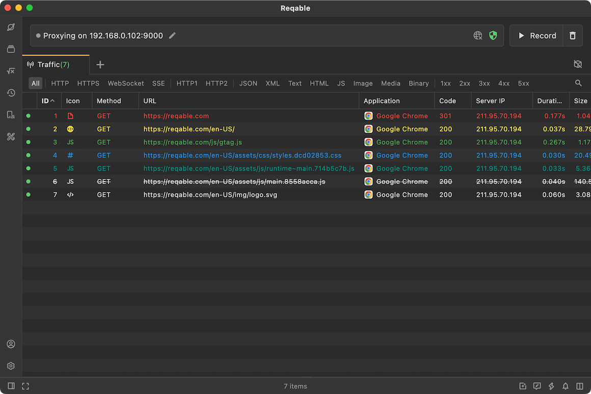
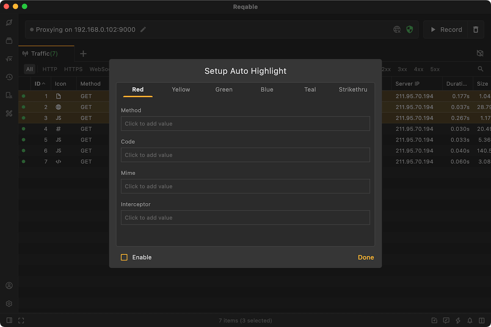

# Highlight

import Shortcut from '@site/src/components/Shortcut';

Reqable can set the highlight state for the item, and supports six highlights:
- Red
- Yellow
- Green
- Blue
- Gray
- Strike-Through

Of course, you can also use the shortcut key <Shortcut>Control + 1/2/3/4/5/-</Shortcut>, the highlighting effect is as follows:

If you want to reset the highlighting, you can use the shortcut key <Shortcut>Control + 0</Shortcut> .

Reqable can also set automatic highlighting, which automatically highlights the item that meets the requirements (this feature is disabled by default, and you need to enable it).

