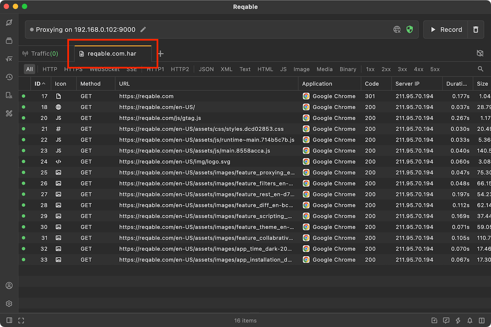
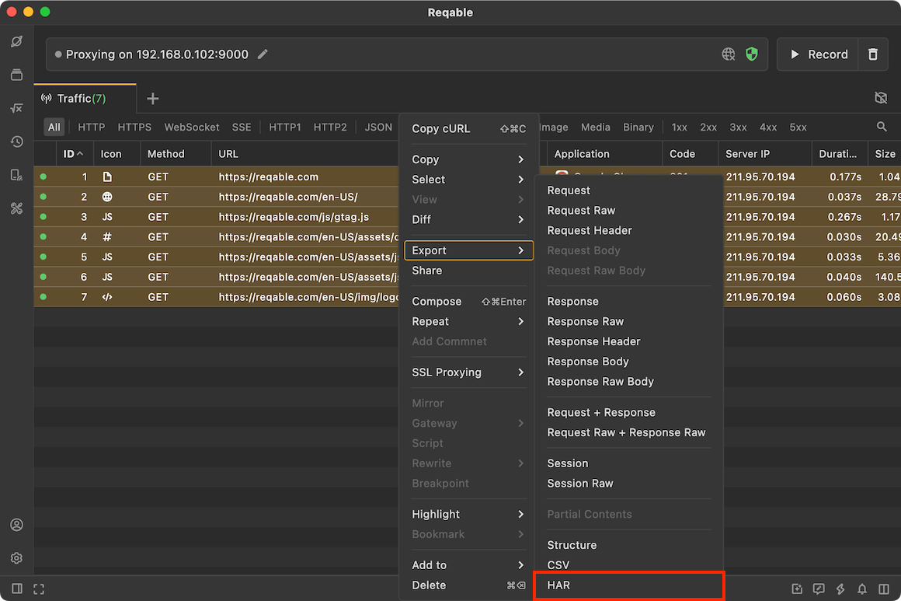

# HAR

import Shortcut from '@site/src/components/Shortcut';

Reqable will automatically associate [HAR](https://en.wikipedia.org/wiki/HAR_(file_format)) format files, and supports opening and exporting HAR files.

There are three ways to open a HAR file:
- Application Menu -> File -> Open File.
- Drag the HAR file to the Reqable main window and release.
- Shortcut key <Shortcut>Control + O</Shortcut>

We can also save the traffic list as a HAR file. You can select the items and right-click to export it, or right-click the tab to save all.

