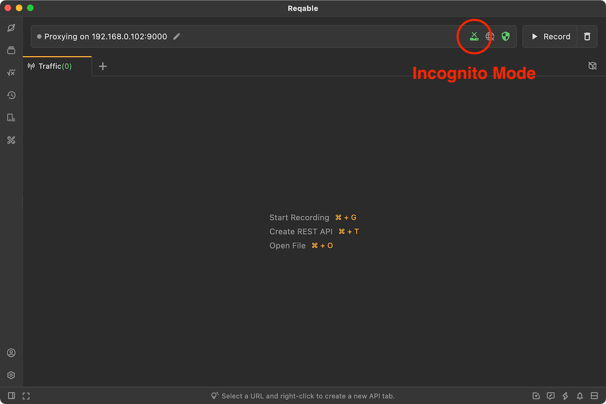
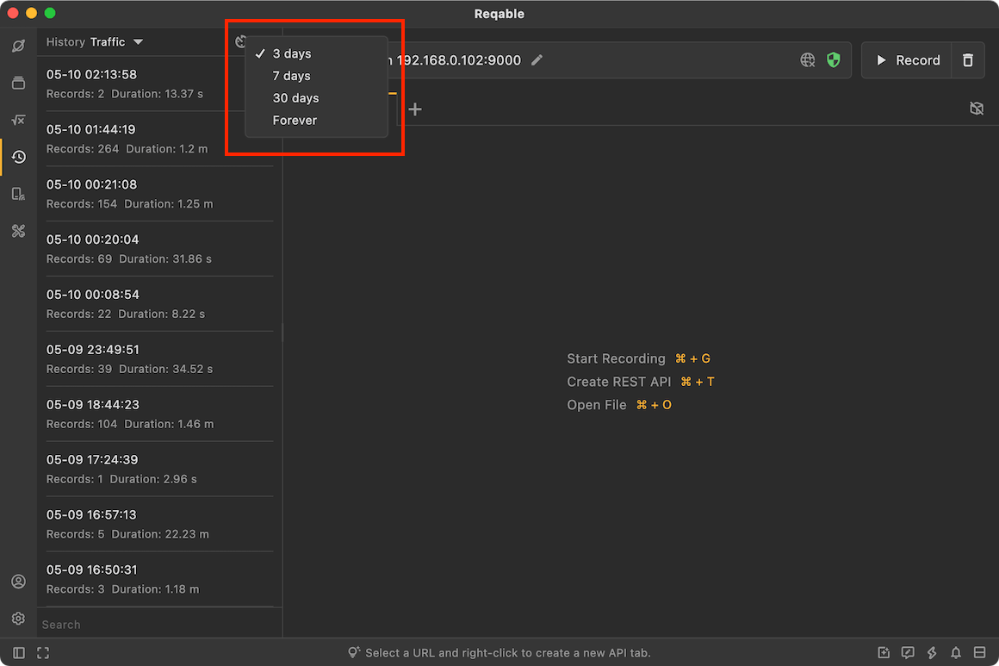

# History

Reqable will automatically save traffic data to the history, this feature is enabled by default. If you want to protect your privacy, you can choose to manually enable the incognito mode, and all traffic in this mode will not be stored to history.

To improve performance, Reqable will store traffic data in files, including history. If the traffic is too large or the historical data is too much, the local file storage may occupy too much space and the user needs to manually delete and clean it up. If automatic cleaning is required, you can set a suitable cache time.

:::caution
The default cache period for history is 7 days. However, due to historical reasons, the default configuration for early users is permanent. This may result in data not being automatically cleaned up and requires manual settings.
:::