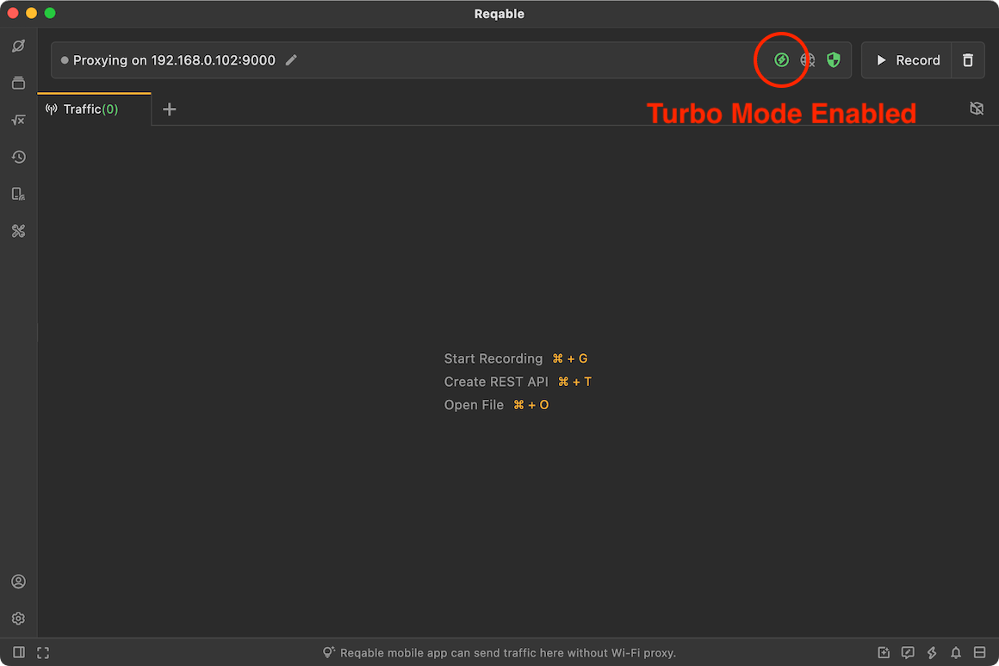

# Turbo Mode

Reqable provides the turbo mode to optimize the performance. In turbo mode, the traffic list will not be updated, but [Gateway](gateway), [Mirror](mirror), [Script](script), [Rewrite](rewrite) and [Breakpoint](breakpoint) still work. This mode helps to keep the system resource usage low.

