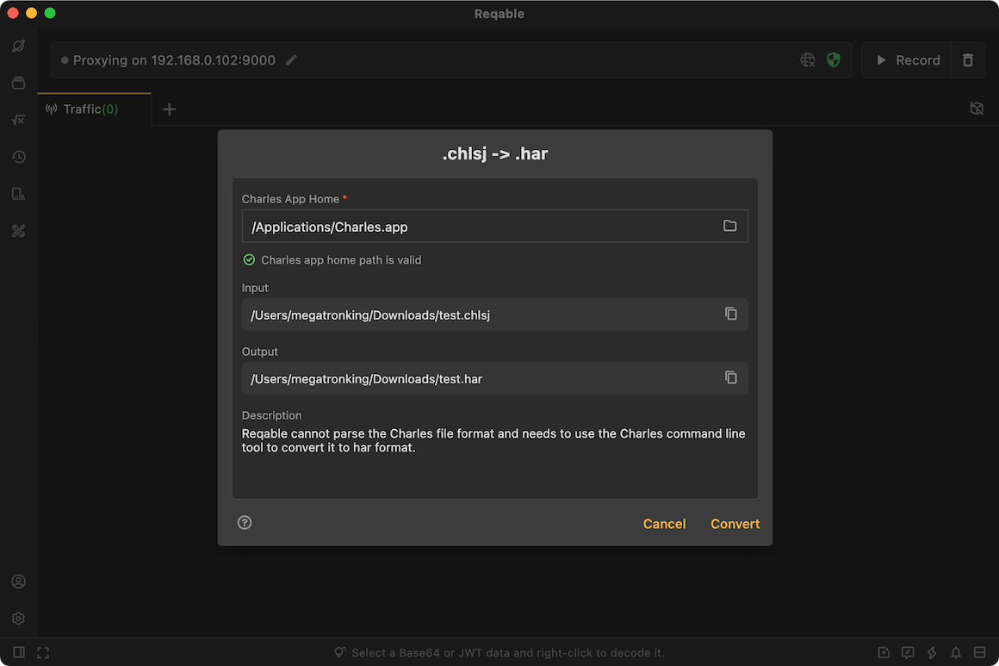

# Charles Support

Reqable supports viewing Charles Session files, but since Charles Session files are a format unique to Charles applications, Reqable cannot read them directly and needs to rely on Charles Command-line tools. When opening a Charles Session file, Reqable will automatically call the Charles command line to parse it into `HAR` format. The user only needs to configure the directory where the Charles application is located in advance.

If the directory where the Charles application is located is not configured in advance, the following pop-up window will appear when opening the Charles Session file:

After the configuration is ok, click `Convert`.