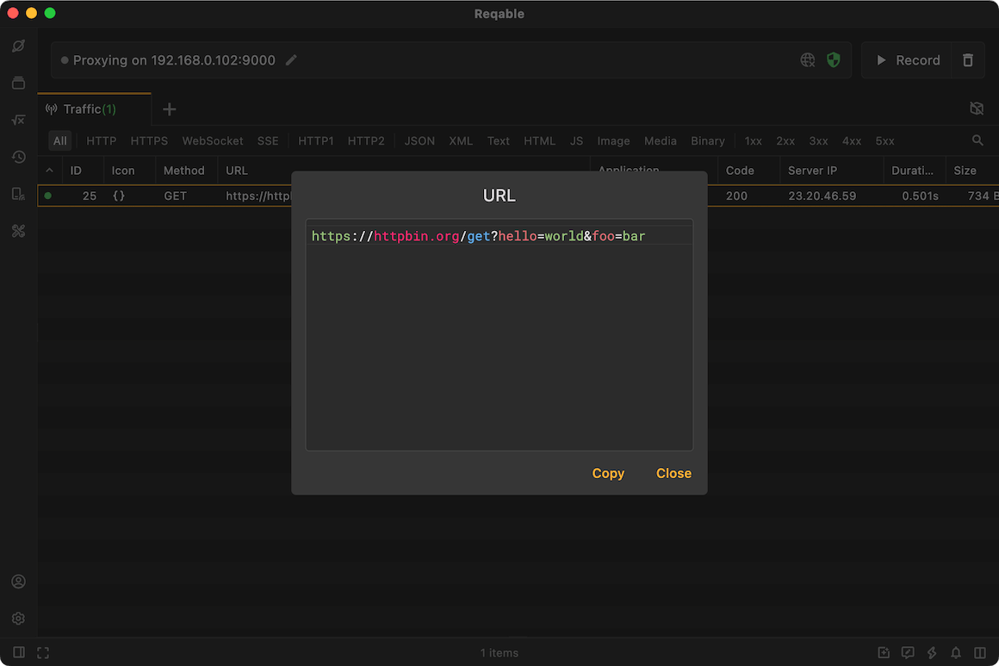
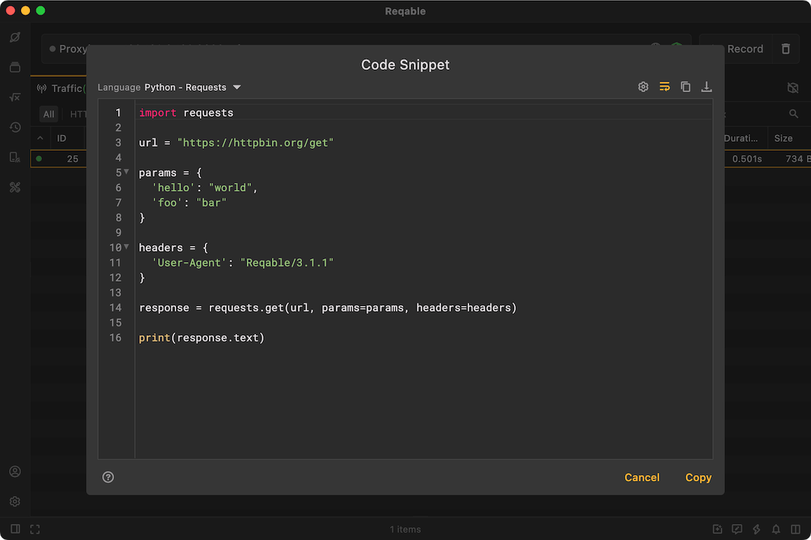

# View-As

import Shortcut from '@site/src/components/Shortcut';

Reqable provides some commonly used viewing functions, let me introduce it to you.

### URL

Long URLs may not be fully displayed in the traffic list. Reqable provides a URL viewer (shortcut key <Shortcut>Control + U</Shortcut>). Select the request, right-click -> View -> URL, and a URL viewer pop-up window will open.

### Code Snippet

Reqable can directly convert the request into code, shortcut key <Shortcut>Alt + S</Shortcut>, or select the request and right-click -> View -> Code Snippet, a code snippet pop-up window will open.

Reqable currently supports code snippet for the following languages and libraries.

- C - cURL
- Go - Native
- Java - AsyncHttp
- Java - java.net.http
- Java - OkHttp
- Java - Unirest
- Javascript - Axios
- Javascript - Fetch
- Javascript - Jquery
- Javascript - XHR
- Kotlin - OkHttp
- NodeJS - Axios
- NodeJS - Fetch
- NodeJS - Native
- NodeJS - Request
- NodeJS - Unirest
- PHP - cURL
- PHP - Guzzle
- Python - http.client
- Python - Requests
- Shell - cURL

If you have requirements for other languages and network libraries, you can click [here](https://github.com/reqable/reqable-app/issues/new/choose) to submit an issue!

### QR-Code

Reqable can convert the request URL into a QR code, which is convenient for scanning with mobile devices. The shortcut key is <Shortcut>Alt + U</Shortcut>, or you can right-click -> View -> QR code after selecting the request, and the QR code will be opened.

### Application Home

When the traffic application source is detected, Reqable supports opening the file manager and directly locating the directory where the application is located. Select the request, right-click -> View -> Application Home.

:::info

- This feature currently does not support Linux platforms.
- Some applications may not be able to detect the localtion.

:::