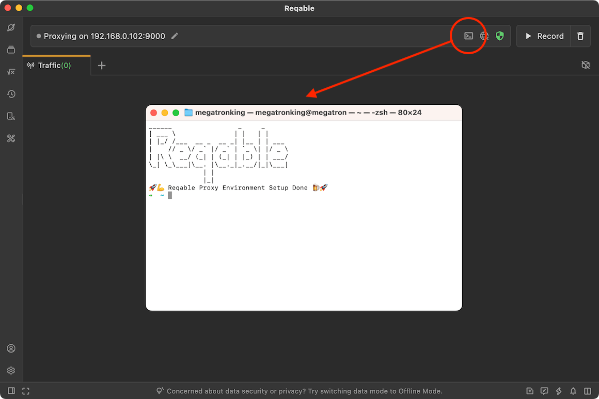

# Proxy Terminal

When sending HTTP(s) requests or executing scripts in the command line, the traffic of these requests will not pass through Reqable. The developer must to manually configure the environment variables (such as HTTP_PROXY) in the terminal, or specify the proxy address in the source code. Although these methods can work, but inefficient.

In addition, many network libs do not trust the CA certificates installed by the system. After setting up the debugging proxy, the request will still report an error, such as Python's requests.

Reqable can start a terminal with one click and automatically configure the proxy environment and solve the CA certificate trust issue.

:::info
This feature is available in version v2.26.0+.
:::

### How to use

Click the icon in the quick bar at the top of the application to start the terminal window (shortcut keys `Alt` + `T`), or start it from the **Tools** menu. The started terminal window will display the `Reqable` art text and a prompt that the configuration is done.

HTTP(s) requests in the terminal can be intercepted by Reqable and displayed in the traffic list.

- For Mac, Apple Terminal (default) and iTerm2 are supported.
- For Windows, CMD (default), PowerShell and Pwsh are supported.
- For Linux, Ubuntu's gnome console and KDE's konsole are supported.

:::info
The default terminal app can be switched in the context menu of the icon.
:::

The proxy terminal currently supports the following network libs:

- NodeJS's axios, got, fetch.
- Python's request, requests, aiohttp, httplib.
- Ruby's http, net/http.
