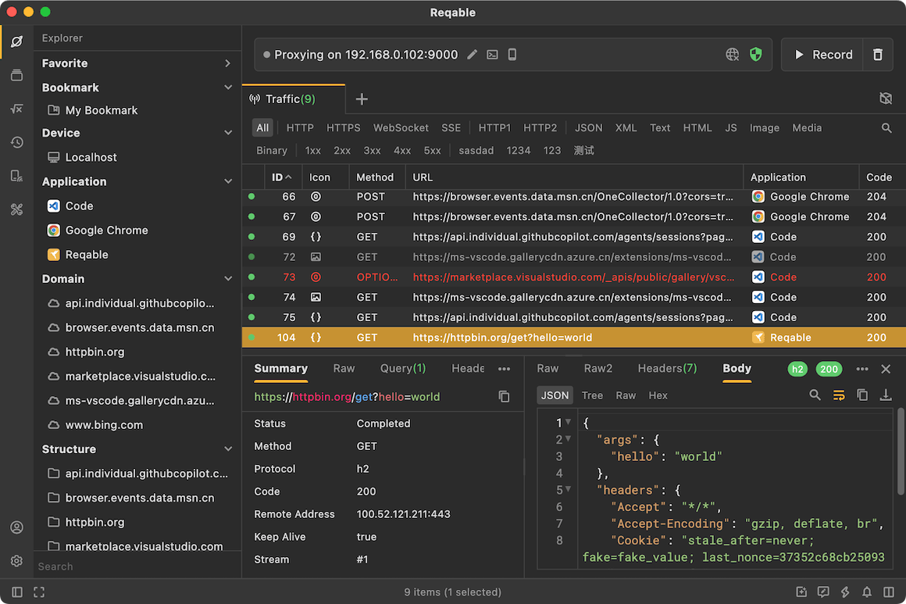

# API Debugging

Debugging proxy is a powerful way used by developers and network engineers to intercept, inspect, and manipulate network traffic between devices and the internet. Reqable provides a MITM proxy for capturing and debugging HTTP(s) traffic.

### Views

- [Traffic List](./list)
- [List Column](./column)
- [Quick Bar](./quickbar)
- [Explorer](./explorer)
- [Tabs](./tabs)
- [Search View](./search)
- [Highlight](./hightlight)

### Guides
- [Proxy](./proxy)
- [SSL](./ssl)
- [Localhost](./localhost)
- [Session](./sessions)
- [Compose](./compose)
- [History](./history)

### Advanced Guides
- [Access Control](./access-control)
- [Gateway](./gateway)
- [Mirror](./mirror)
- [Script](./script)
- [Breakpoint](./breakpoint)
- [Rewrite](./rewrite)
- [Reverse Proxy](./reverse-proxy)
- [Diff](./diff)
- [Network Condition](./network-condition)
- [Report Server](./report-server)
- [Repeat](./repeat)
- [HAR](./har)
- [Turbo Mode](./turbo)
- [Proxy Terminal](./proxy-terminal)
- [Charse File](./chls)

