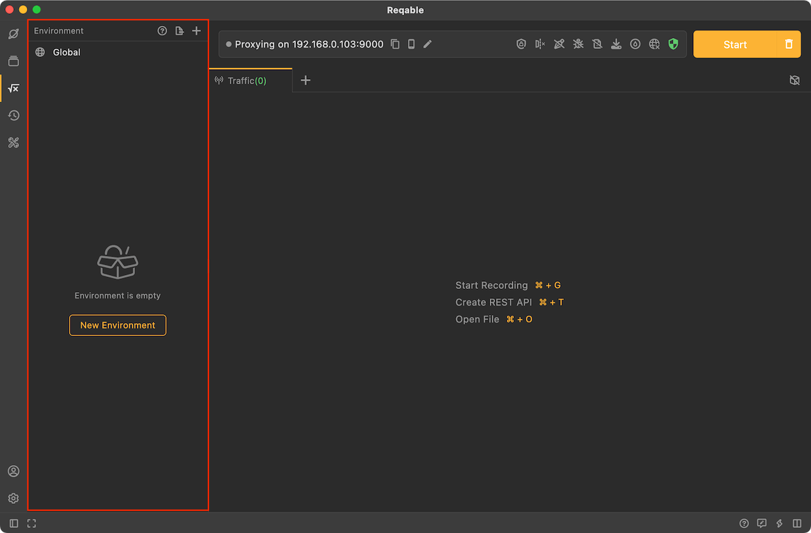

# Environment Variable

Environments help you create variables that you can reuse in API requests and python scripts.

An environment allows you to group together a set of variable data. You can reference the variable data you define in an environment throughout Reqable when sending API requests or using python scripts.

Environment in Reqable are divided into two types: `Global Environment` and `User Environment`. Variables in `Global Environment` are available throughout the Reqable application, while `User Environment` variables are set for a specific environment (such as development, testing, production, etc.).

By using environment, users can easily switch between different environments without having to manually change values in each request. Open Reqable's `Environment' panel to create and manage environments and set different variable values for each environment. These environment variables are then used in requests to dynamically reference these values based on the currently active environment.

You can click the environment icon in the sidebar to open the environment panel, as shown in the picture above.

For more information on environments, please read the documentation below.

import DocCardList from '@theme/DocCardList';

<DocCardList />