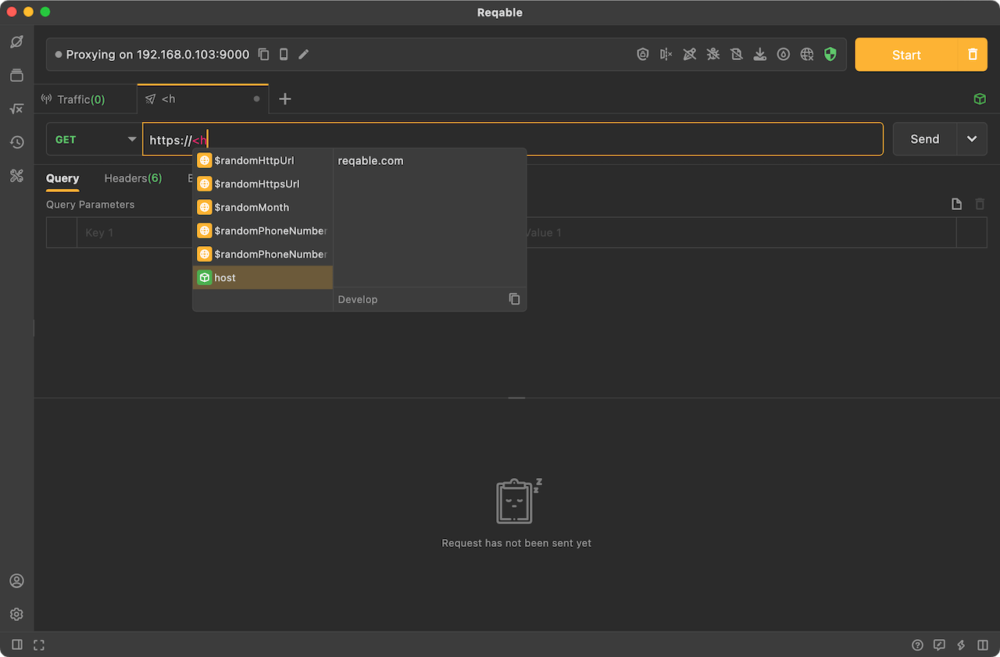
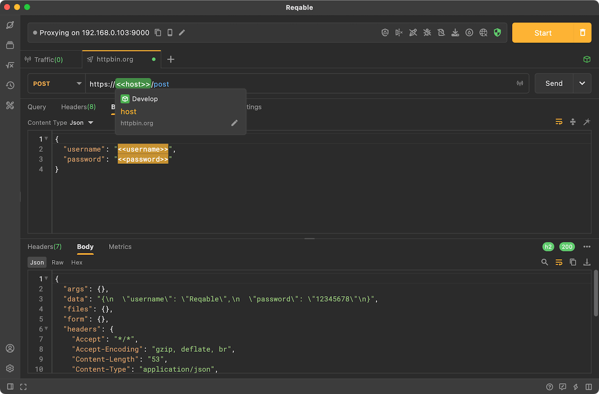

# Practice

Reqable currently supports the use of environment variables in API testing and Python scripts. Below we will explain and demonstrate them in two parts.

## API Testing

You can use angle brackets (such as `<<variable_name>>`) to reference the corresponding environment variables in the request. Reqable will automatically replace these references with the actual variable values when sending the request. Users can use environment variables in the URL, Query Parameters, Headers, Body, and Authorization.

After entering a angle bracket `<` in the input box, the variable prompt will automatically appear, and the user can view the currently matching environment variables. When the mouse pointer hovers over a variable, the variable information will be automatically prompted.



Reqable will automatically replace these references with actual variable values when sending the request.



## Python Script

In Python scripts, environment variables exist in the `env` field of the `context` attribute. You can use the following code to operate the environment variables.

```python
# Read the variable
print(context.env['username'])
# Write a variable
context.env['username'] = 'reqable'
```

When writing a variable through a script, if no user environment is currently activated, the variable will be written to the global environment, otherwise it will be written to the currently activated environment. In addition, if a variable with the same name already exists in the writing environment, its value will be overwritten.