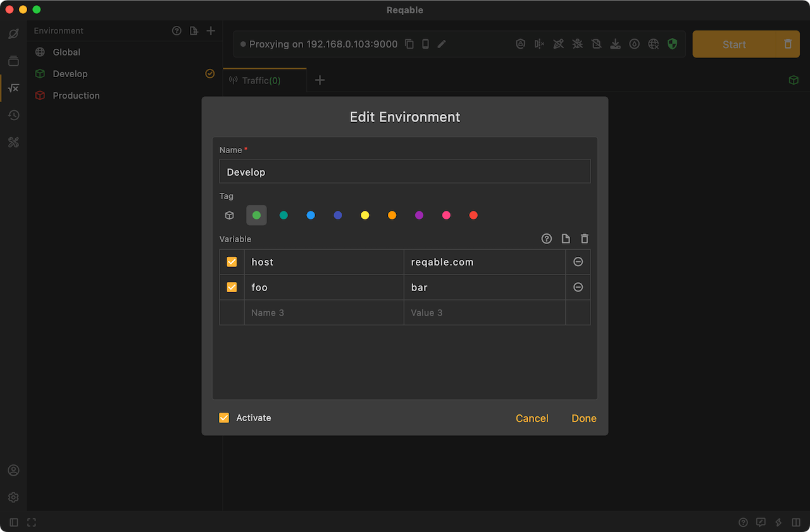
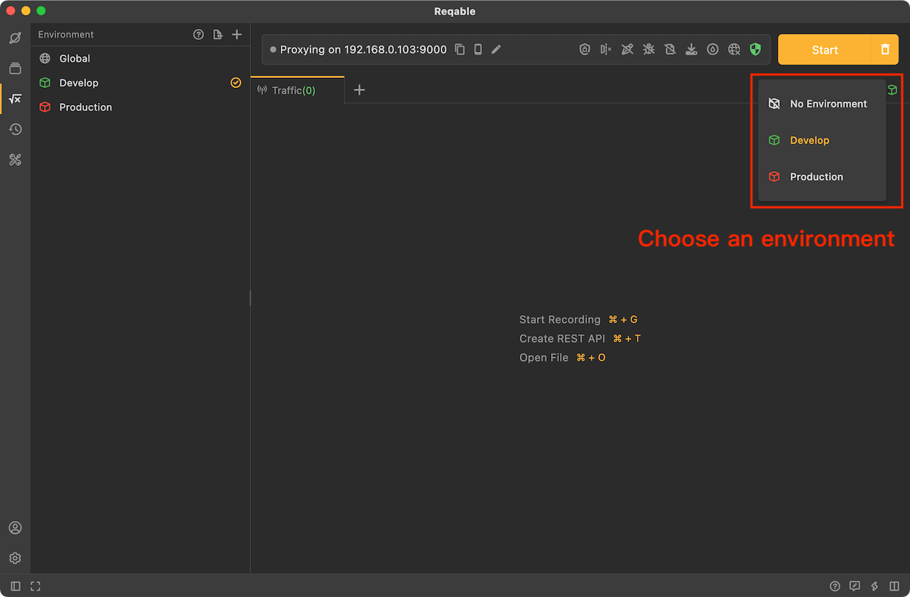

# User Environment

In Reqable, in addition to global environment, there is also a non-global environment, also known as user environment. Unlike global environment variables, the scope of user environment variables is limited to a specific environment. This means that user environment variables can only be used within the environment they belong to and cannot be shared with other environments or globally.

Using user environment variables can help users manage and use specific data values in a specific environment without affecting the values ​​of other environments or global variables. This allows for more flexible organization and management of data, allowing each environment to have its own independent configuration.

To use user environment in Reqable, you need to create and name an environment first, and then create the variables. Users can create multiple different environments and create variables within each environment. For easy differentiation, you can also choose labels of different colors.

When using user variables in requests, you can also use angle brackets (such as `<<variable_name>>`) to refer to the corresponding environment variables. Reqable will automatically replace these references with actual variable values when sending the request.

:::caution
User environment variables have higher priority than global environment variables. Variables with the same name in the currently activated environment will be used first.
:::

## Activate Environment

For user environment variables to take effect, the environment must be activated first, and only one user environment can be activated at the same time.

You can activate (deactivate) the environment through the environment right-click menu, or select the environment by tapping the environment icon.

