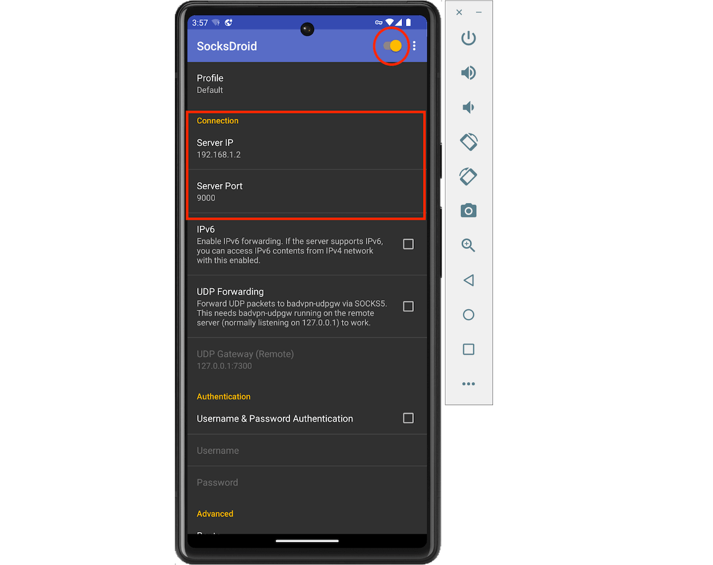

# FAQ

### 1. Reqable log file directory{#log}

- Windows
```
C:\Users\xxx\AppData\Roaming\Reqable\log
```
- MacOS
```
~/Library/Caches/Reqable/log
```
- Linux
```
~/.local/share/reqable
```

### 2. Browser or application no respond {#troubleshot-pc}

It may be caused by port conflict, just change the proxy port of Reqable.


### 3. No traffic can be observed on mobile phone {#troubleshot-mobile}

If the computer is working normally, the mobile phone cannot get any traffic, please check the CheckList below.

- [x] Both mobile phone and PC are connected to the same LAN.
- [x] The mobile Wifi proxy has set the IP address and port number of Reqable (see the top of the Reqable window), or use SocksDroid for forwarding.
- [x] The CA certificate has been correctly installed on the phone (Only has `CONNECT` traffic).
- [x] The PC network firewall has opened the port address of Reqable.

### 4. Android does not respect Wifi proxy {#socksdroid}

Some Android network libraries do not use Wifi proxy, we can forward traffic to Reqable proxy through VPN.

Install `socksdroid` (an open source tool, you can also compile it yourself), open the address below to download the apk file.

```
https://github.com/bndeff/socksdroid/releases/download/1.0.3/socksdroid-1.0.3.apk
```

Install the downloaded `socksdroid`, or you can use `adb` to install it.
```bash
adb install socksdroid-1.0.3.apk
```
After the installation is complete, open `socksdroid`, configure the computer's IP address and Reqable proxy port, and activate the switch.

