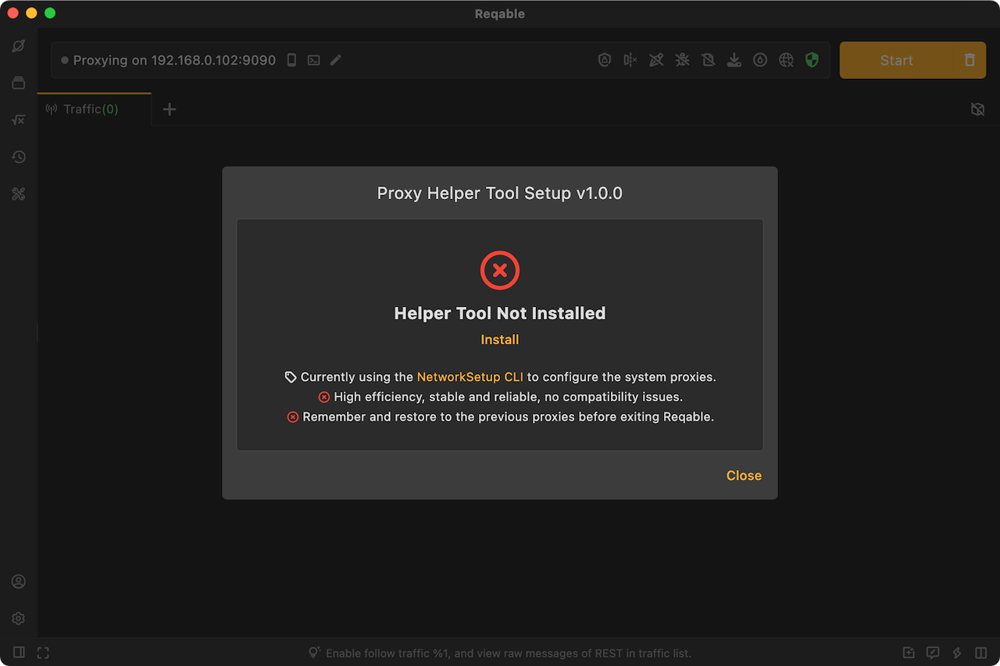
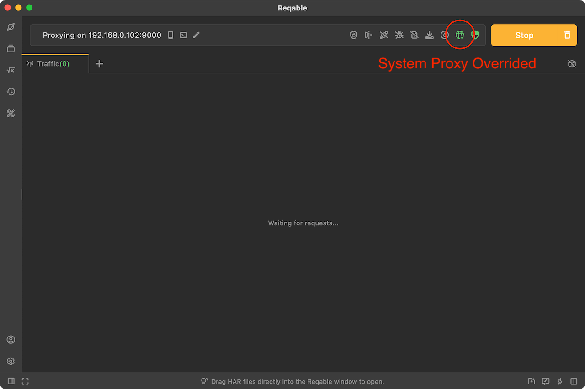
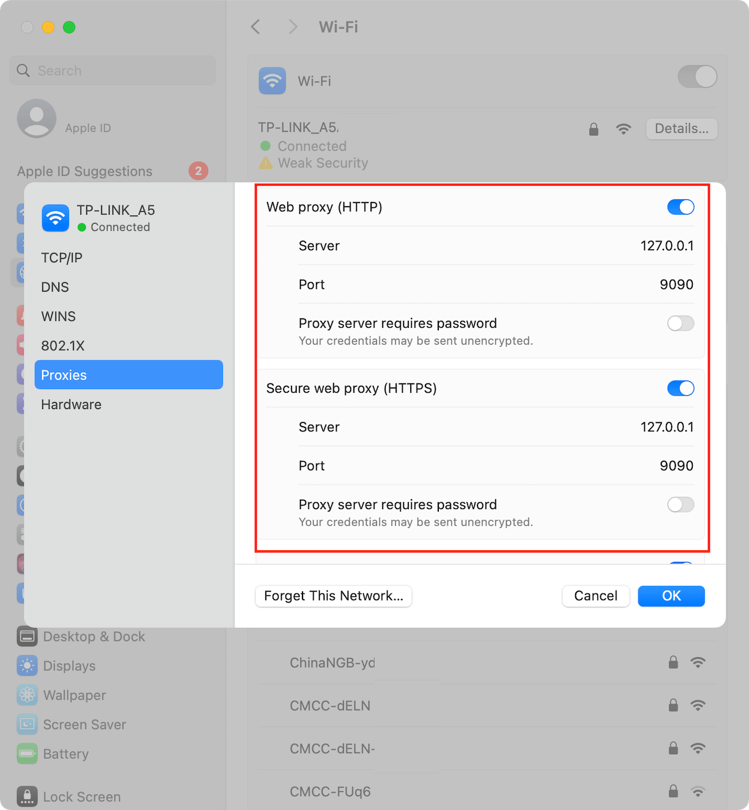
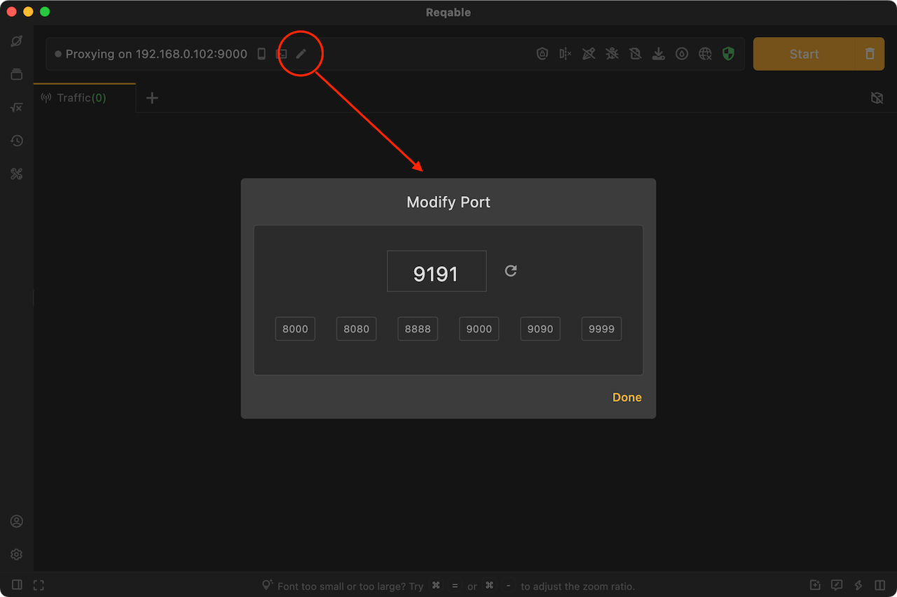
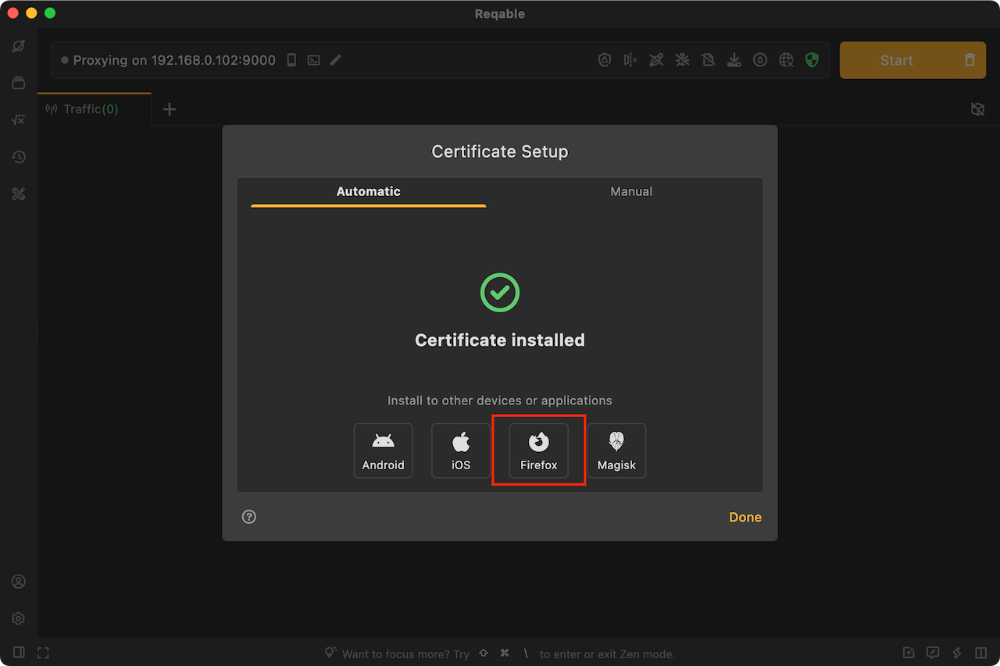

# Mac FAQs

:::info
Please update Reqable to the latest version before troubleshooting.
:::

### 1. Reqable cache directory

```
~/Library/Application Support/com.reqable.macosx
```

### 2. Reqable log files

```
~/Library/Application Support/com.reqable.macosx/log
```

:::note
Click the bottom bar of Reqable 5 times to open the log console to view the current log.
:::

### 3. Unable to automatically configure system proxy

The phenomenon is that the network proxy icon cannot turn green after clicking or turns green and then changes to other colors. This is because the current account does not have permission to modify the system proxy, and `Proxy Helper Tool` needs to be installed manually. You can open the `Proxy Helper Tool` in the `Proxy` menu to install it. During the installation, you need to enter the current account password for authorization. After the installation is complete, the system proxy can be configured in one click.



### 4. Unable to capture traffic from PC applications

Please make sure the following actions have been processed first.

- Capture button has been turned on.
- All filtering and search conditions have been removed.
- [Secondary Proxy](../capture/proxy#secondary) has been turned off.

Then you can follow the steps below to troubleshoot.

#### 4.1 Check whether the system proxy is configured

Reqable needs to configure the network proxy in system settings, and other applications need to access Reqable's proxy server through the system's network proxy configuration. If the system network proxy is configured, the network icon in Reqable will be displayed in green.



Manually check whether the network proxy is configured successfully in the system settings, System Settings -> Network -> Wi-Fi -> Details -> Proxies, check whether `Web proxy (HTTP)`, `Security web proxy (HTTPS)`, `Socks proxy` switches are turned on, and whether the address is `127.0.0.1` and port is the port number displayed at the top of the Reqable main window.



If the network icon is green, but the manual check of the network proxy in the system settings is unsuccessful, you can report it to us on [Github](https://github.com/reqable/reqable-app/issues).

If there is no issue with the system proxy configuration, please proceed to the next step.

#### 4.2 Check if can capture the browser's traffic

After Reqable starts the capture, open the browser (Chrome or Edge is recommended) and visit the www.google.com.

Case 1: Google cannot be accessed, and no traffic (including CONNECT requests) can be seen.

It may be that the Reqable proxy server port is broken (for example, occupied by other program processes). You can try to change the port and try again.



If your browser still cannot access Google after changing the port, please report it to us on [Github](https://github.com/reqable/reqable-app/issues).

Case 2: Google is accessible, but no traffic (including CONNECT requests) can be seen.

Check again whether the system network proxy is configured correctly in 4.1 above, or try to restart the browser, or try to restart PC. If this situation still occurs, please report it to us on [Github](https://github.com/reqable/reqable-app/issues).

Case 3: Google is accessible, and traffic (including CONNECT requests) can also be seen.

This means that Reqable is working properly, but the application does not use the system network proxy to access Reqable's proxy server. You can handle it as follows.

- If the application is a script process such as Python, NodeJS or Ruby, you can try to use the [Proxy Terminal](../capture/proxy-terminal).
- Check whether the application supports manual setup network proxy.
- Try to use third-party software such as Proxifier for forced proxy.
- Contact the application owner for a solution.

### 5. Firefox prompts unsafe website

The Firefox browser uses the built-in CA Store. The CA certificate installed by the system cannot take effect. You need to follow the Firefox certificate installation guide in the Reqable to install it.



### 6. Chrome and Safari prompts unsafe website

On some devices, there may be a bug that after installing the Reqable CA certificate, Chrome and Safari browsers still cannot trust the CA certificate.

You need to open the Keychain Access app and manually delete the installed Reqable CA certificate, then reinstall the CA certificate in Reqable. After reinstalling the certificate, restart Reqable and the browser and try again.

If you still have problems after trying the above, please report it to us on [Github](https://github.com/reqable/reqable-app/issues).

### 7. Unable to capture localhost traffic

By default, localhost traffic will not go through the system network proxy and needs to be specially processed using the mirroring feature. Please refer to [localhost traffic](../capture/localhost).

### 8. The mobile device cannot connect to PC

- Check if the mobile and PC are in the same LAN.
- Check if the mobile and PC are in the same LAN segment. Some LANs prohibit cross-segment communication when networking.
- Try connecting the PC to the mobile's hotspot, and then scan the QR code on the mobile to connect to the PC.
- Check if the system firewall has disabled the inbound and outbound traffic of the Reqable proxy port number.