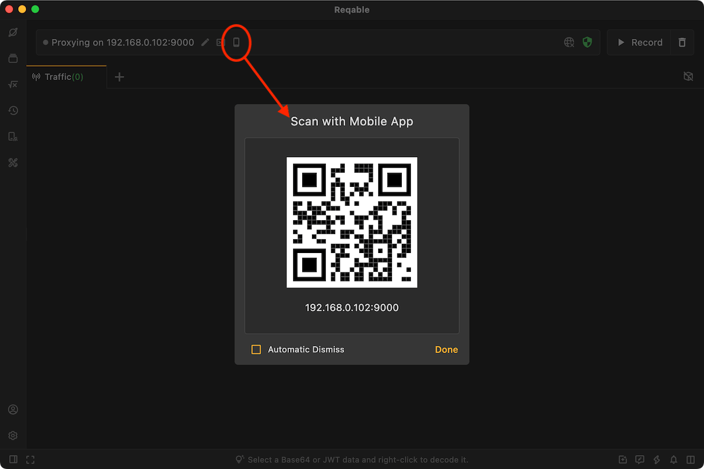
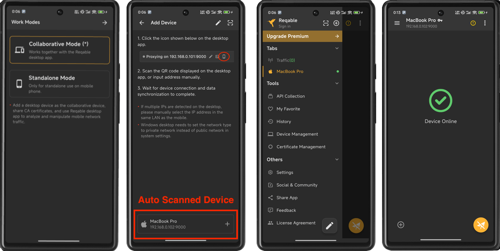
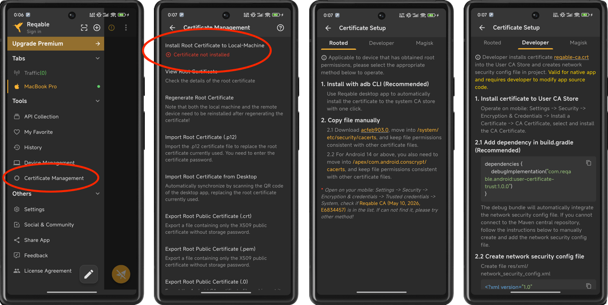
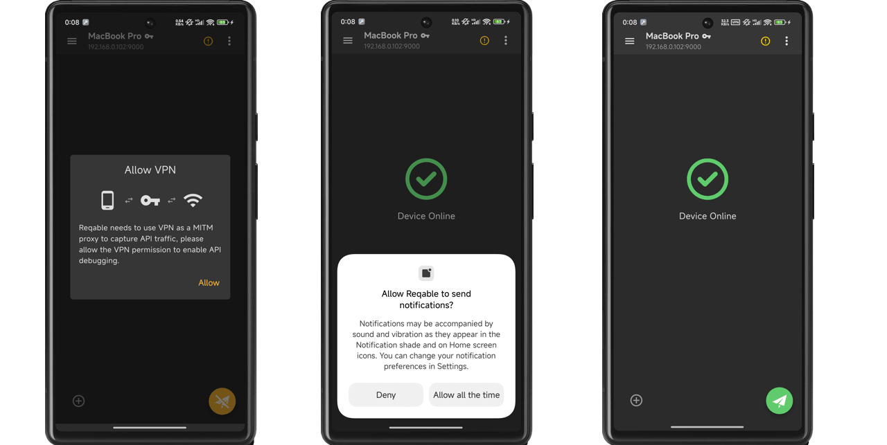
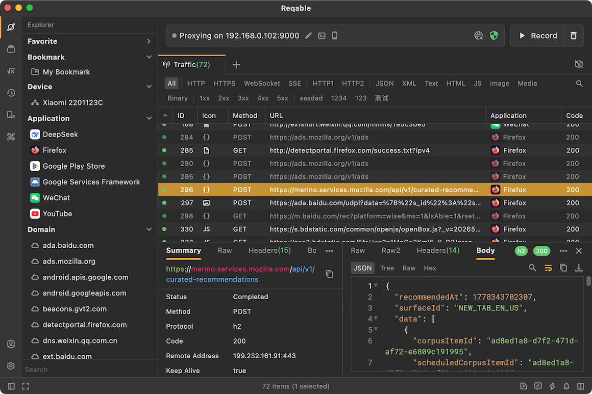

Traffic analysis is a very important part of mobile application development and debugging, whether it is data mocking or malware analysis. Our most common method is to setup a Wi-Fi proxy on the mobile and proxy the traffic to the MITM server of the desktop apps, such as Charles and Fiddler.

But this is not an efficient way. Looking back at the entire step, we will find the following uncomfortable points.

- Wi-Fi proxy can only be configured manually and needs to be changed back after debugging.
- Some application frameworks or network libraries do not respect system proxies, such as Flutter.
- When installing the root CA certificate, it is inconvenient to import the certificate to the mobile phone.
- Wi-Fi proxy is system global and cannot be applied to specific applications.

Using Reqable's collaborative mode, you can effectively solve those issues.

## Preparation

Start Reqable desktop application, and click the phone icon to open the QR code page, as follows:

Next, let’s configure the mobile app. Select Collaboration Mode and scan the QR code on the desktop in the previous step.

In this step, Reqable will automatically synchronize the root CA certificate from the desktop to the mobile app. The Reqable mobile app will remember the IP address and port of the remote device (desktop) and will automatically connect the next time it is started. If the IP address and port of the remote device change, yout can click the scan code icon in the drawer to scan again.

If you have already initialized the Reqable mobile app, you can add a computer device from the `Remote Devices` in the sidebar by clicking the `+` button in the upper right corner.

Note that although the CA certificate has been synchronized from the desktop to the mobile app, but there is still a most important step left: installing it on the device.

Next, we start installing the root certificate to the device, which is probably the most complicated step of the entire process. We can not complete this step automatically and need to handle it manually according to the device conditions and usage scenarios.

Steps: Open Side Drawer -> Tap Certificate Management -> Install Root Certificate to Lcoal Machine.

For more information, please refer to: [Certificate Installation](../installation#mobile).

The Reqable mobile app will automatically check the installation status of the certificate. If the installation is not successful, a red prompt will appear on the page: Certificate is not installed.

If you have completed this step, congratulations, the entire preparation process is over. 🍺🍺🍺

## Forward Traffic

Before capturing traffic, we first select the remote device (named with IP:Port) in the mobile side drawer. And then tab the floating action button to start recording.

The Reqable mobile app will start the VPN service and forward the mobile traffic to the Reqable desktop. This is why it can capture traffic without Wi-Fi proxy. On Android, you can also capture traffic for specific apps and ignore others.

The system will prompt you to configure and enable VPN permissions, please click allow.

After Reqable mobile app enters recording mode, Reqable desktop will also automatically enter recording mode and wait for traffic to enter.

When an HTTP request is processed, we can view and analyze it on the Reqable desktop. For example, use breakpoints, repeat, rewrites, scripts, etc.

:::note
Reqable can detect application information on Android, but iOS does not support this due to technical limitations.
:::

