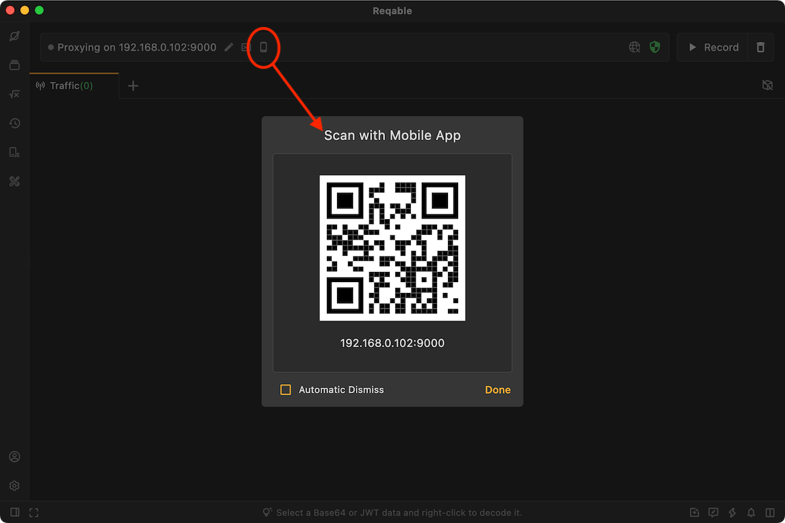
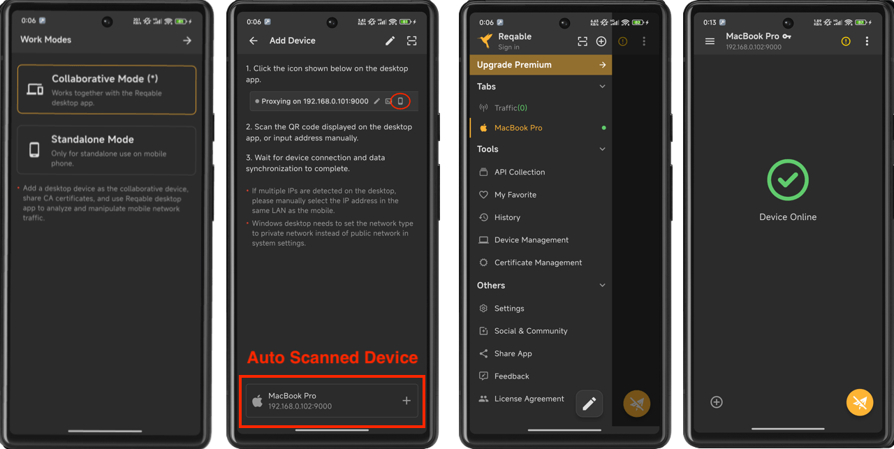
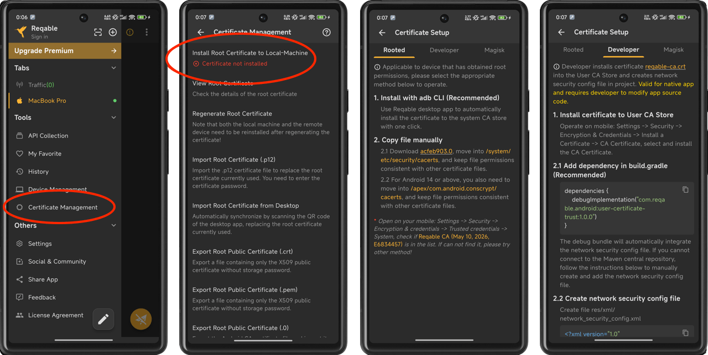
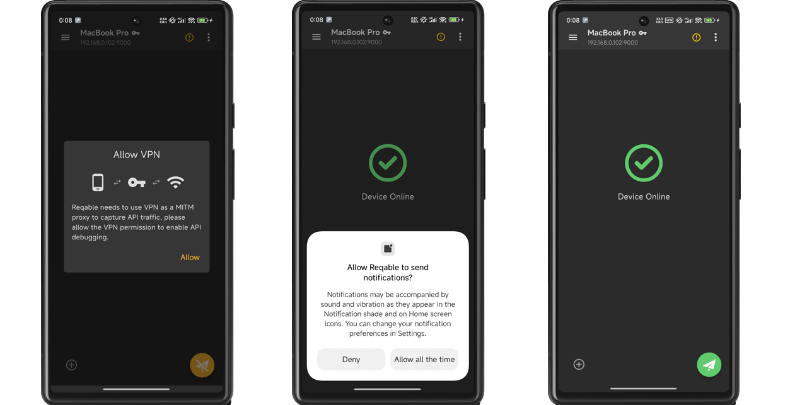
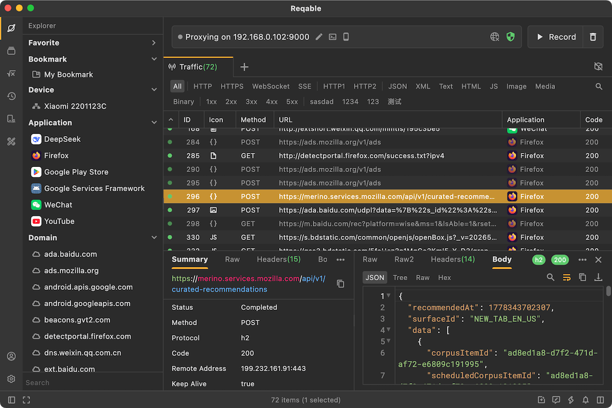
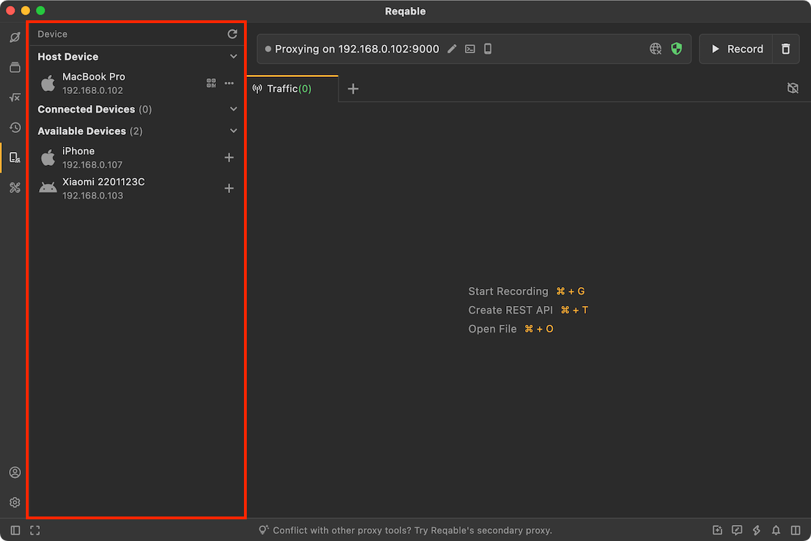
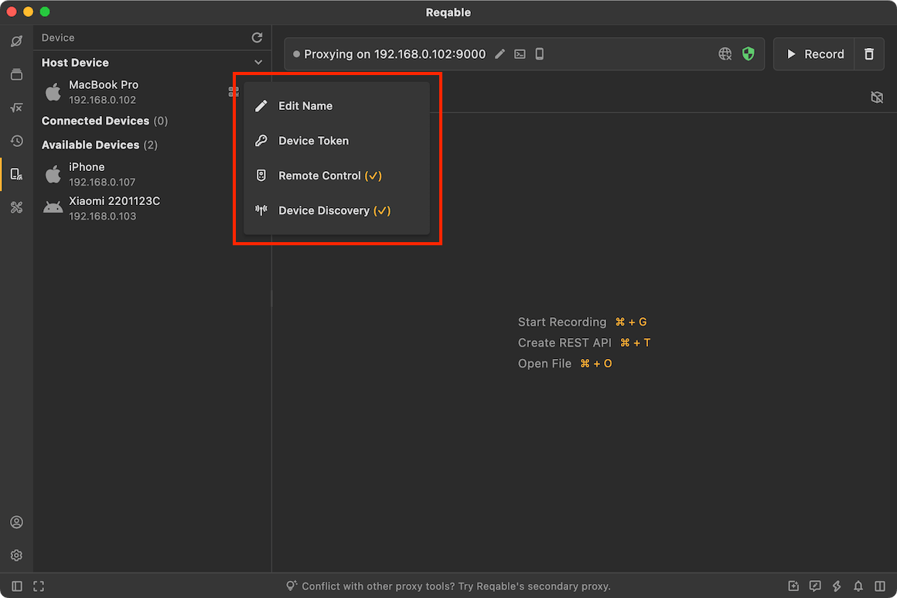
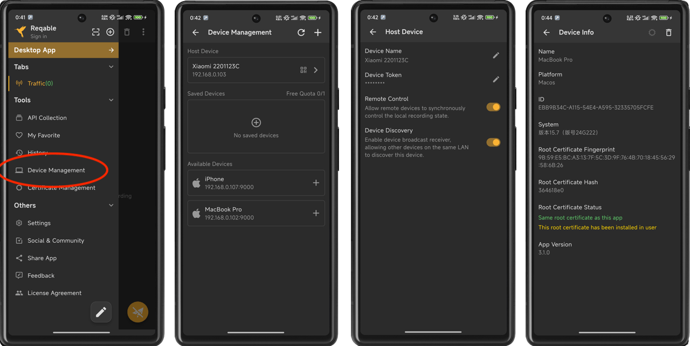

Traffic analysis is a core part of mobile development and debugging—whether for data mocking or malware analysis. A common approach is to set a Wi-Fi proxy on the phone and forward traffic to a desktop MITM tool such as Charles or Fiddler.

This approach is inefficient and has several drawbacks:

- Wi-Fi proxy can only be configured manually and needs to be changed back after debugging.
- Some application frameworks or network libraries do not respect system proxies, such as Flutter.
- Importing a root CA certificate onto the phone is inconvenient.
- A Wi-Fi proxy is system-wide and cannot target specific apps.

Reqable's collaboration mode addresses these issues.

## 1. Add Collaborative Device

Start the Reqable desktop app and click the phone icon to open the QR code page:

Next, let’s configure the mobile app. Select Collaboration Mode and scan the QR code on the desktop in the previous step. If the mobile device and the desktop device are on the same local area network (LAN), compatible devices can be automatically detected and added directly with a single click.

In this step, Reqable will automatically synchronize the root CA certificate from the desktop to the mobile app. The Reqable mobile app will remember the IP address and port of the remote device (desktop) and will automatically connect the next time it is started. If the IP address and port of the remote device change, you can click the scan code icon in the drawer to scan again.

If you have already initialized the Reqable mobile app, you can add a computer device from the `Remote Devices` in the sidebar by clicking the `+` button in the upper right corner.

Note that although the CA certificate has been synchronized from the desktop to the mobile app, one critical step remains: installing it on the device.

Next, install the root certificate on the device. This is often the most involved step. Reqable cannot complete it automatically; you must install the certificate manually based on your device and use case.

Steps: Open Side Drawer -> Tap Certificate Management -> Install Root Certificate to Local Machine.

For more information, please refer to: [Certificate Installation](../installation#mobile).

The Reqable mobile app will automatically check the installation status of the certificate. If the installation is not successful, a red prompt will appear on the page: Certificate is not installed.

Once this step is complete, setup is finished.

## 2. Forward Traffic

Before capturing traffic, select the remote device in the mobile side drawer, then tap the floating action button to start recording.

The Reqable mobile app will start the VPN service and forward the mobile traffic to the Reqable desktop. This is why it can capture traffic without Wi-Fi proxy. On Android, you can also capture traffic for specific apps and ignore others.

When the system prompts you to configure and enable VPN permissions, tap Allow.

After Reqable mobile app enters recording mode, Reqable desktop will also automatically enter recording mode and wait for traffic to enter.

Once a request is captured, you can inspect and analyze it on the Reqable desktop—for example with breakpoints, repeat, rewrites, and scripts.

:::note
Reqable can detect application information on Android, but iOS does not support this due to technical limitations.
:::

## 3. Manage Collaborative Devices

In the Reqable desktop application, open the `Devices` panel to view currently connected collaborative devices and automatically discovered mobile devices available for collaboration. Clicking the `+` button allows you to directly add the current device as a collaborative device from the mobile side.

For the current desktop device, clicking the `...` button allows you to perform actions such as editing the device name, editing the device token (only devices sharing the same token can be automatically discovered), toggling collaborative control, and toggling device discovery.

For the mobile device, open the drawer and tap `Device Management` to delete devices, add new devices, or edit and configure the current device. Tapping on a saved device also allows you to view detailed device information.

