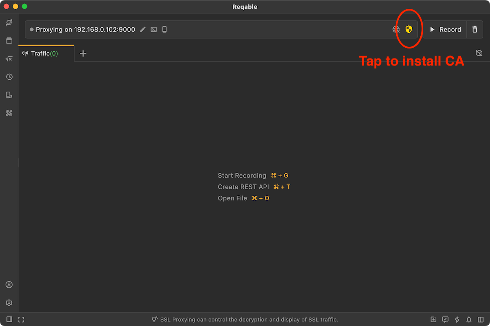
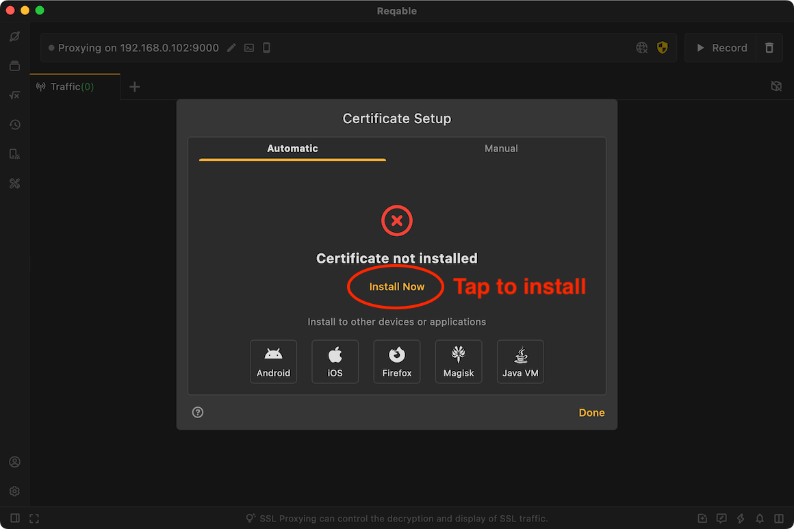
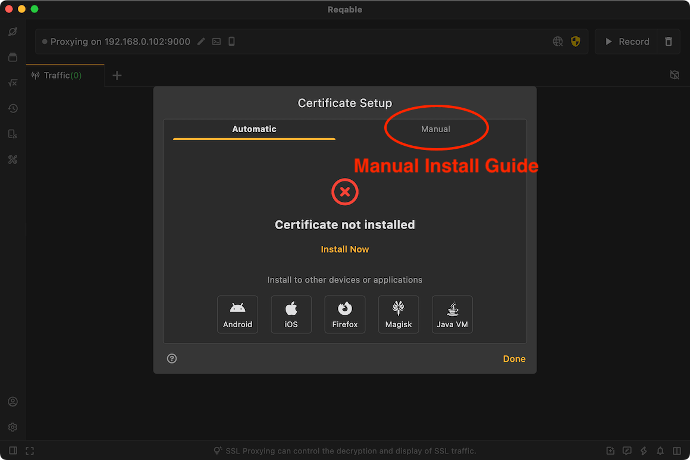
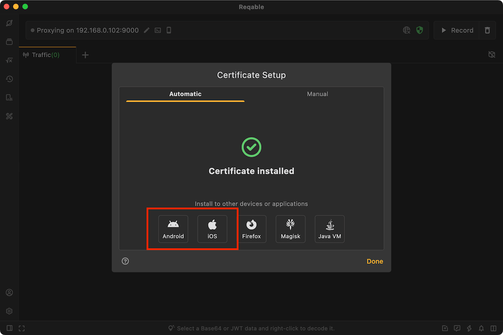
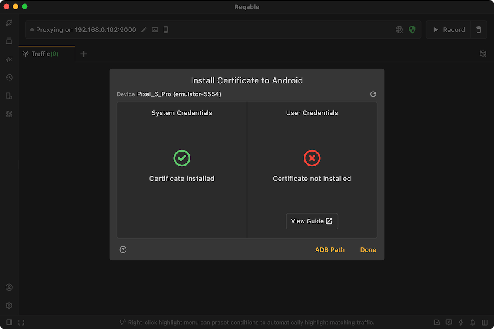
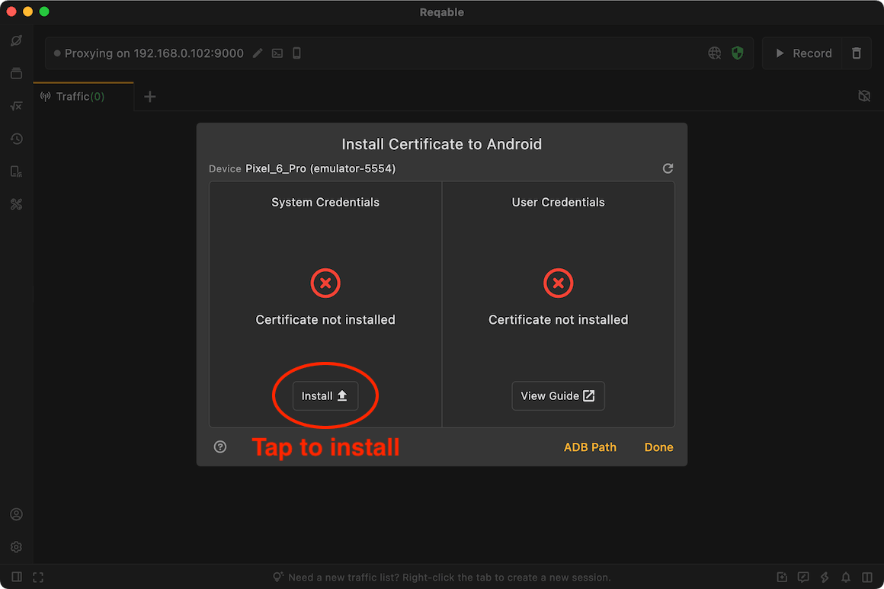

## Why should install a certificate?

Reqable uses the classic man-in-the-middle (MITM) technique to analyze HTTPS traffic. When the client communicates with Reqable proxy server (hereinafter referred to as `MITM`), the MITM needs to re-sign the SSL certificate of the remote server. In order to ensure the successful SSL handshake communication between the client and the MITM, it is necessary to install the MITM's root certificate (hereinafter referred to as `CA Certificate`) to the client's local certificate management center. If the CA Certificate did't installed in your device, you might see the error `SSL Handshake Error`.

If the target client is a PC application, the CA Certificate needs to be installed in the certificate management center of the PC; if the target client is a mobile application, the CA certificate needs to be installed in the certificate management center of the mobile phone. If you do not need traffic analysis, you can ignore this step.

:::info Tips
Reqable automatically generates a CA certificate for each user, and uses a random certificate key, so you don't have to worry about this certificate being exploited by a third party.
:::

## Desktop {#desktop}

Different desktop platforms (here mainly Windows/MacOS/Linux) have different certificate installation methods. In order to simplify the installation process, Reqable provides a one-click certificate installation way.

The certificate installation page is located on the top QuickBar, click the shield icon to open the pop-up window.



Just click `Install Now`:



After clicking, the system will pop up a confirmation pop-up window or enter the account password to authorize, just follow the prompts to confirm. If there is no accident, the certificate will be automatically installed successfully; if the automatic installation fails, you can switch to the Tab of `Manual` and follow the steps to install it manually.



Note that Chrome and Firefox on Linux devices have built-in certificate management systems, and you also need to install the CA certificate into the browser's certificate management center. Please follow the prompts in Reqable.

:::info Installation Status
When the CA certificate is not installed or the installation fails, the shield icon is displayed in yellow; after the installation is successful, the shield icon is displayed in green.
:::

## Mobile {#mobile}

If you need to analyze mobile applications, you must install the CA certificate on the mobile device. We have built-in guidelines for installing Android and iOS certificates in Reqable.



:::warning
If you use the desktop app to analyze traffic, please install the CA root certificate on PC to the mobile device; if you use the mobile app to analyze traffic directly, please install the CA root certificate on the mobile device.
:::

The CA root certificate generated by Reqable for each device is different. If you want all devices to share the same CA root certificate, you can export the certificate in .p12 format and then import it on other devices.

:::info Tips
After the mobile App is initialized and selects the collaborative mode and scans the qrcode to connect to PC, the CA root certificate on PC will be automatically synchronized to the current mobile device. At this time, the CA root certificate of the two devices is the same.
:::

### Android

There are two types of Android certificates: user certificate and system certificate. User certificates does not require additional permissions to install, while the system requires root permission to install.

Reqable requires that the user has installed the ADB tool on PC in advance. Reqable will use the ADB tool to check the certificate installation status of the Android device connected, including the system certificate status and the user certificate status.



:::info About ADB
Android Debug Bridge (ADB) is an Android device toolkit provided by Google and can be downloaded from the Android Developers [website](https://developer.android.google.cn/tools/adb), After downloading and installing, configure the `ANDROID_HOME` and `PATH` environment variables and restart Reqable.
:::

#### System Certificate

Regardless of whether the device is rooted or not, Reqable can detect the installation status of the system certificate. However, only rooted devices can install the certificate with one click (supporting Android 5.0 - 15 systems).



If the system certificate has been installed, you can skip the next step of installing the user certificate.

#### User Certificate

The user certificate needs to be installed manually by the user. Open the settings on the mobile and follow the steps below:

Open Settings -> Security -> Encryption & Credentials -> Install a Certificate -> CA Certificate.

Note that Reqable cannot detect the user certificate installation status of non-root devices and will always display "Unknown Certificate Installation Status".

On devices with Android 7.0 and above, after installing the user certificate, the developer needs to perform additional configuration in the project to trust the user certificate.

:::caution
This installation is only valid for Android native apps, not for Flutter-based apps.
:::

Method 1: Add dependency in build.gradle (Recommended)

```groovy
dependencies {
  debugImplementation("com.reqable.android:user-certificate-trust:1.0.0")
}
```

According to the above configuration, the debug package will automatically integrate the network security configuration file. If you cannot connect to the maven central repository, please follow the instructions in method 2 to manually create and configure the network security file.

Method2: Create network security config file

Create file res/xml/network_security_config.xml

```xml
<?xml version="1.0" encoding="utf-8"?>
<network-security-config>
  <base-config cleartextTrafficPermitted="true">
    <trust-anchors>
      <certificates src="system" />
      <certificates src="user" />
    </trust-anchors>
  </base-config>
</network-security-config>
```

Config AndroidManifest.xml

```xml
<?xml version="1.0" encoding="utf-8"?>
<manifest>
  <application android:networkSecurityConfig="@xml/network_security_config">
    ...
  </application>
</manifest>
```

Please remove this configuration in the release version. For more information about the network security configuration file, please refer to: [Android Docs](https://developer.android.google.cn/training/articles/security-config).

#### Browser

Successfully installing CA certificate does not mean it can be trusted by the browser, even if it is installed in the system certificate directory.

##### Chrome Browser

Chrome's trust policy for certificates is constantly changing. For example, the latest version of Chrome will ignore the self-signed CA certificate installed in the Android system certificate directory. If you need to capture the Chrome traffic, please note:

- If you using a higher version of Chrome, you need to install the CA certificate in the user certificate directory.
- If you using a lower version of Chrome, you need to install the CA certificate in the system certificate directory.

If you are not sure which method to choose, you can try them two.

##### Firefox Browser

Firefox uses a built-in CA store. Regardless of whether the Reqable CA certificate is installed in the system directory or the user directory, it will not be trusted, and the user needs to perform additional actions.

- Firefox settings -> About Firefox -> Click on the top logo 5 times to enable the debug menu.
- Firefox settings -> Secret Settings -> Enable Use third party CA certificates.

After completing the above steps, install the CA certificate in the user directory to take effect.

### iOS

Installing CA certificate on an iOS device is very easy. Just follow the steps below.

First, download and install the description file (certificate). The description file can be saved manually or downloaded through the browser.

- Manual save: Export the CA certificate, find the exported CA certificate in the Reqable document directory of the file app, and manually copy or move it to the upper directory. After clicking on the certificate, a prompt `Description file downloaded` will appear.
- Browser download: Click on the certificate to automatically open the browser to download. After the download is complete, a prompt `Description file downloaded` will automatically appear.

Step 2: Open Settings -> Downloaded Profile -> Select Reqable CA -> Install the certificate file just downloaded.

Step 3: Trust the certificate, Settings -> General -> About -> Certificate Trust Settings -> Turn on the switch.

### Special cases

In some special cases, HTTPS traffic may not be decrypted properly even if the certificate has been installed. Common cases include the following.

- The network request enables certificate pinning, requiring the server to return a specified certificate.

- The network request enables two-way verification, requiring the client to upload a certificate to the server for verification.

- The application uses the built-in CA certificates for verification instead of the system CA certificates.