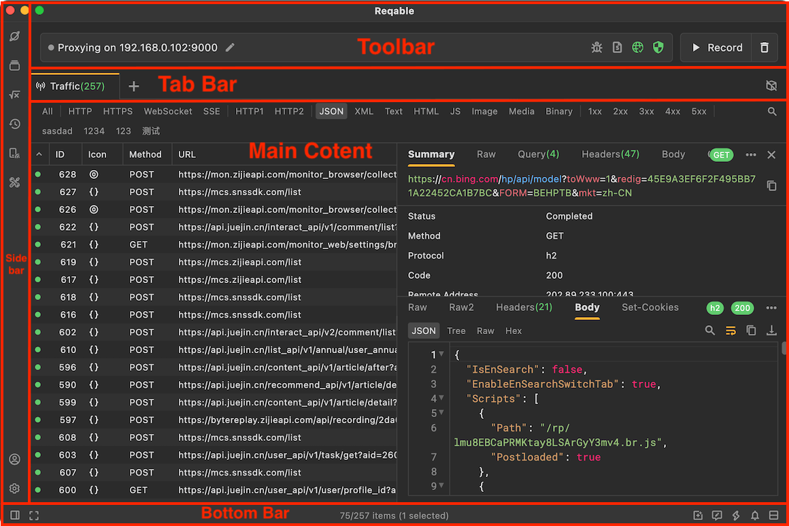
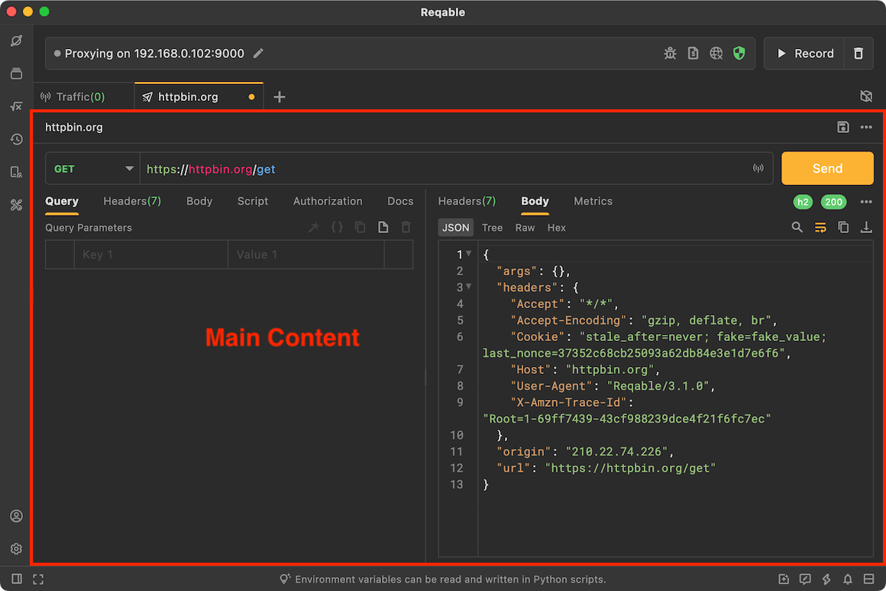
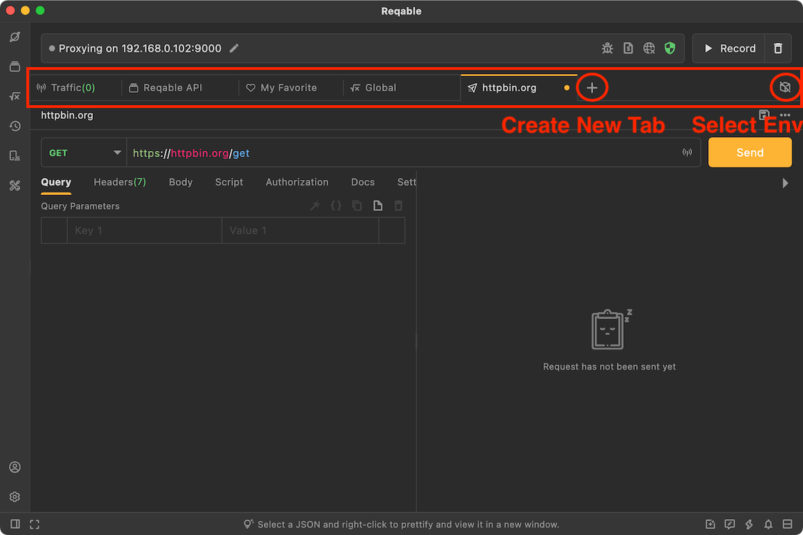
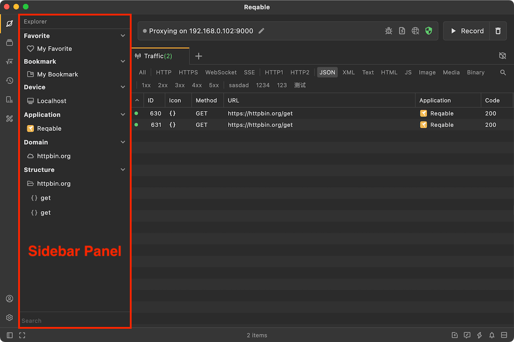
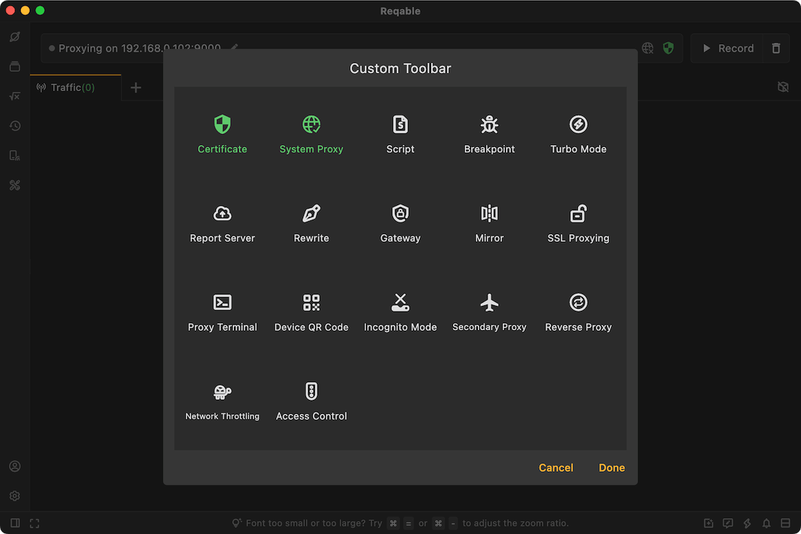

Let's take a look at the layout of the Reqable. Reqable is using a classic layout similar to `VS Code`, but there are still some differences.

The layout of Reqable is divided into [Main Board](#main_board), [Side Bar](#side_bar), [Quick Bar](#quick_bar) and [Bottom Bar](#bottom_bar), let's follow these four Parts.

### Main Board {#main_board}

Reqable supports multiple sessions, including traffic list, API editor, history review and HAR files, etc. The session is switched through the tab. When there are too many tab pages, it also supports horizontal scrolling. Right-click the tab to perform actions such as creating, copying, and closing.

### Side Bar {#side_bar}

The sidebar refers to the left sidebar, which is divided into upper and lower parts. The upper part includes explorer, history, api collection and toolbox, and the lower part includes account settings.

Click the icon to expand the sidebar panel, and click the icon again to close the panel. Long press the boundary line and drag left and right to adjust the size of the sidebar panel, and over drag to the left to close the sidebar panel directly.

### Quick Bar {#quick_bar}

The quick bar refers to the area above the tab page. The quick bar is the control center, integrates such as SSL certificate, proxy, turbo mode, incognito mode, script, breakpoint, rewrite, mirror and gateway. For example, tap the network icon can automatically configure the system proxy or close the system proxy, and right-clicking can config the proxy protocol.

The quick bar also displays the IP address of the device, which is convenient for remote device debugging.

### Bottom Bar {#bottom_bar}

The bottom bar places some infrequently used function entries, such as layout direction, report & feedback, shortcut keys, and application upgrades. In traffic list session, the status of the list is also displayed, such as total, filtered, selected, etc.

