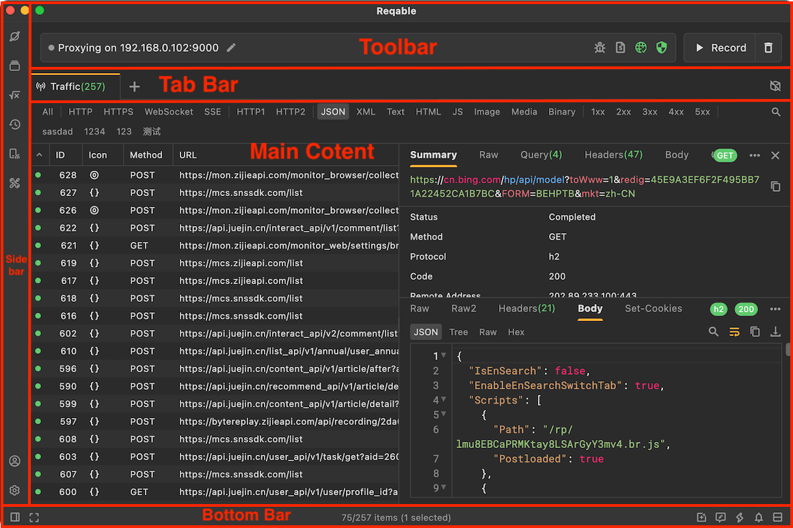
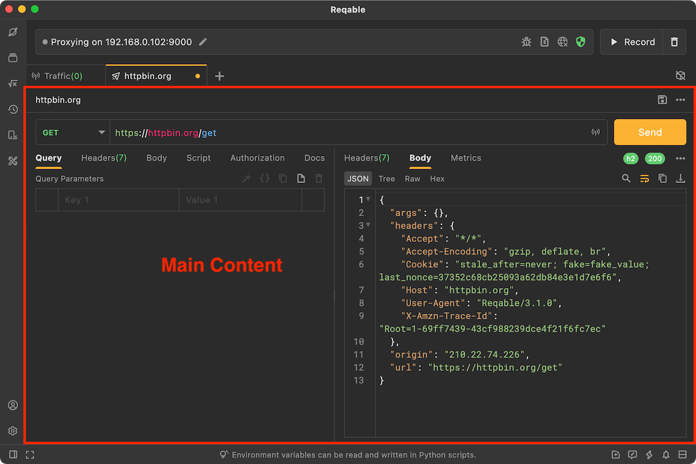
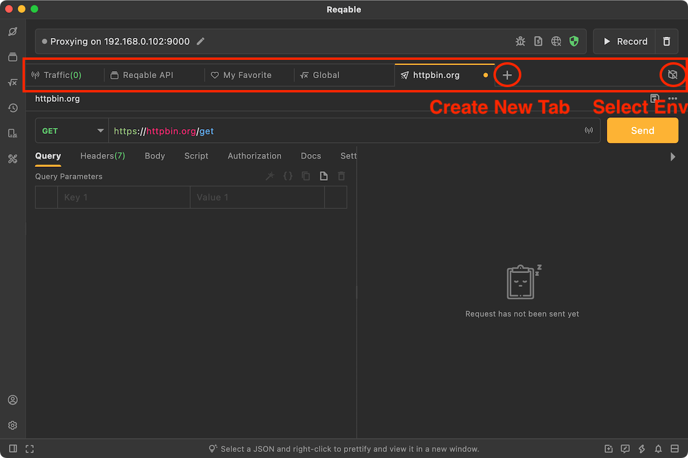
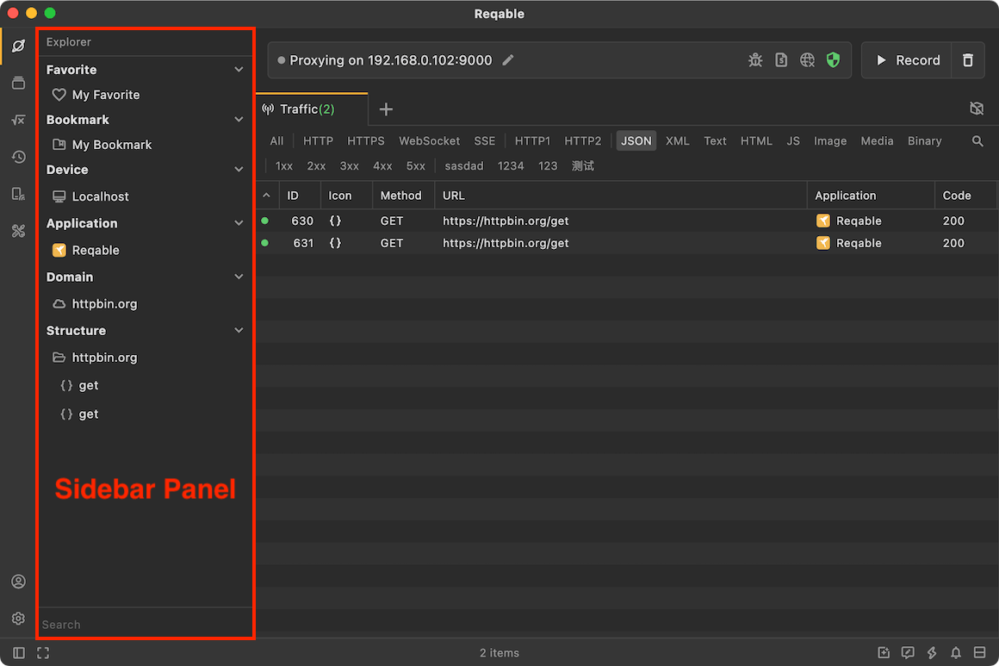
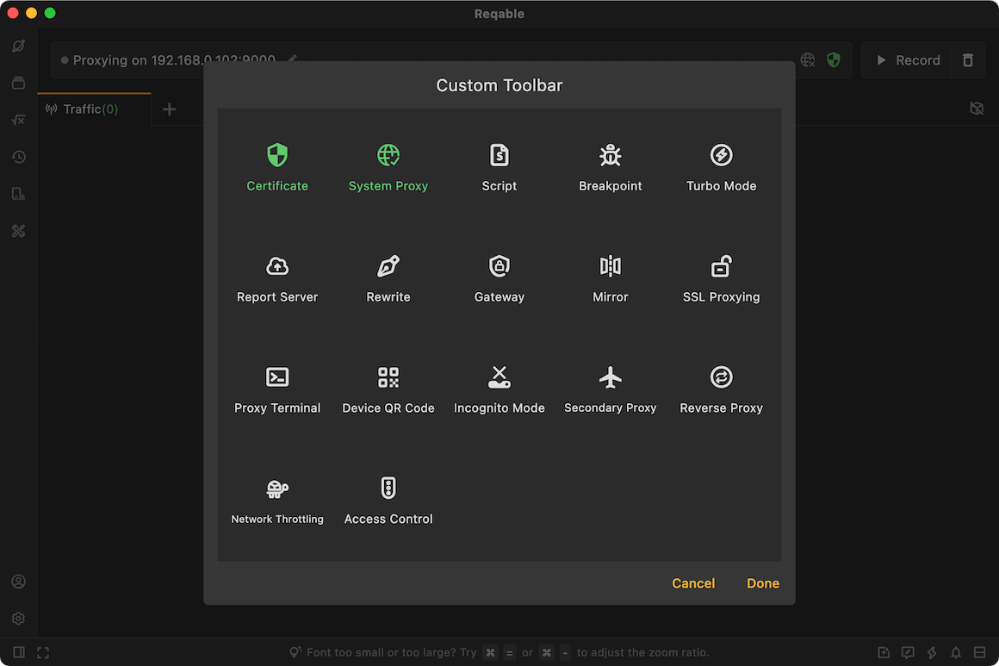
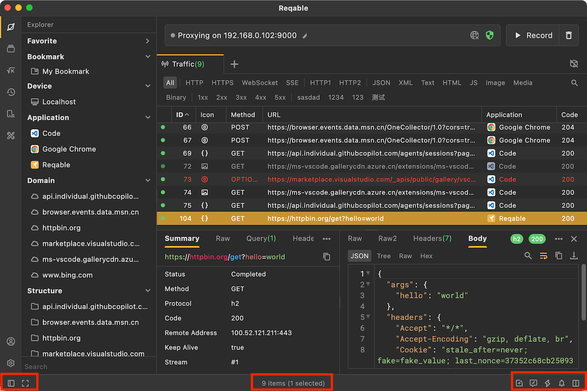

import Shortcut from '@site/src/components/Shortcut';

Let's take a look at the overall layout of the Reqable. If you are familiar with `VS Code`, it should feel quite familiar. That's right, Reqable uses a layout similar to the classic `VS Code` layout, though there are still some differences. Let's go through them below.

Reqable's layout is divided into the [Main Content Area](#main_board), [Tab Bar](#tab_bar), [Sidebar](#sidebar), [Top Toolbar](#toolbar), and [Bottom Bar](#bottom_bar). We will introduce these five parts one by one.

### Main Content Area {#main_board}

The main content area is used to display core content such as the `Traffic`, `REST API`, `Environment`, and `API Collection`. Main content is managed through the tabs in the tab bar. Clicking different tabs shows different content. The image below shows the main content area for REST API.

### Tab Bar {#tab_bar}

The tab bar is used to manage different content. Click the `+` button to create tabs for different features. If there are too many tabs, you can scroll left and right. Every tab supports a context menu, and the available options vary depending on the tab type.

You can also navigate tabs with keyboard shortcuts.

- <Shortcut>`Control` + `number key`</Shortcut>: Select a tab by index. The first tab has index 1, and index 0 means the last tab.
- <Shortcut>`Control` + `[` / `]`</Shortcut>: Switch to the tab on the left or right.

The current environment is displayed on the far right side of the tab bar. Click it to switch environments.

### Sidebar {#sidebar}

The sidebar refers to the left sidebar and is divided into upper and lower sections. The upper section includes `Explorer (F1)`, `API Collection (F2)`, `Environment (F3)`, `History (F4)`, `Device (F5)`, and `Toolbox (F6)`. The lower section includes `Account` and `Settings`.

Clicking an icon in the upper sidebar opens or closes the sidebar panel. You can drag the boundary horizontally to resize the panel, and dragging it all the way to the left will close the panel directly.

### Top Toolbar {#toolbar}

The top toolbar refers to the area above the tabs. It is also called the `Quick Bar`. It displays the IP address of the current device as well as shortcuts to commonly used features. Some enabled features also display their corresponding icons here, such as `Network Throttling`.

The context menu of the top toolbar can open the editor, where you can pin or unpin commonly used features.

### Bottom Bar {#bottom_bar}

The bottom bar contains entry points for less frequently used features such as `Layout Direction`, `Zen Mode`, `Community and Media`, `Feedback`, `Shortcuts`, `Notifications`, and version upgrades.

The center area of the bottom bar randomly displays Reqable usage tips. However, the text in the center changes on different tabs. For example, when you switch to the `Traffic` tab, it displays information such as the total number of items in the list, the filtered count, and the selected count.

