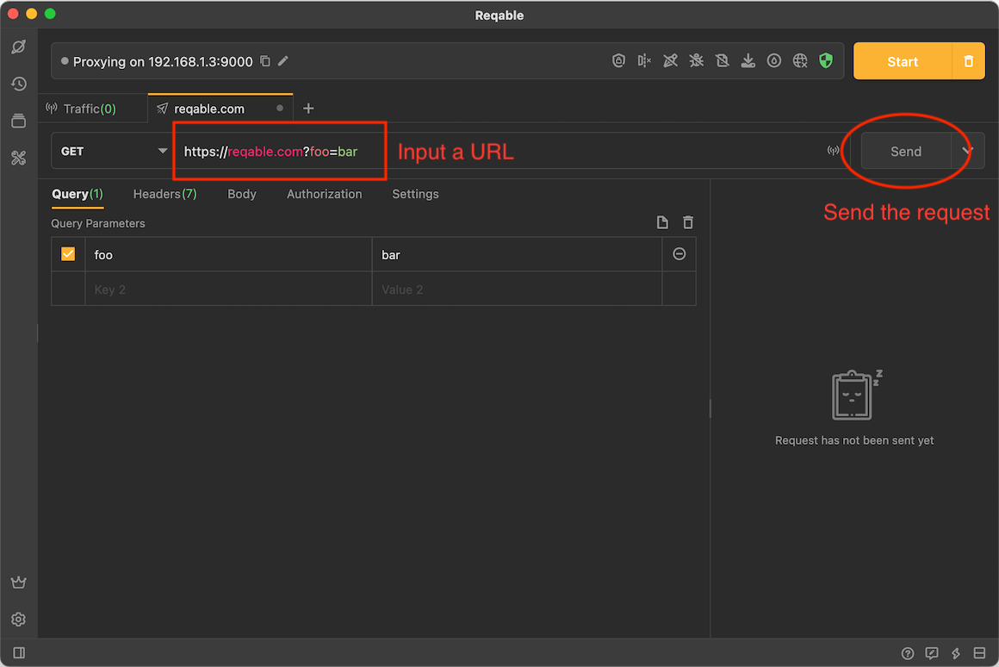
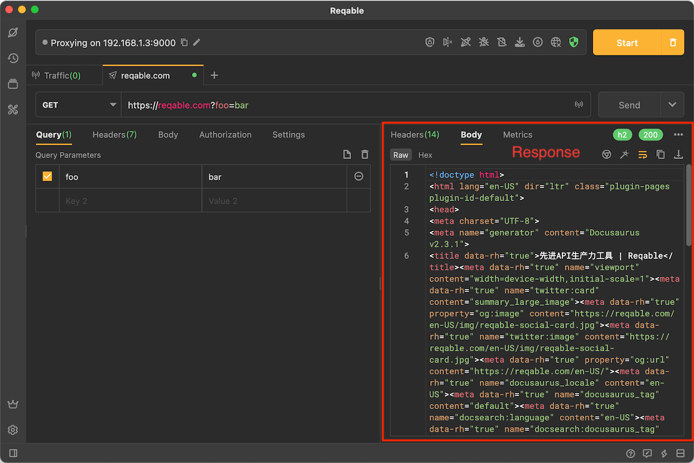
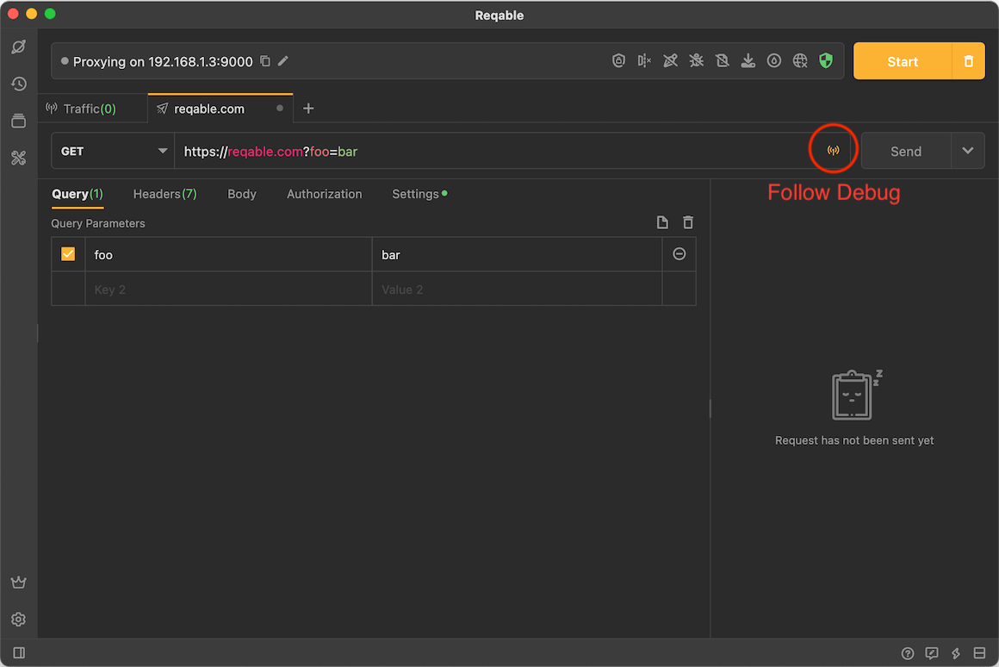
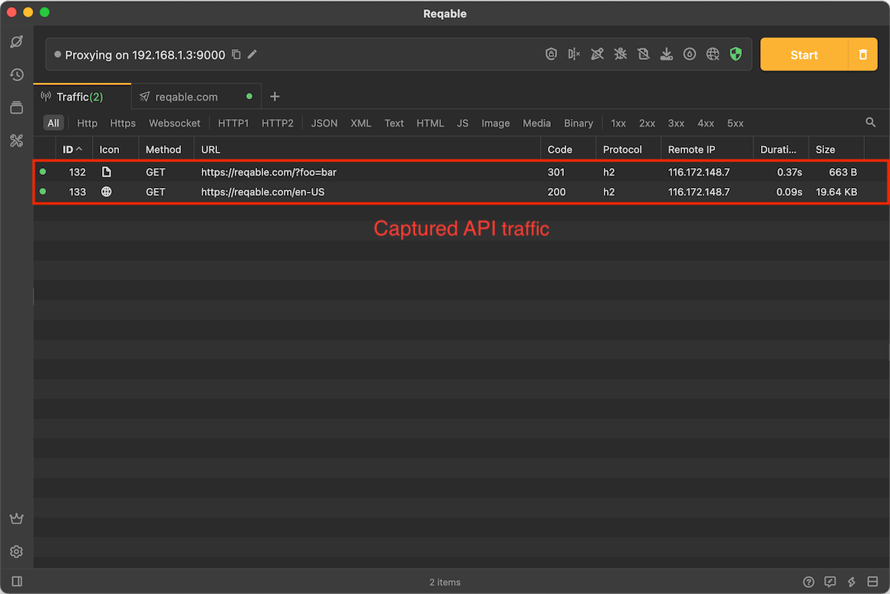
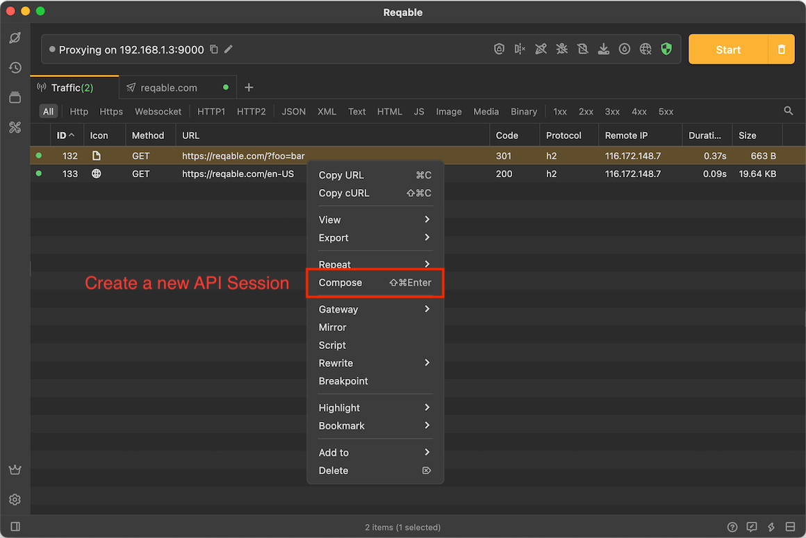

Reqable supports HTTP1, HTTP2, and HTTP3 (QUIC) protocols. The following explains how to create an API and send a request.

## Create API

Tap the `+` icon in the tab bar to create a new API session.

Enter the address `https://reqable.com?foo=bar` in the address field and tap the `Send` button.

Wait for a few seconds, you can receive the response from the server, a simple GET request is sent, and we can view the details of the response of this request.

## Follow Debug

The API request supports interaction with the debugging features. Reqable can capture traffic while sending the API. Tap the signal button at the end of the address line to enable the debugging.

Tap the `Send` button again, and you can see the captured traffic in the traffic list. There are two requests in the traffic list in the figure below because of request redirection.

Select a request in the traffic list and double-click to open the details panel, or right-click to create a new API session.

