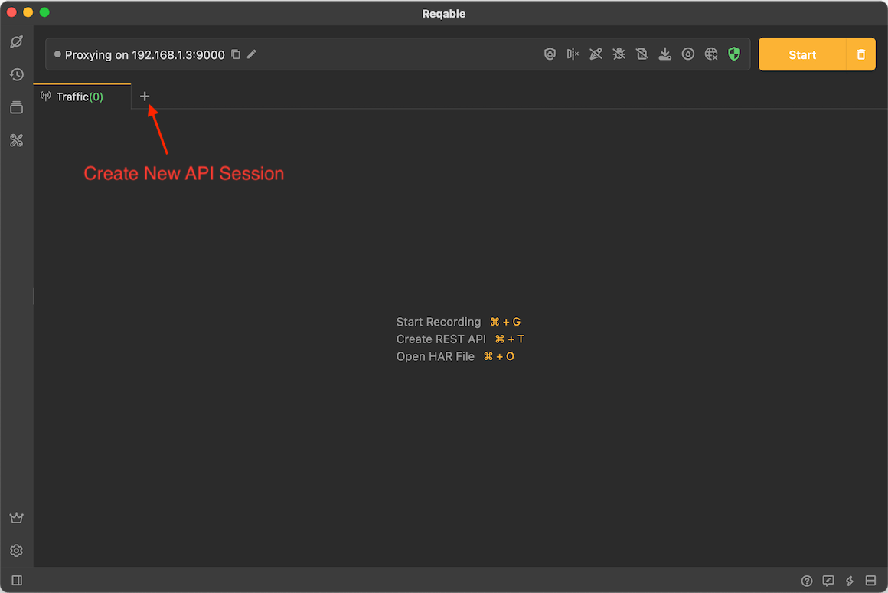
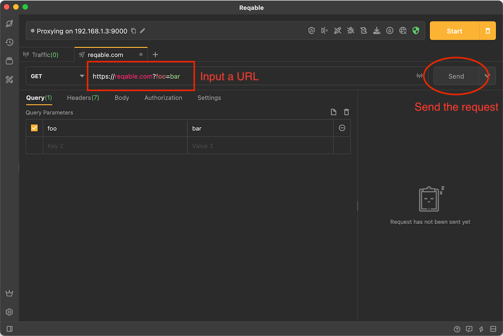
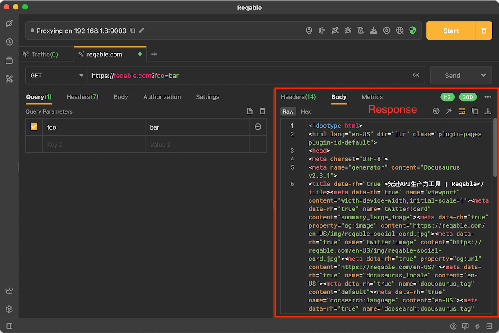
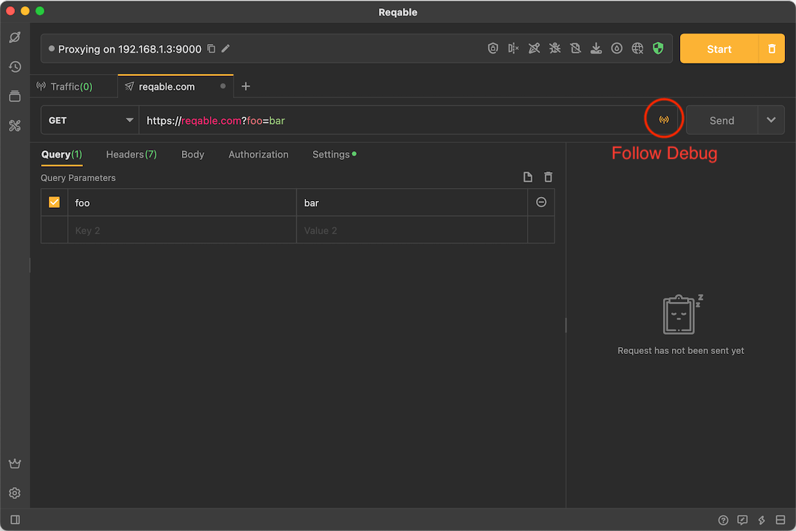
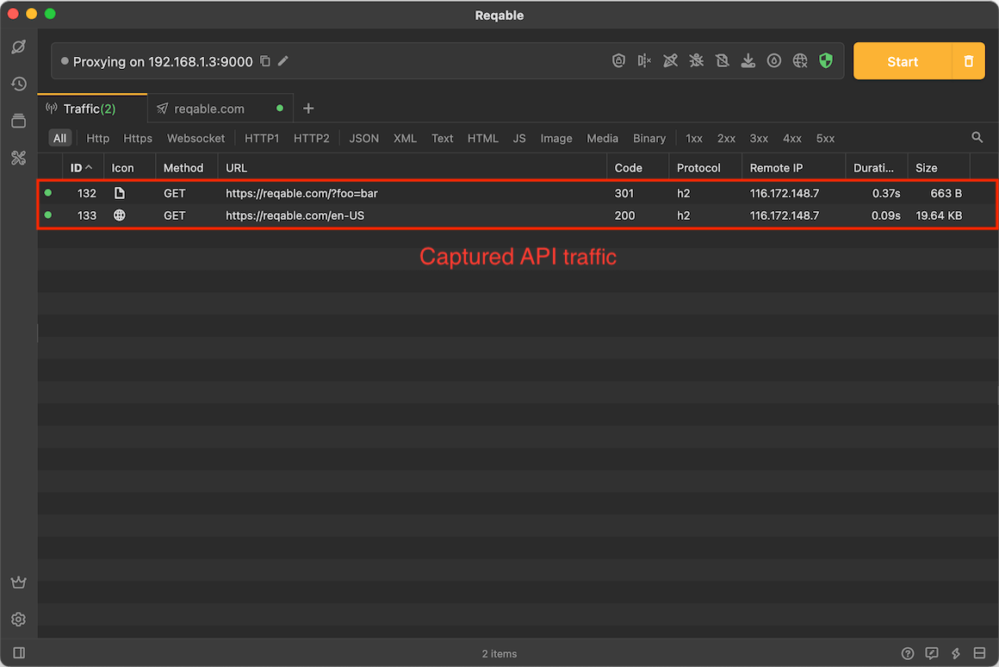
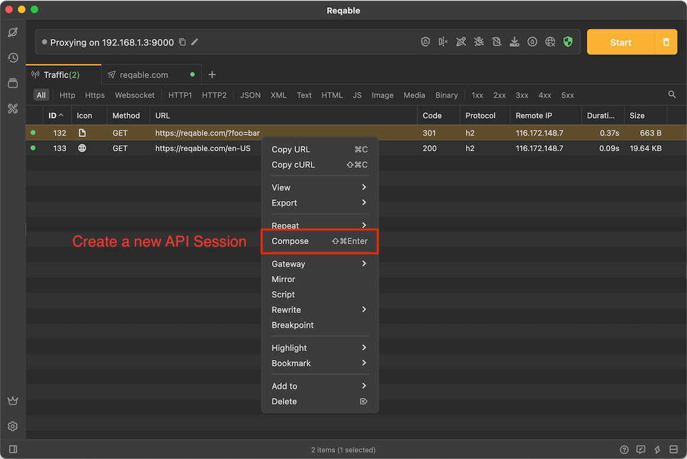

Reqable supports HTTP1, HTTP2, and HTTP3 (QUIC) protocols. The following explains how to create an API and send a request.

## Create API

Tap the `+` icon in the tab bar to create a new API session.

Enter the address `https://reqable.com?foo=bar` in the address field and tap the `Send` button.

After a few seconds, the server response appears. Reqable sends a simple GET request, and you can inspect the response details.

## Follow Debug

API requests can work with capture features. Reqable can capture traffic while sending the request. Tap the signal button at the end of the address bar to enable Follow Debug.

Tap the `Send` button again, and you can see the captured traffic in the traffic list. There are two requests in the traffic list in the figure below because of request redirection.

Select a request in the traffic list and double-click to open the details panel, or right-click to create a new API session.

